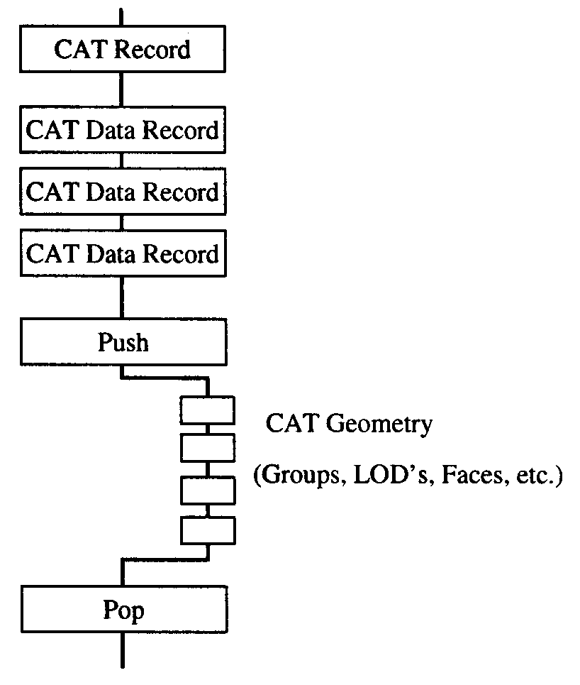
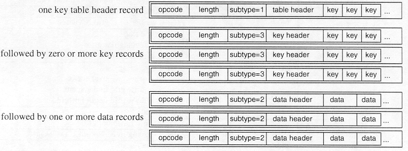
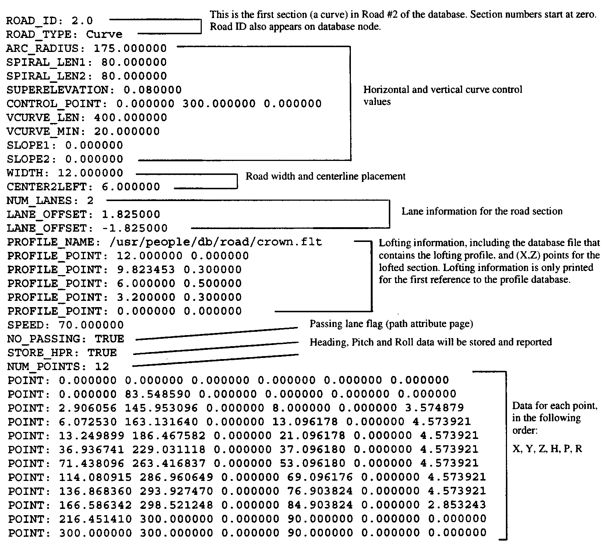

[appendix]
:appendix-caption: Annex
== OpenFlight v16.0 Technical Description – Annotated

This document has been annotated to reflect the conventions established by the CDB standard. Collectively, these conventions are referred to as OpenFlight/CDB. The conventions define how OpenFlight files are interpreted by a CDB-compliant OpenFlight reader; the stated conventions supersede or replace related aspects of this annotated specification. Unless stated otherwise, CDB-compliant OpenFlight readers will ignore any data that fails to conform to the stated conventions.

OpenFlight® +
Scene Description +
Database Specification

Annotated with CDB conventions

Version 16.0

Document Revision A

November 2004

[[AnnexB_Contents]]
=== Contents

<<AnnexB_OpenFlightConcepts>>

<<AnnexB_DatabaseHierarchy>>

<<AnnexB_NodeAttributes>>

<<AnnexB_Palettes>>

<<AnnexB_Instancing>>

<<AnnexB_Replication>>

<<AnnexB_BoundingVolumes>>

<<AnnexB_Multitexture>>

<<AnnexB_OpenFlightRecordTypes>>

<<AnnexB_ControlRecords>>

<<AnnexB_HierarchyLevelChangeRecords>>

<<AnnexB_PushLevelRecord>>

<<AnnexB_PopLevelRecord>>

<<AnnexB_PushSubfaceRecord>>

<<AnnexB_PopSubfaceRecord>>

<<AnnexB_PushExtensionRecord>>

<<AnnexB_PopExtensionRecord>>

<<AnnexB_PushAttributeRecord>>

<<AnnexB_PopAttributeRecord>>

<<AnnexB_HierarchyInstancingRecords>>

<<AnnexB_InstanceDefinitionRecord>>

<<AnnexB_InstanceReferenceRecord>>

<<AnnexB_NodePrimaryRecords>>

<<AnnexB_HeaderRecord>>

<<AnnexB_GroupRecord>>

<<AnnexB_ObjectRecord>>

<<AnnexB_FaceRecord>>

<<AnnexB_MeshNodes>>

<<AnnexB_MeshRecord>>

<<AnnexB_LocalVertexPoolRecord>>

<<AnnexB_MeshPrimitiveRecord>>

<<AnnexB_LightPointNodes>>

<<AnnexB_IndexedLightPointRecord>>

<<AnnexB_LightPointRecord>>

<<AnnexB_LightPointSystemRecord>>

<<AnnexB_DegreeofFreedomRecord>>

<<AnnexB_VertexListRecord>>

<<AnnexB_MorphVertexListRecord>>

<<AnnexB_BinarySeparatingPlaneRecord>>

<<AnnexB_ExternalReferenceRecord>>

<<AnnexB_LevelofDetailRecord>>

<<AnnexB_SoundRecord>>

<<AnnexB_LightSourceRecord>>

<<AnnexB_RoadSegmentRecord>>

<<AnnexB_RoadConstructionRecord>>

<<AnnexB_ClipRegionRecord>>

<<AnnexB_TextRecord>>

<<AnnexB_SwitchRecord>>

<<AnnexB_CATRecord>>

<<AnnexB_ExtensionRecord>>

<<AnnexB_CurveRecord>>

<<AnnexB_AncillaryRecords>>

<<AnnexB_CommentRecord>>

<<AnnexB_LongIDRecord>>

<<AnnexB_IndexedStringRecord>>

<<AnnexB_Multitexture>>

<<AnnexB_MultitextureRecord>>

<<AnnexB_UVListRecord>>

<<AnnexB_ReplicateRecord>>

<<AnnexB_RoadZoneRecord>>

<<AnnexB_TransformationRecords>>

<<AnnexB_MatrixRecord>>

<<AnnexB_RotateAboutEdgeRecord>>

<<AnnexB_TranslateRecord>>

<<AnnexB_ScaleRecord>>

<<AnnexB_RotateandorScaletoPointRecord>>

<<AnnexB_PutRecord>>

<<AnnexB_GeneralMatrixRecord>>

<<AnnexB_RotateAboutPointRecord>>

<<AnnexB_VectorRecord>>

<<AnnexB_BoundingVolumeRecords>>

<<AnnexB_BoundingBoxRecord>>

<<AnnexB_BoundingSphereRecord>>

<<AnnexB_BoundingCylinderRecord>>

<<AnnexB_BoundingConvexHullRecord>>

<<AnnexB_BoundingHistogramRecord>>

<<AnnexB_BoundingVolumeCenterRecord>>

<<AnnexB_BoundingVolumeOrientationRecord>>

<<AnnexB_CATDataRecord>>

<<AnnexB_ExtensionAttributeRecord>>

<<AnnexB_ContinuationRecord>>

<<AnnexB_PaletteRecords>>

<<AnnexB_VertexPaletteRecords>>

<<AnnexB_VertexPaletteRecord>>

<<AnnexB_VertexwithColorRecord>>

<<AnnexB_VertexwithColorandNormalRecord>>

<<AnnexB_VertexwithColorandUVRecord>>

<<AnnexB_VertexwithColor,NormalandUVRecord>>

<<AnnexB_ColorPaletteRecord>>

<<AnnexB_NameTableRecord>>

<<AnnexB_MaterialPaletteRecord>>

<<AnnexB_TexturePaletteRecord>>

<<AnnexB_EyepointandTrackplanePaletteRecord>>

<<AnnexB_KeyTableRecords>>

<<AnnexB_LinkagePaletteRecord>>

<<AnnexB_SoundPaletteRecord>>

<<AnnexB_LightSourcePaletteRecord>>

<<AnnexB_LightPointAppearancePaletteRecord>>

<<AnnexB_LightPointAnimationPaletteRecord>>

<<AnnexB_LineStylePaletteRecord>>

<<AnnexB_TextureMappingPaletteRecord>>

<<AnnexB_TexturePatternFiles>>

<<AnnexB_TextureAttributeFiles>>

<<AnnexB_VertexNodeParameters>>

<<AnnexB_FaceNodeParameters>>

<<AnnexB_ObjectNodeParameters>>

<<AnnexB_LODNodeParameters>>

<<AnnexB_GroupNodeParameters>>

<<AnnexB_DOFNodeParameters>>

<<AnnexB_SoundNodeParameters>>

<<AnnexB_SwitchNodeParameters>>

<<AnnexB_TextNodeParameters>>

<<AnnexB_LightSourceNodeParameters>>

<<AnnexB_ClipNodeParameters>>

<<AnnexB_ValidOpcodes>>

<<AnnexB_ObsoleteOpcodes>>

<<AnnexC_Overview>>

<<AnnexC_FormatChanges>>

<<AnnexC_ContinuationRecord>>

<<AnnexC_HeaderRecord>>

<<AnnexC_MeshNodes>>

<<AnnexC_MeshRecord>>

<<AnnexC_LocalVertexPoolRecord>>

<<AnnexC_MeshPrimitiveRecord>>

<<AnnexC_Multitexture>>

<<AnnexC_MultitextureRecord>>

<<AnnexC_UVListRecord>>

<<AnnexC_TextureAttributeFile>>

<<AnnexC_Subtexture>>

<<AnnexD_Overview>>

<<AnnexD_DocumentCorrections>>

<<AnnexD_TextRecord>>

<<AnnexD_CATRecord>>

<<AnnexD_HeaderRecord>>

<<AnnexD_GroupRecord>>

<<AnnexD_LevelofDetailRecord>>

<<AnnexD_ExternalReferenceRecord>>

<<AnnexD_IndexedStringRecord>>

<<AnnexD_FaceRecord>>

<<AnnexD_MeshRecord>>

<<AnnexD_LocalVertexPoolRecord>>

<<AnnexD_VertexPaletteRecords>>

<<AnnexD_LightPoints>>

<<AnnexD_LightPointAppearancePaletteRecord>>

<<AnnexD_LightPointAnimationRecord>>

<<AnnexD_IndexedLightPointRecord>>

<<AnnexD_LightPointSystemRecord>>

<<AnnexD_TextureMappingPaletteRecord>>

<<AnnexD_Parametersfor3PointPutTextureMappingType1>>

<<AnnexD_Parametersfor4PointPutTextureMappingType2>>

<<AnnexE_Overview>>

<<AnnexE_DocumentCorrections>>

<<AnnexE_HeaderRecord>>

<<AnnexE_FaceRecord>>

<<AnnexE_MeshRecord>>

<<AnnexE_SwitchRecord>>

<<AnnexE_TextureMappingPaletteRecord>>

<<AnnexE_IndexedStringRecord>>

<<AnnexE_BoundingConvexHullRecord>>

<<AnnexE_BoundingHistogramRecord>>

<<AnnexE_FormatChanges>>

<<AnnexE_ExternalReferenceRecord>>

<<AnnexE_FaceRecord>>

<<AnnexE_MeshRecord>>

<<AnnexE_LightPointAppearancePaletteRecord>>

<<AnnexE_ShaderPaletteRecord>>

<<AnnexE_TextureAttributeFile>>

<<AnnexE_TextureMappingPaletteRecord>>

<<AnnexE_Parametersfor3PointPutTextureMappingType1>>

OpenFlight Scene Description Database Specification, version 16.0. November, 2004

[[AnnexB_OpenFlightSceneDescription]]
=== OpenFlight® Scene Description

[red]#The following symbols have been used throughout the document to specify the conventions established by OpenFlight/CDB.#

[red]#&#10003;= The record, field or value is supported by OpenFlight/CDB readers and follows the same conventions and usage as the OpenFlight Standard#

[red]#&#10122;= The record, field is not considered by OpenFlight/CDB readers (e.g. ignored)#

[red]#&#10123;= The record, field or value is specific to MultiGen-Paradigm and therefore is not considered by OpenFlight/CDB readers (e.g. ignored)#

[red]#&#10124;= The value for the specified field is not supported by OpenFlight/CDB readers. OpenFlight/CDB readers ignore any fields with values that are not supported.#

[red]#&#10125;= The record, field or value is specific to MultiGen’s Creator tool and therefore is not considered by OpenFlight/CDB readers (e.g. ignored)#

The primary audience for this document includes software developers whose applications are intended to read and/or write OpenFlight database files. To this end, this document discusses concepts incorporated in OpenFlight and contains a detailed description of the physical layout of OpenFlight files as represented on disk.

[[AnnexB_OpenFlightConcepts]]
=== OpenFlight Concepts

The OpenFlight database format supports both simple and relatively sophisticated real-time software applications. The full implementation of OpenFlight supports variable levels of detail, degrees of freedom, sound, instancing (both within a file and to external files), replication, an­imation sequences, bounding volumes for real-time culling, scene lighting features, light points and light point strings, transparency, texture mapping, material properties, and many other fea­tures.

A simple application that interprets an OpenFlight database can implement a subset of the database specification and use databases that contain that subset. Such an application could sim­ply scan for the color palette, faces, and vertices, and ignores groups, objects, and other more sophisticated features.

[[AnnexB_DatabaseHierarchy]]
=== Database Hierarchy

The OpenFlight database hierarchy organizes the visual database into logical groupings and facilitates real-time functions such as field-of-view culling, level-of-detail switching, and in­stancing. Each OpenFlight database is organized in a tree structure.

The database tree structure consists of nodes (historically called beads). Most nodes can have child nodes as well as sibling nodes. In general, nodes can be thought of in three hierarchical classes. Starting from the top of the hierarchy, these three node classes include container nodes, geometry nodes and vertex nodes.

Geometry nodes are nodes that actually represent some physical (renderable) geometry. The at­tributes of geometry nodes typically include visual attributes such as color, material, texture, etc. The two main geometry nodes in OpenFlight are the face and mesh nodes. Other geometry nodes include the light point and text node. Though OpenFlight allows it, there are very few cases in which at least one geometry node is not contained somewhere below a container node.

Each node type has data attributes specific to its function in the database. The principal node types in OpenFlight are described here:

*Group*: A group node distinguishes a logical subset of the database. Group nodes can be trans­formed (translated, rotated, scaled, etc.). The transformation applies to itself and to all its chil­dren. Groups can have child nodes and sibling nodes of any type, except a header node. For more information, see <<AnnexB_GroupRecord>> .

*Object*: An object node contains a logical collection of geometry. It is effectively a low-level group node that offers some attributes distinct from the group node. For more information, see <<AnnexB_ObjectRecord>> .

*Face*: A face node represents geometry. Its children are limited to a set of vertices that describe a polygon, line, or point. For a polygon, the front side of the face is viewed from an in-order traversal of the vertices. Face attributes include color, texture, material, and transparency. For more information, see <<AnnexB_FaceRecord>> .

*Mesh*: A mesh node defines geometric primitives that share attributes and vertices. See For more information, see <<AnnexB_MeshNodes>> .

*Light point*: A light point node represents a collection of light point vertices or a replicated string of a single light point vertex. A light point is visible as one or more self-illuminated small points that do not illuminate surrounding objects. For more information, see <<AnnexB_LightPointNodes>> .

*Light point system*: A light point system enables you to collect a set of light points and enable/disable or brighten/dim them as a group. For more information, see <<AnnexB_LightPointSystemRecord>> .

*Light source*: A light source node serves as the location and orientation of a light source. The light source position and direction are transformed by the transformations above it in the tree (if any). For more information, see <<AnnexB_LightSourceRecord>> .

*Sound*: A sound node serves as the location for a sound emitter. The emitter position is the sound offset transformed by the transformations above it in the tree (if any). For more information, see <<AnnexB_SoundRecord>> .

*Text*: A text node draws text in a string with a specified font, without injecting the actual geom­etry into the database as face nodes. This is a leaf node and therefore cannot have any children. For more information, see <<AnnexB_TextRecord>> .

*Vertex*: A vertex node represents a point in space, expressed as a double precision 3D coordi­nates. Each vertex is stored in the vertex palette record. Vertex attributes include x, y, z and optionally include color, normal and texture mapping information. Vertex nodes are the chil­dren of face nodes and light point nodes. For more information, see <<AnnexB_VertexListRecord>> , <<AnnexB_MorphVertexListRecord>>  and <<AnnexB_VertexPaletteRecords>>.

*Morph vertex*: A morph vertex node is a second vertex node. The vertex and morph vertex rep­resent the two endpoints of a path between which the actual vertex may be interpolated. One endpoint represents the minimum (non morphed) weighting and the other represents the maxi­mum (fully morphed) weighting. Each endpoint (or weight) is a reference into the vertex palette record. All vertex attributes may be morphed. Morph vertex nodes are the children of face nodes. For more information, see For more information, see <<AnnexB_MorphVertexListRecord>> .

*Clip region*: A clip node defines a set of clipping planes. Any geometry, of the clip node’s chil­dren, that falls outside the specified clipping planes is not displayed. For more information, see <<AnnexB_ClipRegionRecord>> .

*Degree of freedom*: A degree of freedom (DOF) node serves as a local coordinate system with a predefined set of internal transformations. It specifies the articulation of parts in the database and set limits on the motion of those parts. For more information, see <<AnnexB_DegreeofFreedomRecord>> .

*Level of detail*: A level of detail (LOD) node serves as a switch to turn the display of everything below it on or off based on its range from the viewer, according to its switch-in, switch-out dis­tance and center location. For more information, see <<AnnexB_LevelofDetailRecord>> .

*Switch*: A switch node is a more general case of an LOD node. It allows the selection of zero or more children by invoking a selector mask. Any combination of children can be selected per mask and the number of definable masks is unlimited. For more information, see <<AnnexB_SwitchRecord>> .

*External reference*: An external reference node serves to reference a node in another database file, or an entire database file. The referenced (child) node or database is considered an external part of the referencing (parent) database. For more information, see <<AnnexB_ExternalReferenceRecord>> .

[[AnnexB_NodeAttributes]]
=== Node Attributes

Nodes in the OpenFlight scene contain attributes whose values describe different properties or characteristics of the node. Most attributes are represented directly on the node itself and are geared toward describing the specific characteristics of that type of node. The level of detail (LOD) node, for example, defines a switch in and switch out distance. Used together, these dis­tances define a range within which the geometry contained in the LOD is visible.

Other attributes are represented indirectly on a node, using a lookup index into a table (palette) of attributes to describe the characteristics of a node. The face node, for example, defines sev­eral indirect attributes, including color index, material index and texture index. The values of these index attributes are used to map specific colors, materials and textures to the face node. The definitions of the colors, materials and textures referenced by these index attributes are stored in palettes in the database rather than directly on the nodes themselves.

This mechanism of indirect attribute mapping via palettes has some advantages. It can both save space in the OpenFlight file and can simplify the task of making global changes to nodes in the database.

To see how this indirection saves space, consider the material index attribute on the face node. A material is defined by over 15 separate color and other visual attributes. If each of these at­tributes were maintained per face in the database, the size of the database would get large quick­ly. Since it is common to map a single material to hundreds (or even thousands) of faces in the database, it is much more efficient to store a single material index attribute per face rather than storing the entire material definition.

Also, in terms of changing the appearance of a particular material in your database, when you do change the material definition in the palette, the faces that reference that material get updated automatically. This can make global changes much more simple to accomplish.

[[AnnexB_Palettes]]
=== Palettes

In the previous section, indirect attribute mapping was introduced. As part of that discussion, the notion of database palettes was also mentioned briefly. In fact, indirect attribute mapping is not possible without a robust implementation of database palettes. A database palette is a col­lection (or set) of attribute definitions. As mentioned in the previous section, the material pal­ette defines a set of materials, each material being composed of several different color and visual attributes.

The OpenFlight database supports many different palettes. The most obvious palettes are the color, material and texture palettes. Most palettes support variable numbers of elements while others enforce fixed size constraints. The material and texture palettes are both variable sized palettes that can contain zero or more entries. The color palette, in contrast, is a fixed size pal­ette that contains exactly 1024 entries.

All the database palettes supported by OpenFlight are described in <<AnnexB_PaletteRecords>> . Specific palettes in OpenFlight include:

•”Color Palette Record”

•”Material Palette Record”

•”Texture Palette Record”

•”Texture Mapping Palette Record”

•”Sound Palette Record”

•”Line Style Palette Record”

•”Light Source Palette Record”

•”Light Point Appearance Palette Record”

•”Light Point Animation Palette Record”

•”Vertex Palette Records”

•”Name Table Record”

•”Eyepoint and Trackplane Palette Record”

•”Linkage Palette Record”

[[AnnexB_Instancing]]
=== Instancing

Instancing is the ability to define all or part of a database once, then reference it one or more times while applying various transformations. This allows you to define a piece of geometry once and place it multiple times in the scene. OpenFlight supports internal and external instanc­ing with operations such as Rotate, Translate, Scale, and Put.

An internal instance is a subtree of the database that has been declared as an instance definition. An instance definition represents the root of a stand-alone subtree within the database. It is in­troduced by an instance definition record that contains a unique instance definition number. An instance definition is invoked by an instance reference record in a subsequent part of the data­base tree.

An external instance refers to an entire database file. It is introduced by an external reference node. An external reference node contains the name of the (child) database file to attach to that point in the referencing (parent) database tree. It also includes attributes that determine whether the child uses its own color, material, and texture palettes, or those of its parent.

Instance definitions can themselves contain instance definitions and references. Internal in­stances cannot reference themselves. External instances should not reference themselves direct­ly or indirectly. The result of such use is undefined.

Instance definition and instance reference records are described in <<AnnexB_HierarchyInstancingRecords>> . External reference records are described in <<AnnexB_ExternalReferenceRecord>>.

[[AnnexB_Replication]]
=== Replication

Replication instances a subtree of the database several times, applying a transformation each time. For example, a string of trees can be represented by a single group node that is instantiated and translated to a new position several times.

Replication is legal for group, face, and light point nodes. Therefore a replication record is an ancillary record of a group, face, or light point node. In conjunction with a replication record there will be one or more ancillary transformation records.

[[AnnexB_BoundingVolumes]]
=== Bounding Volumes

Bounding volumes can be used by the application to determine if a particular subtree of the da­tabase is in view. A bounding volume can be a box, a sphere, or a cylinder. Each group node can have only one bounding volume. The volume normally encompasses the full geometric ex­tent of the group node’s children, including any instances and replications. A bounding volume record is an ancillary record of a group node.

[[AnnexB_Multitexture]]
=== Multitexture

OpenFlight supports eight textures per polygon or mesh as well as eight uv values per vertex. The texture information stored directly on the face, mesh and vertex record is referred to as “the base texture” or “texture layer 0”. Each additional texture layer is stored in ancillary records to the face, mesh and vertex list records and is referred to as “texture layer N” (for N=1..7). See <<AnnexB_Multitexture>> for more information.
OpenFlight supports eight textures per polygon or mesh as well as eight uv values per vertex. The texture information stored directly on the face, mesh and vertex record is referred to as “the base texture” or “texture layer 0”. Each additional texture layer is stored in ancillary records to the face, mesh and vertex list records and is referred to as “texture layer N” (for N=1..7). See <<AnnexB_Multitexture>> for more information.

[[AnnexB_OpenFlightFileFormat]]
=== OpenFlight File Format

The hierarchical structure of an OpenFlight database is stored on disk as a file. The file consists of a linear stream of binary records. Byte ordering in the file is big endian. All OpenFlight records begin with a 4 byte sequence. The first two bytes of this sequence identifies the record type (opcode) and the second two bytes specify the length of the record. Note that the length includes this 4 byte sequence so the minimum length of any record (that does not contain any additional data) will be 4. Given this very regular structure, OpenFlight records can be read from disk and parsed easily.

•All OpenFlight records are a multiple of 4 bytes in length. When a record contains less than an full multiple of 4 bytes of data, the record is padded up (bytes added to the end of the record) to be a mul­tiple of 4 bytes in length. In some cases, OpenFlight records are padded up to be multiples of 8 bytes in length.

•The length of all records (and fields in all records) as well as the offset of all fields are expressed in bytes.

•Unless explicitly stated otherwise, bit fields and masks are counted starting at 0 (i.e., the first bit is bit number 0).

•Unless explicitly stated otherwise, the elements of matrix records stored in OpenFlight appear in row major order. That is, the elements of the matrix appear in the following order: +
row0col0, row0col1, row0col2, row0col3, +
row1col0, row1col1, row1col2, row1col3, +
row2col0, row2col1, row2col2, row2col3, +
row3col0, row3col1, row3col2, row3col3

•The length of all OpenFlight records is limited to the largest value that can be encoded with 2 bytes or 16 bits (65535). For fixed-size records, this maximum size is sufficient. For vari­able-size records, this limitation is addressed with the Continuation Record. For more in­formation, see <<AnnexB_ContinuationRecord>> .

[[AnnexB_OpenFlightRecordTypes]]
=== OpenFlight Record Types

There are four major categories of records: control records, node primary records, ancillary records and continuation records.

Control records mark the hierarchy of the tree. A push control record (a record containing the push opcode) indicates an increase in the depth of the tree. A push control record drops you down one level in the tree. A pop control record (a record containing a pop opcode) returns you to the previous level of hierarchy. All records between a push and a pop represent sibling nodes at the same level of hierarchy. Other control records include: instance definition, instance ref­erence, push subface, pop subface, push attribute, and pop attribute.

Each node is represented on disk by one primary record and zero or more ancillary records. The primary record identifies a node type and includes most of the node attribute data. Additional node attributes, such as comments, long ID, and transformations, are stored in subsequent an­cillary records. Ancillary records follow the primary record, but precede any control records. Child nodes are introduced by a push control record and are concluded by a pop control record.

Palette records are ancillary records of the header node. Palette records generally follow the header node’s primary record, with the exception of behavior (linkage) palette records. Behav­ior palette records, if present, are the last (non-control) records in the file.

Many records include an eight character ASCII ID consisting of the first seven characters of the node name plus a terminating <nil> character. If the node ID is longer than seven characters, an ancillary long ID record containing the complete ID follows the node primary record.

For example, a record with an object opcode is followed by a push control record. Next comes a record with a face opcode, also followed by a push control record. After that comes the vertex list record(s) that describe the vertices of the face, and then a pop control record. This, in turn, may be followed by another face record for the next face in the same object, or by a pop record to return to object level.

[[AnnexB_ControlRecords]]
==== Control Records

Control records indicate a change in the level of the database hierarchy. The three basic types of control records are: level changes, instance definition, and instance reference. Level changes are indicated by push and pop control records. Instance definitions and references are indicated by instance definition and instance reference control records.

[[AnnexB_HierarchyLevelChangeRecords]]
===== Hierarchy Level Change Records

A database contains three distinct types of hierarchy: generic, subface, and attribute. Hierarchy may be skipped by scanning past the push control record for the corresponding pop control record.

Generic A push level control record introduces a generic subtree of the database hierarchy. A pop level control record concludes that subtree.

Subface A push subface control record introduces a subtree of coplanar faces. A pop subface control record concludes that subtree.

Extension A push extension control record introduces a subtree of user defined records. A pop exten­sion control records concludes that subtree.

Attribute A push attribute control record introduces a subtree of records reserved for internal use by MultiGen-Paradigm, Inc.. A pop attribute control record concludes that subtree.

[[AnnexB_PushLevelRecord]]
===== Push Level Record

[cols=",,,,",]
|=======================================================================
|*Data Type* |*Offset* |*Length* |*Description* |[red]#CDB OpenFlight Reader#
|Int |0 |2 |Push Level Opcode 10 | [red]#&#10003;#
|Unsigned Int |2 |2 |Length - length of the record | [red]#&#10003;#
|=======================================================================

[[AnnexB_PopLevelRecord]]
===== Pop Level Record

[cols=",,,,",]
|=======================================================================
|*Data Type* |*Offset* |*Length* |*Description* |[red]#CDB OpenFlight Reader#
|Int |0 |2 |Pop Level Opcode 11 |[red]#&#10003;#
|Unsigned Int |2 |2 |Length - length of the record |[red]#&#10003;#
|=======================================================================

[[AnnexB_PushSubfaceRecord]]
===== Push Subface Record

[cols=",,,,",]
|=======================================================================
|*Data Type* |*Offset* |*Length* |*Description* |[red]#CDB OpenFlight Reader#
|Int |0 |2 |Push Subface Opcode 19 |[red]#&#10003;#
|Unsigned Int |2 |2 |Length - length of the record |[red]#&#10003;#
|=======================================================================

[[AnnexB_PopSubfaceRecord]]
===== Pop Subface Record

[cols=",,,,",]
|=======================================================================
|*Data Type* |*Offset* |*Length* |*Description* |[red]#CDB OpenFlight Reader#
|Int |0 |2 |Pop Subface Opcode 20 |[red]#&#10003;#
|Unsigned Int |2 |2 |Length - length of the record |[red]#&#10003;#
|=======================================================================

[[AnnexB_PushExtensionRecord]]
===== Push Extension Record

[cols=",,,,",]
|=========================================================================
|*Data Type* |*Offset* |*Length* |*Description* |[red]#CDB OpenFlight Reader#
|Int |0 |2 |Push Extension Opcode 21 |[red]#&#10003;#
|Unsigned Int |2 |2 |Length - length of the record |[red]#&#10003;#
|Char |4 |18 |Reserved |[red]#&#10122;#
|Unsigned Int |22 |2 |Vertex reference index; -1 if not vertex extension |[red]#&#10122;#
|=========================================================================

[[AnnexB_PopExtensionRecord]]
===== Pop Extension Record

[cols=",,,,",]
|=========================================================================
|*Data Type* |*Offset* |*Length* |*Description* |[red]#CDB OpenFlight Reader#
|Int |0 |2 |Pop Extension Opcode 22 |[red]#&#10003;#
|Unsigned Int |2 |2 |Length - length of the record |[red]#&#10003;#
|Char |4 |18 |Reserved |[red]#&#10122;#
|Unsigned Int |22 |2 |Vertex reference index; -1 if not vertex extension |[red]#&#10122;#
|=========================================================================

[[AnnexB_PushAttributeRecord]]
===== Push Attribute Record

[cols=",,,,",]
|=======================================================================
|*Data Type* |*Offset* |*Length* |*Description* |[red]#CDB OpenFlight Reader#
|Int |0 |2 |Push Attribute Opcode 122 |[red]#&#10003;#
|Unsigned Int |2 |2 |Length - length of the record |[red]#&#10003;#
|Int |4 |4 |Vertex reference index; -1 if not vertex attribute |[red]#&#10123;#
|=======================================================================

[[AnnexB_PopAttributeRecord]]
===== Pop Attribute Record

[cols=",,,,",]
|=======================================================================
|*Data Type* |*Offset* |*Length* |*Description* |[red]#CDB OpenFlight Reader#
|Int |0 |2 |Pop Attribute Opcode 123 |[red]#&#10003;#
|Unsigned Int |2 |2 |Length - length of the record |[red]#&#10003;#
|=======================================================================

[[AnnexB_HierarchyInstancingRecords]]
===== Hierarchy Instancing Records

An instance definition record introduces a stand-alone subtree of the database. The subtree is referenced one or more times from different branches in the database by instance reference records. At the point of reference, the subtree is copied (or possibly shared) as a child of the current parent node.

The instance definition record must appear in the file stream prior to the first instance reference record that references it. A typical usage of these records might look like:

[source,txt]
----
        INSTANCE DEFINITION 1
PUSH
The records between this PUSH and POP define the
stand-alone subtree that is INSTANCE DEFINITION 1
POP
...
GROUP
MATRIX
PUSH
INSTANCE REFERENCE 1
POP
GROUP
MATRIX
PUSH
INSTANCE REFERENCE 1
POP
----

In this example, both groups reference instance definition number 1, each presumably applying a different matrix to place the instance in different locations in the scene.

[[AnnexB_InstanceDefinitionRecord]]
===== Instance Definition Record

[cols=",,,,",]
|=======================================================================
|*Data Type* |*Offset* |*Length* |*Description* |[red]#CDB OpenFlight Reader#
|Int |0 |2 |Instance Definition Opcode 62 |[red]#&#10003;#
|Unsigned Int |2 |2 |Length - length of the record |[red]#&#10003;#
|Int |4 |2 |Reserved |[red]#&#10122;#
|Int |6 |2 |Instance definition number |[red]#&#10003;#
|=======================================================================

[[AnnexB_InstanceReferenceRecord]]
===== Instance Reference Record

[cols=",,,,",]
|=======================================================================
|*Data Type* |*Offset* |*Length* |*Description* |[red]#CDB OpenFlight Reader#
|Int |0 |2 |Instance Reference Opcode 61 |[red]#&#10003;#
|Unsigned Int |2 |2 |Length - length of the record |[red]#&#10003;#
|Int |4 |2 |Reserved |[red]#&#10122;#
|Int |6 |2 |Instance definition number |[red]#&#10003;#
|=======================================================================

[[AnnexB_NodePrimaryRecords]]
==== Node Primary Records

[[AnnexB_HeaderRecord]]
===== Header Record

The header record is the primary record of the header node and is always the first record in the database file. Attributes within the header record provide important information about the database file as a whole.

Format revision level indicates the OpenFlight version of the file. Correctly interpreting the at­tributes of other records, such as the face and vertex records, depends upon the format revision. The format revision encompasses both Flight and OpenFlight versions.

Some representative values for format revision are:

[cols=",,",]
|=============================================================================
|*Format Revision Value* |*Flight/OpenFlight Version* |[red]#CDB OpenFlight Reader#
|11 |Flight V11 |[red]#&#10124;#
|12 |Flight V12 |[red]#&#10124;#
|14 |OpenFlight v14.0 and v14.1 |[red]#&#10124;#
|1420 |OpenFlight v14.2 |[red]#&#10124;#
|1510 |OpenFlight v15.1 |[red]#&#10124;#
|1540 |OpenFlight v15.4 |[red]#&#10124;#
|1550 |OpenFlight v15.5 |[red]#&#10124;#
|1560 |OpenFlight v15.6 |[red]#&#10124;#
|1570 |OpenFlight v15.7 |[red]#&#10124;#
|1580 |OpenFlight v15.8 |[red]#&#10124;#
|1600 |OpenFlight v16.0 |[red]#&#10003;#
|=============================================================================

This document describes OpenFlight version 16.0, therefore the attribute descriptions are based upon a format revision level of 1600.

Geographic attributes such as projection type, latitude, and longitude may be stored in the header record. The MultiGen Series II and Creator Terrain options set the value of these attributes when creating terrain databases. Positive latitudes reference the northern hemisphere and negative longitudes reference the western hemisphere.

Delta x, y and z attributes indicate the placement of the database when several separate databases, each with a local origin of zero, are used to represent an area.

.Header Record
[cols=",,,,",]
|=======================================================================
|*Data Type* |*Offset* |*Length* |*Description* |[red]#CDB OpenFlight Reader#
|Int |0 |2 |Header Opcode 1 |[red]#&#10003;#
|Unsigned Int |2 |2 |Length - length of the record |[red]#&#10003;#
|Int |12 |4 |Format revision level |[red]#&#10003;#
|Int |16 |4 |Edit revision level |[red]#&#10122;#
|Char |20 |32 |Date and time of last revision |[red]#&#10122;#
|Int |52 |2 |Next Group node ID number |[red]#&#10122;#
|Int |54 |2 |Next LOD node ID number |[red]#&#10122;#
|Int |56 |2 |Next Object node ID number |[red]#&#10122;#
|Int |58 |2 |Next Face node ID number |[red]#&#10122;#
|Int |60 |2 |Unit multiplier (always 1) |[red]#&#10122;#
|Int |62 |1 |Vertex coordinate units |[red]#&#10003;#
| | | |0 = Meters |[red]#&#10003;#
| | | |1 = Kilometers |[red]#&#10124;#
| | | |4 = Feet |[red]#&#10124;#
| | | |5 = Inches |[red]#&#10124;#
| | | |8 = Nautical miles |[red]#&#10124;#
|Int |63 |1 |if TRUE set texwhite on new faces |[red]#&#10122;#
|Int |64 |4 |Flags (bits, from left to right) |[red]#&#10122;#
| | | |0 = Save vertex normals |[red]#&#10122;#
| | | |1 = Packed Color mode |[red]#&#10122;#
| | | |2 = CAD View mode |[red]#&#10122;#
| | | |3-31 = Spare |[red]#&#10122;#
|Int |68 |4*6 |Reserved |[red]#&#10122;#
|Int |92 |4 |Projection type |[red]#&#10003;#
| | | |0 = Flat earth |[red]#&#10003;#
| | | |1 = Trapezoidal |[red]#&#10122;#
| | | |2 = Round earth |[red]#&#10122;#
| | | |3 = Lambert |[red]#&#10122;#
| | | |4 = UTM |[red]#&#10122;#
| | | |5 = Geodetic |[red]#&#10003;#
| | | |6 = Geocentric |[red]#&#10122;#
|Int |96 |4*7 |Reserved |[red]#&#10122;#
|Int |124 |2 |Next DOF node ID number |[red]#&#10122;#
|Int |126 |2 |Vertex storage type |[red]#&#10122;#
| | | |1 = Double precision float - should always be 1 |[red]#&#10122;#
|=======================================================================

.Header Record (Continued)
[cols=",,,,",]
|========================================================================================
|*Data Type* |*Offset* |*Length* |*Description* |[red]#CDB OpenFlight Reader#
|Int |128 |4 |Database origin |[red]#&#10122;#
| | | |100 = OpenFlight |[red]#&#10124;#
| | | |200 = DIG I/DIG II |[red]#&#10124;#
| | | |300 = Evans and Sutherland CT5A/CT6 |[red]#&#10124;#
| | | |400 = PSP DIG |[red]#&#10124;#
| | | |600 = General Electric CIV/CV/PT2000 |[red]#&#10124;#
| | | |700 = Evans and Sutherland GDF |[red]#&#10124;#
|Double |132 |8 |Southwest database coordinate x |[red]#&#10122;#
|Double |140 |8 |Southwest database coordinate y |[red]#&#10122;#
|Double |148 |8 |Delta x to place database |[red]#&#10122;#
|Double |156 |8 |Delta y to place database |[red]#&#10122;#
|Int |164 |2 |Next sound node ID number |[red]#&#10122;#
|Int |166 |2 |Next path node ID number |[red]#&#10122;#
|Int |168 |4*2 |Reserved |[red]#&#10122;#
|Int |176 |2 |Next Clip node ID number |[red]#&#10122;#
|Int |178 |2 |Next Text node ID number |[red]#&#10122;#
|Int |180 |2 |Next BSP node ID number |[red]#&#10122;#
|Int |182 |2 |Next Switch node ID number |[red]#&#10122;#
|Int |184 |4 |Reserved |[red]#&#10122;#
|Double |188 |8 |Southwest corner latitude |[red]#&#10122;#
|Double |196 |8 |Southwest corner longitude |[red]#&#10122;#
|Double |204 |8 |Northeast corner latitude |[red]#&#10122;#
|Double |212 |8 |Northeast corner longitude |[red]#&#10122;#
|Double |220 |8 |Origin latitude |[red]#&#10122;#
|Double |228 |8 |Origin longitude |[red]#&#10122;#
|Double |236 |8 |Lambert upper latitude |[red]#&#10122;#
|Double |244 |8 |Lambert lower latitude |[red]#&#10122;#
|Int |252 |2 |Next Light source node ID number |[red]#&#10122;#
|Int |254 |2 |Next Light point node ID number |[red]#&#10122;#
|Int |256 |2 |Next Road node ID number |[red]#&#10122;#
|Int |258 |2 |Next CAT node ID number |[red]#&#10122;#
|Int |260 |2 |Reserved |[red]#&#10122;#
|Int |262 |2 |Reserved |[red]#&#10122;#
|Int |264 |2 |Reserved |[red]#&#10122;#
|Int |266 |2 |Reserved |[red]#&#10122;#
|Int |268 |4 |Earth ellipsoid model |[red]#&#10122;#
| | | |0 = WGS 1984 |[red]#&#10124;#
| | | |1 = WGS 1972 |[red]#&#10124;#
| | | |2 = Bessel |[red]#&#10124;#
| | | |3 = Clarke 1866 |[red]#&#10124;#
| | | |4 = NAD 1927 |[red]#&#10124;#
| | | |-1 = User defined ellipsoid |[red]#&#10124;#
|Int |272 |2 |Next Adaptive node ID number |[red]#&#10122;#
|Int |274 |2 |Next Curve node ID number |[red]#&#10122;#
|Int |276 |2 |UTM zone (for UTM projections - negative value means Southern hemisphere) |[red]#&#10122;#
|Char |278 |6 |Reserved |[red]#&#10122;#
|========================================================================================

[[AnnexB_HeaderRecordContinued]]
===== Header Record (Continued)

[cols=",,,,",]
|===========================================================================================================
|*Data Type* |*Offset* |*Length* |*Description* |[red]#CDB OpenFlight Reader#
|Double |284 |8 |Delta z to place database (used in conjunction with exist­ing Delta x and Delta y values) |[red]#&#10122;#
|Double |292 |8 |Radius (distance from database origin to farthest corner) |[red]#&#10122;#
|Unsigned int |300 |2 |Next Mesh node ID number |[red]#&#10122;#
|Unsigned int |302 |2 |Next Light Point System ID number |[red]#&#10122;#
|Int |304 |4 |Reserved |[red]#&#10122;#
|Double |308 |8 |Earth major axis (for user defined ellipsoid) in meters |[red]#&#10122;#
|Double |316 |8 |Earth minor axis (for user defined ellipsoid) in meters |[red]#&#10122;#
|===========================================================================================================

[[AnnexB_GroupRecord]]
===== Group Record

The group record is the primary record of the group node. Groups are the most generic hierar­chical node present in the database tree. Attributes within the group record provide bounding volumes that encompass the group’s children and real-time control flags.

Relative priority specifies a fixed ordering of the group relative to its sibling nodes. Ordering is from left (lesser values) to right (higher values). Nodes of equal priority may be arbitrarily or­dered. All nodes have an implicit (default) relative priority value of zero.

A group can represent an animation sequence in which case each immediate child of the group represents one frame of the sequence. An animation sequence is made of one or more loops.

For a group with N children, both forward and backward loops consist of N frames. The frames of forward and backward loops are:

[cols=",,,,,",]
|==============================================================
|*Direction* |*Frame 1* |*Frame 2* |*Frame 3* |*...* |*Frame N*
|Forward |Child 1 |Child 2 |Child 3 |... |Child N
|Backward |Child N |Child N-1 |Child N-2 |... |Child 1
|==============================================================

Independent of the direction of the loop, a loop can optionally _swing._ A swing loop is one that plays its children in the primary direction and then plays them in the opposite direction. Note that as the loop swings from the current direction to the opposite direction, the last frame in the current direction is not repeated. Therefore, for a group with N children, the first loop of both forward swing and backward swing animations

consist of M frames where M equals ((2*N)-1) frames. Subsequent loops of swing animations consist of M-1 frames. The frames of the first loop of forward and backward swing animations are:

[cols=",,,,,,,,",]
|===============================================================================================
|*Direction* |*Frame 1* |*Frame 2* |*...* |*Frame N* |*Frame N+1* |*Frame N+2* |*...* |*Frame M*
|Forward |Child 1 |Child 2 |... |Child N |Child N-1 |Child N-2 |... |Child 1
|Backward |Child N |Child N-1 |... |Child 1 |Child 2 |Child 3 |... |Child N
|===============================================================================================

The frames of subsequent loops of forward and backward swing animations are:

[cols=",,,,,,,,",]
|=================================================================================================
|*Direction* |*Frame 1* |*Frame 2* |*...* |*Frame N* |*Frame N+1* |*Frame N+2* |*...* |*Frame M-1*
|Forward |Child 2 |Child 3 |... |Child N |Child N-1 |Child N-2 |... |Child 1
|Backward |Child N-1 |Child N-2 |... |Child 1 |Child 2 |Child 3 |... |Child N
|=================================================================================================

The number of times an animation loop repeats within the sequence is specified by the loop count attribute. A loop count of 0 indicates that the loop is to repeat forever.

The duration of one loop within the sequence is specified by the loop duration attribute and is measured in seconds. A loop duration of 0 indicates that the loop is to play as fast as possible.

For finite animation sequences (those with positive, non-zero loop count values), the duration that the last frame of the last loop is extended after the sequence has finish is specified by the last frame duration attribute and is measured in seconds. A last frame duration of 0 indicates that the last frame is not displayed any longer after the sequence finishes.

Special effect ID1 and ID2 are application-defined attributes. Their values can be used to enhance the meaning of existing attributes, such as the animation flags, or extend the interpretation of the group node. Normally, the value of these attributes is zero.

Significance can be used to assist real-time culling and load balancing mechanisms, by defining the visual significance of this group with respect to other groups in the database. Normally the value of this attribute is zero.

Layer ID is used by the Instrumentation Tools in the modeling products to identify (for display) a collection of groups, independent of their locations in the hierarchy. Normally the value of this attribute is zero.

.Group Record
[cols=",,,,",]
|=======================================================================

|*Data Type* |*Offset* |*Length* |*Description* |[red]#CDB OpenFlight Reader#
|Int |0 |2 |Group Opcode 2 |[red]#&#10003;#
|Unsigned Int |2 |2 |Length - length of the record |[red]#&#10003;#
|Char |4 |8 |7 char ASCII ID; 0 terminates |[red]#&#10003;#
|Int |12 |2 |Relative priority |[red]#&#10003;#
|Int |14 |2 |Reserved |[red]#&#10122;#
|Int |16 |4 |Flags (bits, from left to right) |[red]#&#10003;#
| | | |0 = Reserved |[red]#&#10124;#
| | | |1 = Forward animation |[red]#&#10003;#
| | | |2 = Swing animation |[red]#&#10003;#
| | | |3 = Bounding box follows |[red]#&#10124;#
| | | |4 = Freeze bounding box |[red]#&#10124;#
| | | |5 = Default parent |[red]#&#10124;#
| | | |6 = Backward animation |[red]#&#10003;#
| | | |7-31 = Spare |[red]#&#10124;#
|Int |20 |2 |Special effect ID1 - application defined |[red]#&#10122;#
|Int |22 |2 |Special effect ID2 - application defined |[red]#&#10122;#
|Int |24 |2 |Significance |[red]#&#10003; per CDB convention#
|Int |26 |1 |Layer code |[red]#&#10122;#
|Int |27 |1 |Reserved |[red]#&#10122;#
|Int |28 |4 |Reserved |[red]#&#10122;#
|Int |32 |4 |Loop count |[red]#&#10003;#
|Float |36 |4 |Loop duration in seconds |[red]#&#10003;#
|Float |40 |4 |Last frame duration in seconds |[red]#&#10003;#
|=======================================================================

.Group Animation Flags Examples
[cols=",,,",]
|====================================================================

a|
*Forward*

*Animation*

 a|
*Backward*

*Animation*

 a|
*Swing*

*Animation*

 |*Result*
|0 |0 |0 |Group is not animated
|1 |0 |0 |Animation loop is forward, no swing.
|0 |1 |0 |Animation loop is backward, no swing.
|1 |0 |1 |Animation loop is forward with swing.
|0 |1 |1 |Animation loop is backward with swing.
|1 |1 |Any |Undefined, must be either forward or backward (not both).
|====================================================================

Here are some examples that show how the loop duration, loop count and last frame duration attributes affect the animation. Note that these values are independent of the animation flags from above.

.Group Animation Count Examples
[cols=",,,",]
|==============================================================================

a|
*Loop*

*Duration*

 a|
*Loop*

*Count*

 a|
*Last Frame*

*Duration*

 |*Result*
|0 |0 |Any |Each loop plays as fast as possible. +
Loops are played forever. +
Last Frame Duration not applicable.
|T |0 |Any |Each loop lasts T seconds. +
Loops are played forever. +
Last Frame Duration not applicable.
|0 |N |0 |Each loop plays as fast as possible. +
N loops are played. +
Last frame displayed as long as any other frame.
|0 |N |T |Each loop plays as fast as possible. +
N loops are played. +
Last frame of last (Nth) loop displayed T seconds longer than any other frame.
|T1 |N |0 |Each loop lasts T1 seconds. +
N loops are played. +
Last frame of last (Nth) loop displayed as long as any other frame.
|T1 |N |T2 |Each loop lasts T1 seconds. +
N loops are played. +
Last frame of last (Nth) loop displayed T2 seconds longer than any other frame.
|==============================================================================

[[AnnexB_ObjectRecord]]
===== Object Record

The object record is the primary record of the object node. Objects are low-level grouping nodes that contain attributes pertaining to the state of it child geometry. Only face and light point nodes may be the children of object nodes.

The time-of-day object flags can be used to inhibit the display of certain objects, depending on the current time of day.

The illumination flag, when set, makes an object self-illuminating, and is not subject to lighting calculations. In practice, geometric normals should be ignored.

The flat shading flag, when set, indicates that lighting calculations should produce a faceted ap­pearance to the object’s geometry. In practice, geometric normals should be constrained to face normals.

The shadow flag indicates the object represents the shadow of the rest of the group. When used as part of a moving model (e.g., an aircraft), the application can apply appropriate distortions, creating a realistic shadow on the terrain or runway.

Relative priority specifies a fixed ordering of the object relative to its sibling nodes. Ordering is from left (lesser values) to right (higher values). Nodes of equal priority may be arbitrarily or­dered. All nodes have an implicit (default) value of zero.

When used, transparency applies to all an object’s children (geometry). The value should be mod­ulated with the transparency of the geometry and material alpha calculation, as described in the Face Record, Mesh Record and Material Record sections.

NOTE: The MultiGen-Paradigm, Inc. modeling environment does not use the object transparency value for rendering as described above.

However, when an object’s transparency value is set in Creator, that value is set on all children faces of the object. Runtime applications may choose to use the transparency value at the object level at their discretion.

.Object Record
[cols=",,,,",]
|=======================================================================
|*Data Type* |*Offset* |*Length* |*Description* |[red]#OpenFlight CDB Reader#
|Int |0 |2 |Object Opcode 4 |[red]#&#10003;#
|Unsigned Int |2 |2 |Length - length of the record |[red]#&#10003;#
|Char |4 |8 |7 char ASCII ID; 0 terminates |[red]#&#10003;#
|Int |12 |4 |Flags (bits from to right) |[red]#&#10003;#
| | | |0 = Don't display in daylight |[red]#&#10003;#
| | | |1 = Don't display at dusk |[red]#&#10003;#
| | | |2 = Don't display at night |[red]#&#10003;#
| | | |3 = Don't illuminate |[red]#&#10003;#
| | | |4 = Flat shaded |[red]#&#10003;#
| | | |5 = Group's shadow object |[red]#&#10003;#
| | | |6-31 = Spare |[red]#&#10124;#
|Int |16 |2 |Relative priority |[red]#&#10003;#
|Unsigned Int |18 |2 |Transparency |[red]#&#10003;#
| | | |0 = Opaque |[red]#&#10003;#
| | | |65535 = Totally clear |[red]#&#10003;#
|Int |20 |2 |Special effect ID1 - application defined |[red]#&#10122;#
|Int |22 |2 |Special effect ID2 - application defined |[red]#&#10122;#
|Int |24 |2 |Significance |[red]#&#10003; Per CDB conventions#
|Int |26 |2 |Reserved |[red]#&#10122;#
|=======================================================================

[[AnnexB_FaceRecord]]
===== Face Record

The face record is the primary record of the face node. A face contains attributes describing the visual state of its child vertices. Only vertex and morph vertex nodes may be children of faces. This should not be confused with the fact that faces may have subfaces.

If a face contains a non-negative material index, its apparent color is a combination of the face color and material color, as described in <<AnnexB_MaterialPaletteRecord>> . If a face contains a nonaddictive material with an alpha component and the transparency field is set, the total transparency is the product of the material alpha and face transparency.

NOTE: As mentioned in <<AnnexB_ObjectRecord>> , the object transparency is not used in the Mul­tiGen-Paradigm, Inc. modeling environment to determine the actual transparency value of a face.

If a face is a unidirectional or bidirectional light point, the face record is followed by a vector record (Vector Opcode 50) that contains the unit vector indicating the direction in which the primary color is displayed. For bidirectional light points, the alternate color is displayed in the opposite direction (180 degrees opposed).

NOTE: This method of defining light points is obsolete after OpenFlight version 15.2. Such light point fac­es will be turned into the new light point record when it is read into MultiGen II v1.4 or later.

Relative priority specifies a fixed ordering of the face relative to its sibling nodes. Ordering is from left (lesser values) to right (higher values). Nodes of equal priority may be arbitrarily or­dered. All nodes have an implicit (default) value of zero.

.Face Record
[cols=",,,,",]
|================================================================================================

|*Data Type* |*Offset* |*Length* |*Description* |[red]#CDB OpenFlight Reader#
|Int |0 |2 |Face Opcode 5 |[red]#&#10003;#
|Unsigned Int |2 |2 |Length - length of the record |[red]#&#10003;#
|Char |4 |8 |7 char ASCII ID; 0 terminates |[red]#&#10003;#
|Int |12 |4 |IR color code |[red]#&#10122;#
|Int |16 |2 |Relative priority |[red]#&#10003;#
|Int |18 |1 |Draw type |[red]#&#10003;#
| | | a|
0 = Draw solid with backface culling

(front side only)

 |[red]#&#10003;#
| | | a|
1 = Draw solid, no backface culling

(both sides visible)

 |[red]#&#10003;#
| | | |2 = Draw wireframe and close |[red]#&#10124;#
| | | |3 = Draw wireframe |[red]#&#10124;#
| | | |4 = Surround with wireframe in alternate color |[red]#&#10124;#
| | | |8 = Omnidirectional light |[red]#&#10124;#
| | | |9 = Unidirectional light |[red]#&#10124;#
| | | |10 = Bidirectional light |[red]#&#10124;#
|Int |19 |1 |Texture white = if TRUE, draw textured face white |[red]#&#10122;#
|Unsigned Int |20 |2 |Color name index |[red]#&#10003;#
|Unsigned Int |22 |2 |Alternate color name index |[red]#&#10003;#
|Int |24 |1 |Reserved |[red]#&#10122;#
|Int |25 |1 |Template (billboard) |[red]#&#10003;#
| | | |0 = Fixed, no alpha blending |[red]#&#10003;#
| | | |1 = Fixed, alpha blending |[red]#&#10003;#
| | | |2 = Axial rotate with alpha blending |[red]#&#10003;#
| | | |4 = Point rotate with alpha blending |[red]#&#10003;#
|Int |26 |2 |Detail texture pattern index, -1 if none |[red]#&#10122; Note: Detail textures are IRIS GL specific#
|Int |28 |2 |Texture pattern index, -1 if none |[red]#&#10003;#
|Int |30 |2 |Material index, -1 if none |[red]#&#10003;#
|Int |32 |2 |Surface material code (for DFAD) |[red]#&#10003; (tentative)#
|Int |34 |2 |Feature ID (for DFAD) |[red]#&#10122;#
|Int |36 |4 |IR material code |[red]#&#10122;#
|Unsigned Int |40 |2 |Transparency |[red]#&#10003;#
| | | |0 = Opaque |
| | | |65535 = Totally clear |
|Unsigned Int |42 |1 |LOD generation control |[red]#&#10125;#
|Unsigned Int |43 |1 |Line style index |[red]#&#10122;#
|Int |44 |4 |Flags (bits from left to right) |[red]#&#10003;#
| | | |0 = Terrain |[red]#&#10003;#
| | | |1 = No color |[red]#&#10003;#
| | | |2 = No alternate color |[red]#&#10003;#
| | | |3 = Packed color |[red]#&#10003;#
| | | |4 = Terrain culture cutout (footprint) |[red]#&#10003;#
| | | |5 = Hidden, not drawn |[red]#&#10003;#
| | | |6 = Roofline |[red]#&#10003;#
| | | |7-31 = Spare |[red]#&#10122;#
|Unsigned Int |48 |1 |Light mode |[red]#&#10003;#
| | | |0 = Use face color, not illuminated |[red]#&#10003;#
| | | |1 = Use vertex colors, not illuminated |[red]#&#10003;#
| | | |2 = Use face color and vertex normals |[red]#&#10003;#
| | | |3 = Use vertex colors and vertex normals |[red]#&#10003;#
|Char |49 |7 |Reserved |[red]#&#10122;#
|Unsigned Int |56 |4 |Packed color, primary (a, b, g, r) - only b, g, r used |[red]#&#10003;#
|Unsigned Int |60 |4 |Packed color, alternate (a, b, g, r) - only b, g, r used |[red]#&#10003;#
|Int |64 |2 |Texture mapping index |[red]#&#10122;#
|Int |66 |2 |Reserved |[red]#&#10122;#
|Unsigned Int |68 |4 |Primary color index |[red]#&#10003;#
|Unsigned Int |72 |4 |Alternate color index |[red]#&#10003;#
|Int |76 |2 |Reserved |[red]#&#10122;#
|Int |78 |2 |Shader index, -1 if none |[red]#&#10122;#
|================================================================================================

[[AnnexB_MeshNodes]]
==== Mesh Nodes

A mesh node is defined by three distinct record types:

* _Local Vertex Pool Record_ - defines the set of vertices that are referenced by the geometric primitives of the mesh.
* _Mesh Primitive Record_ - defines a geometric primitive (triangle-strip, triangle-fan, quadrilateral-strip or indexed face set) for the mesh.

A mesh node consists of one mesh record, one local vertex pool record, and one or more mesh primitive records. The mesh primitive records are delimited by push and pop control records as shown in the following example:

[source,txt]
----
MESH
LOCAL VERTEX POOL
PUSH
MESH PRIMITIVE
MESH PRIMITIVE
...
MESH PRIMITIVE
POP
----

[[AnnexB_MeshRecord]]
==== Mesh Record

The mesh record is the primary record of a mesh node and defines the common “face-like” attributes associated to all geometric primitives of the mesh. These attributes are identical to those of the face record. See <<AnnexB_FaceRecord>> .

.Mesh Record
[cols=",,,,",]
|================================================================================================
|*Data Type* |*Offset* |*Length* |*Description* |[red]#CDB OpenFlight Reader#
|Int |0 |2 |Mesh Opcode 84 |[red]#&#10003;#
|Unsigned Int |2 |2 |Length - length of the record |[red]#&#10003;#
|Char |4 |8 |7 char ASCII ID; 0 terminates |[red]#&#10003;#
|Int |4 |4 |Reserved |[red]#&#10122;#
|Int |16 |4 |IR color code |[red]#&#10122;#
|Int |20 |2 |Relative priority |[red]#&#10003;#
|Int |22 |1 |Draw type |[red]#&#10003;#
| | | a|
0 = Draw solid with backface culling

(front side only)

 |[red]#&#10003;#
| | | a|
1 = Draw solid, no backface culling

(both sides visible)

 |[red]#&#10003;#
| | | |2 = Draw wireframe and close |[red]#&#10124;#
| | | |3 = Draw wireframe |[red]#&#10124;#
| | | |4 = Surround with wireframe in alternate color |[red]#&#10124;#
| | | |8 = Omnidirectional light |[red]#&#10124;#
| | | |9 = Unidirectional light |[red]#&#10124;#
| | | |10 = Bidirectional light |[red]#&#10124;#
|Int |23 |1 |Texture white = if TRUE, draw textured face white |[red]#&#10122;#
|Unsigned Int |24 |2 |Color name index |[red]#&#10003;#
|Unsigned Int |26 |2 |Alternate color name index |[red]#&#10003;#
|Int |28 |1 |Reserved |[red]#&#10122;#
|Int |29 |1 |Template (billboard) |[red]#&#10003;#
| | | |0 = Fixed, no alpha blending |[red]#&#10003;#
| | | |1 = Fixed, alpha blending |[red]#&#10003;#
| | | |2 = Axial rotate with alpha blending |[red]#&#10003;#
| | | |4 = Point rotate with alpha blending |[red]#&#10003;#
|Int |30 |2 |Detail texture pattern index, -1 if none |[red]#&#10122;Note: Detail textures are IRIS GL specific#
|Int |32 |2 |Texture pattern index, -1 if none |[red]#&#10003;#
|Int |34 |2 |Material index, -1 if none |[red]#&#10003;#
|Int |36 |2 |Surface material code (for DFAD) |[red]#&#10003; (tentative)#
|Int |38 |2 |Feature ID (for DFAD) |[red]#&#10122;#
|Int |40 |4 |IR material code |[red]#&#10122;#
|Unsigned Int |44 |2 |Transparency |[red]#&#10003;#
| | | |0 = Opaque |
| | | |65535 = Totally clear |
|Unsigned Int |46 |1 |LOD generation control |[red]#&#10125;#
|Unsigned Int |47 |1 |Line style index |[red]#&#10122;#
|Int |48 |4 |Flags (bits from left to right) |[red]#&#10003;#
| | | |0 = Terrain |[red]#&#10003;#
| | | |1 = No color |[red]#&#10003;#
| | | |2 = No alternate color |[red]#&#10003;#
| | | |3 = Packed color |[red]#&#10003;#
| | | |4 = Terrain culture cutout (footprint) |[red]#&#10003;#
| | | |5 = Hidden, not drawn |[red]#&#10003;#
| | | |6 = Roofline |[red]#&#10003;#
| | | |7-31 = Spare |[red]#&#10122;#
|Unsigned Int |52 |1 |Light mode |[red]#&#10003;#
| | | |0 = Use mesh color, not illuminated |[red]#&#10003;#
| | | |1 = Use vertex colors, not illuminated |[red]#&#10003;#
| | | |2 = Use mesh color and vertex normals |[red]#&#10003;#
| | | |3 = Use vertex colors and vertex normals |[red]#&#10003;#
|Char |53 |7 |Reserved |[red]#&#10122;#
|Unsigned Int |60 |4 |Packed color, primary (a, b, g, r) - only b, g, r used |[red]#&#10003;#
|Unsigned Int |64 |4 |Packed color, alternate (a, b, g, r) - only b, g, r used |[red]#&#10003;#
|Int |68 |2 |Texture mapping index |[red]#&#10122;#
|Int |70 |2 |Reserved |[red]#&#10122;#
|Unsigned Int |72 |4 |Primary color index |[red]#&#10003;#
|Unsigned Int |76 |4 |Alternate color index |[red]#&#10003;#
|Int |80 |2 |Reserved |[red]#&#10122;#
|Int |82 |2 |Shader index, -1 if none |[red]#&#10122;#
|================================================================================================

[[AnnexB_LocalVertexPoolRecord]]
==== Local Vertex Pool Record

This record defines a set of vertices that is referenced by the geometry (primitives) of the mesh.

NOTE: Currently the Local Vertex Pool is used exclusively in the context of mesh nodes, but it is designed in a general way so that it may appear in other contexts in future versions of the OpenFlight Scene Description.

.Local Vertex Pool Record
[cols=",,,,",]
|=========================================================================================================================================================================================================================================================================================

|*Data Type* |*Offset* |*Length* |*Description* |[red]#CDB OpenFlight Reader#
|Int |0 |2 |Local Vertex Pool Opcode 85 |[red]#&#10003;#
|Unsigned Int |2 |2 |Length - length of the record +
Note: Since the length of this record is represented by an un­signed short, the maximum length of the vertex pool is 216- 1 (or 65535 bytes). If the entire vertex pool cannot fit into this size, one or more continuation records will follow. (See <<AnnexB_ContinuationRecord>> .) |[red]#&#10003;#
|Unsigned Int |4 |4 |Number of vertices - number of vertices in the local vertex pool |[red]#&#10003;#
|Unsigned Int |8 |4 |Attribute mask - Bit mask indicating what kind of vertex infor­mation is specified for each vertex in the local vertex pool. Bits are ordered from left to right as follows: |[red]#&#10003;#
| | | |Bit #Description |
| | | |0 Has Position - if set, data for each vertex in will include x, y, and z coordinates (3 doubles) |[red]#&#10003;#
| | | |1 Has Color Index - if set, data for each vertex will in­clude a color value that specifies a color table index as well as an alpha value |[red]#&#10003;#
| | | |2 Has RGBA Color - if set, data for each vertex will in­clude a color value that is a packed RGBA color value |[red]#&#10003;#
| | | |Note: Bits 1and 2 are mutually exclusive - a vertex can have ei­ther color index or RGB color value or neither, but not both. |[red]#&#10003;#
| | | |3 Has Normal - if set, data for each vertex will include a normal (3 floats) |[red]#&#10003;#
| | | |4 Has Base UV - if set, data for each vertex will include uv texture coordinates for the base texture (2 floats) |[red]#&#10003;#
| | | |5 Has UV Layer 1 - if set, data for each vertex will include uv texture coordinates for layer 1 (2 floats) |[red]#&#10003;#
| | | |6 Has UV Layer 2 - if set, data for each vertex will include uv texture coordinates for layer 2 (2 floats) |[red]#&#10003;#
| | | |7 Has UV Layer 3 - if set, data for each vertex will include uv texture coordinates for layer 3 (2 floats) |[red]#&#10003;#
| | | |8 Has UV Layer 4 - if set, data for each vertex will include uv texture coordinates for layer 4 (2 floats) |[red]#&#10003;#
| | | |9 Has UV Layer 5 - if set, data for each vertex will include uv texture coordinates for layer 5 (2 floats) |[red]#&#10003;#
| | | |10 Has UV Layer 6 - if set, data for each vertex will include uv texture coordinates for layer 6 (2 floats) |[red]#&#10003;#
| | | |11 Has UV Layer 7 - if set, data for each vertex will include uv texture coordinates for layer 7 (2 floats) |[red]#&#10003;#
| | | |12-31 Spare |[red]#&#10122;#
|=========================================================================================================================================================================================================================================================================================

Then beginning at offset 12, the following fields are repeated for each vertex in the local vertex pool, de­pending on the bits set in the Attribute mask field above. In the fields listed below, N ranges from 0 to Number of vertices - 1.

.Local Vertex Pool Record (Continued)
[cols=",,,,",]
|========================================================================================================================================================================
|*Data Type* |*Offset* |*Length* |*Description* |[red]#CDB OpenFlight Reader#
|Double |Varies |8*3 |CoordinateN - Coordinate of vertex N (x, y, z) - present if At­tribute mask includes Has Position. |[red]#&#10003;#
|Unsigned Int |Varies |4 a|
color**N** - Color for vertex N - present if Attribute mask includes Has Color Index or Has RGBA Color.

If Has Color Index, lower 3 bytes specify color table index, upper 1 byte is Alpha.

If Has RGBA Color, 4 bytes specify (a, b, g, r) values.

 |[red]#&#10003;#
|Float |Varies |4*3 |normal**N** - Normal for vertex N (i, j, k) - present if Attribute mask includes Has Normal. |[red]#&#10003;#
|Float |Varies |4*2 |uvBaseN - Texture coordinates (u, v) for base texture layer of vertex N - present if Attribute mask includes Has Base UV. |[red]#&#10003;#
|Float |Varies |4*2 |uv1N - Texture coordinates (u, v) for layer 1 of vertex N - present if Attribute mask includes Has UV Layer 1. |[red]#&#10003;#
|Float |Varies |4*2 |uv2N - Texture coordinates (u, v) for layer 2 of vertex N - present if Attribute mask includes Has UV Layer 2. |[red]#&#10003;#
|Float |Varies |4*2 |uv3N - Texture coordinates (u, v) for layer 3 of vertex N - present if Attribute mask includes Has UV Layer 3. |[red]#&#10003;#
|Float |Varies |4*2 |uv4N - Texture coordinates (u, v) for layer 4 of vertex N - present if Attribute mask includes Has UV Layer 4. |[red]#&#10003;#
|Float |Varies |4*2 |uv5N - Texture coordinates (u, v) for layer 5 of vertex N - present if Attribute mask includes Has UV Layer 5. |[red]#&#10003;#
|Float |Varies |4*2 |uv6N - Texture coordinates (u, v) for layer 6 of vertex N - present if Attribute mask includes Has UV Layer 6. |[red]#&#10003;#
|Float |Varies |4*2 |uv7N - Texture coordinates (u, v) for layer 7 of vertex N - present if Attribute mask includes Has UV Layer 7. |[red]#&#10003;#
|========================================================================================================================================================================

[[AnnexB_MeshPrimitiveRecord]]
===== Mesh Primitive Record

This record defines a geometric primitive (triangle strip, triangle fan, quadrilateral strip, or indexed polygon) for a mesh.

.Mesh Primitive Record
[cols=",,,,",]
|=========================================================================================================================================================================================================

|*Data Type* |*Offset* |*Length* |*Description* |[red]#CDB OpenFlight Reader#
|Int |0 |2 |Mesh Primitive Opcode 86 |[red]#&#10003;#
|Unsigned Int |2 |2 |Length - length of the record |[red]#&#10003;#
|Int |4 |2 |Primitive Type - specifies how the vertices of the prim­itive are interpreted |[red]#&#10003;#
| | | |1 = Triangle Strip |[red]#&#10003;#
| | | |2 = Triangle Fan |[red]#&#10003;#
| | | |3 = Quadrilateral Strip |[red]#&#10003;#
| | | |4 = Indexed Polygon |[red]#&#10003;#
|Unsigned Int |6 |2 |Index Size - specifies the length (in bytes) of each of the vertex indices that follow - will be either 1, 2, or 4 |[red]#&#10003;#
|Unsigned Int |8 |4 |Vertex Count- number of vertices contained in this primitive. |[red]#&#10003;#
4+|The following field is repeated for each vertex referenced by the mesh primitive. These vertices are inter­preted according to Primitive Type. In the field below, N ranges from 0 to Vertex Count - 1. |[red]#&#10003;#
|Int |12+(N*Index Size) |Index Size |IndexN - Index of vertex N of the mesh primitive. |[red]#&#10003;#
|=========================================================================================================================================================================================================

Each mesh primitive is represented using the Mesh Primitive record above. The following descriptions explain how the vertices of each primitive type are interpreted as geometry:

• *Indexed Polygon* -This mesh primitive defines a single polygon in the context of the enclosing mesh. This primitive is similar to the other mesh primitives in that it also shares the polygon attributes of the enclosing mesh. It is different from the other mesh primitive types in that while triangle strips/fans and quadrilateral strips describe a set of connected triangles/quadrilaterals, the indexed polygon defines a single polygon. This primitive contains a sequence of indices that reference vertices from the local vertex pool. One polygon is defined by the sequence of vertices in this record. N vertices represent 1 N-sided closed polygon or 1 (N-1)-sided unclosed polygon.

[[AnnexB_LightPointNodes]]
==== Light Point Nodes

The OpenFlight format supports two kinds of light point records, indexed and inline. In indexed light point records, the attributes are stored in two palettes; the light point appearance palette and the light point animation palette. The indexed light point record simply stores indices into these two palettes. In inline light point records, all the attributes are stored directly in the light point record itself. This section describes both of these records.

[[AnnexB_IndexedLightPointRecord]]
===== Indexed Light Point Record

The indexed light point record is one of the records that can represent a light point node.

The appearance index specifies an entry in the light point appearance palette that contains the visual attributes of the light point.

The animation index specifies an entry in the light point animation palette that contains the behavioral attributes of the light point.

The palette entries referenced by the indexed light point record describe the visual state of the light point’s child vertices. Only vertex nodes may be children of light point nodes.

.Indexed Light Point Record
[cols=",,,,",]
|=======================================================================

|*Data Type* |*Offset* |*Length* |*Description* |[red]#CDB OpenFlight Reader#
|Int |0 |2 |Indexed Light Point Record Opcode 130 |[red]#&#10003;#
|Unsigned Int |2 |2 |Length - length of the record |[red]#&#10003;#
|Char |4 |8 |7 char ASCII ID; 0 terminates |[red]#&#10003;#
|Int |12 |4 |Appearance index |[red]#&#10003;#
|Int |16 |20 |Animation index |[red]#&#10122;#
|Int |24 |4 |Draw order (for calligraphic lights) |[red]#&#10122;#
|Int |28 |4 |Reserved |[red]#&#10122;#
|=======================================================================

[[AnnexB_LightPointRecord]]
===== Light Point Record

[red]#*CDB OpenFlight Readers:* CDB-compliant OpenFlight readers do not consider Light Point Records.#

The light point record is one of the records that can represent a light point node. The light point record contains attributes describing the visual state of its child vertices. Only vertex nodes may be children of light point nodes.

Light points are geometric points that represent real world light sources such as runway lights, vehicle lights, street lights, and rotating beacons. Light points differ from light sources in that they do not illuminate the scene around them. They are primarily used to model important visual cues without incurring the tremendous rendering overhead associated with light sources.

Most light point attributes are specific to these unique requirements. Light points can be displayed on special purpose calligraphic imaging systems, the more familiar raster variety, or even hybrid raster/calligraphic (RASCAL) systems.

.Light Point Record
[cols=",,,",]
|================================================================================================
|*Data Type* |*Offset* |*Length* |*Description*
|Int |0 |2 |Light Point Record Opcode 111
|Unsigned Int |2 |2 |Length - length of the record
|Char |4 |8 |7 char ASCII ID; 0 terminates
|Int |12 |2 |Surface material code
|Int |14 |2 |Feature ID
|Unsigned Int |16 |4 |Back color for bidirectional points
|Int |20 |4 |Display mode
| | | |0 = RASTER
| | | |1 = CALLIGRAPHIC
| | | |2 = EITHER
|Float |24 |4 |Intensity - scalar for front colors
|Float |28 |4 |Back intensity - scalar for back color
|Float |32 |4 |Minimum defocus - (0.0 - 1.0) for calligraphic points
|Float |36 |4 |Maximum defocus - (0.0 - 1.0) for calligraphic points
|Int |40 |4 |Fading mode
| | | |0 = Enable perspective fading calculations
| | | |1 = Disable calculations
|Int |44 |4 |Fog Punch mode
| | | |0 = Enable fog punch through calculations
| | | |1 = Disable calculations
|Int |48 |4 |Directional mode
| | | |0 = Enable directional calculations
| | | |1 = Disable calculations
|Int |52 |4 |Range mode
| | | |0 = Use depth (Z) buffer calculation
| | | |1 = Use slant range calculation
|Float |56 |4 |Min pixel size - minimum diameter of points in pixels
|Float |60 |4 |Max pixel size - maximum diameter of points in pixels
|Float |64 |4 |Actual size - actual diameter of points in database units
|Float |68 |4 |Transparent falloff pixel size - diameter in pixels when points become transparent
|Float |72 |4 |Transparent falloff exponent
| | | |>= 0 - falloff multiplier exponent
| | | |1.0 - linear falloff
|Float |76 |4 |Transparent falloff scalar
| | | |> 0 - falloff multiplier scale factor
|Float |80 |4 |Transparent falloff clamp - minimum permissible falloff multiplier result
|Float |84 |4 |Fog scalar
| | | |>= 0 - adjusts range of points for punch threw effect.
|Float |88 |4 |Reserved
|Float |92 |4 |Size difference threshold - point size transition hint to renderer
|================================================================================================

.Light Point Record (Continued)
[cols=",,,",]
|================================================================================
|*Data Type* |*Offset* |*Length* |*Description*
|Int |96 |4 |Directionality
| | | |0 = OMNIDIRECTIONAL
| | | |1 = UNIDIRECTIONAL
| | | |2 = BIDIRECTIONAL
|Float |100 |4 |Horizontal lobe angle - total angle in degrees
|Float |104 |4 |Vertical lobe angle - total angle in degrees
|Float |108 |4 |Lobe roll angle - rotation of lobe about local Y axis in de­grees
|Float |112 |4 |Directional falloff exponent
| | | |>= 0 - falloff multiplier exponent
| | | |1.0 - linear falloff
|Float |116 |4 |Directional ambient intensity - of points viewed off axis
|Float |120 |4 |Animation period in seconds
|Float |124 |4 |Animation phase delay in seconds - from start of period
|Float |128 |4 |Animation enabled period in seconds
|Float |132 |4 |Significance - drop out priority for RASCAL lights (0.0 - 1.0)
|Int |136 |4 |Calligraphic draw order - for rendering consistency
|Int |140 |4 |Flags (bits, from left to right)
| | | |0 = reserved
| | | |1 = No back color
| | | |TRUE = don’t use back color for bidirectional points
| | | |FALSE = use back color for bidirectional points
| | | |2 = reserved
| | | |3 = Calligraphic proximity occulting (Debunching)
| | | |4 = Reflective, non-emissive point
| | | |5-7 = Randomize intensity
| | | |0 = never
| | | |1 = low
| | | |2 = medium
| | | |3 = high
| | | |8 = Perspective mode
| | | |9 = Flashing
| | | |10 = Rotating
| | | |11 = Rotate Counter Clockwise
| | | |Direction of rotation about local Z axis
| | | |12 = reserved
| | | |13-14 = Quality
| | | |0 = Low
| | | |1 = Medium
| | | |2 = High
| | | |3 = Undefined
| | | |15 = Visible during day
| | | |16 = Visible during dusk
| | | |17 = Visible during night
| | | |18-31 = Spare
|Float |144 |4*3 |Axis of rotation for rotating animation (i, j, k)
|================================================================================

[[AnnexB_LightPointSystemRecord]]
===== Light Point System Record

[red]#*CDB OpenFlight Readers*: CDB-compliant OpenFlight readers do not consider Light Point System Records.#

The light point system record enables you to collect a set of light points and enable/disable or brighten/dim them as a group.

.Light Point System Record
[cols=",,,",]
|=================================================
|*Data Type* |*Offset* |*Length* |*Description*
|Int |0 |2 |Light Point System Record Opcode 130
|Unsigned Int |2 |2 |Length - length of the record
|Char |4 |8 |7 char ASCII ID; 0 terminates
|Float |12 |4 |Intensity
|Int |16 |4 |Animation state
| | | |0 = On
| | | |1 = Off
| | | |2 = Random
|Int |20 |4 |Flags (bits, from left to right)
| | | |0 = Enabled
| | | |1-31 = Spare
|=================================================

[[AnnexB_DegreeofFreedomRecord]]
===== Degree of Freedom Record

The degree of freedom (DOF) record is the primary record of the DOF node. The DOF node specifies a local coordinate system and the range allowed for translation, rotation, and scale with respect to that coordinate system.

The DOF record can be viewed as a series of applied transformations consisting of the following elements:

[.text-center]
{blank}[PTTTRRRSSSP]

where “P” denotes “put,” “T” denotes “translate,” “R” denotes “rotate,” and “S” denotes “scale.”

It is important to understand the order in which these transformations are applied to the geom­etry. A pre-multiplication is assumed, so the sequence of transformations must be read from right to left, in order to describe its effect on the geometry contained below the DOF. In this manner, a DOF is interpreted as a Put followed by three Scales, three Rotates, three Translates, and a Put.

Taking the transformations in right to left order, they represent:

[start=1]
. A Put (3 point to 3 point transformation). This matrix brings the DOF coordinate system to the world origin, with its x-axis aligned along the world x-axis and its y-axis in the world x-y plane. Testing against the DOF's constraints is performed in this standard position. This matrix is therefore the in­verse of the last (see step 11 below).
. Scale in x.
. Scale in y.
. Scale in z.
. Rotation about z (yaw).
. Rotation about y (roll).
. Rotation about x (pitch).
. Translation in x.
. Translation in y.
. Translation in z.
. A final Put. This matrix moves the DOF coordinate system back to its original position in the scene.

The DOF record specifies the minimum, maximum, and current values for each transformation. Only the current value affects the actual transformation applied to the geometry. The increment value specifies discrete allowable values within the range of legal values represented by the DOF.

.Degree of Freedom Record
[cols=",,,,",]
|===============================================================================
|*Data Type* |*Offset* |*Length* |*Description* |[red]#CDB OpenFlight Reader#
|Int |0 |2 |Degree-of-Freedom Opcode 14 |[red]#&#10003;#
|Unsigned Int |2 |2 |Length - length of the record |[red]#&#10003;#
|Char |4 |8 |7 char ASCII ID; 0 terminates |[red]#&#10003;#
|Int |12 |4 |Reserved |[red]#&#10122;#
|Double |16 |8*3 |Origin of DOF's local coordinate system (x, y, z) |[red]#&#10003;#
|Double |40 |8*3 |Point on x axis of DOF's local coordinate system (x, y, z) |[red]#&#10003;#
|Double |64 |8*3 |Point in xy plane of DOF's local coordinate system (x, y, z) |[red]#&#10003;#
|Double |88 |8 |Min z value with respect to local coordinate system |[red]#&#10003;#
|Double |96 |8 |Max z value with respect to local coordinate system |[red]#&#10003;#
|Double |104 |8 |Current z value with respect to local coordinate system |[red]#&#10003;#
|Double |112 |8 |Increment in z |[red]#&#10003;#
|Double |120 |8 |Min y value with respect to local coordinate system |[red]#&#10003;#
|Double |128 |8 |Max y value with respect to the local coordinate system |[red]#&#10003;#
|Double |136 |8 |Current y value with respect to local coordinate system |[red]#&#10003;#
|Double |144 |8 |Increment in y |[red]#&#10003;#
|Double |152 |8 |Min x value with respect to local coordinate system |[red]#&#10003;#
|Double |160 |8 |Max x value with respect to local coordinate system |[red]#&#10003;#
|Double |168 |8 |Current x value with respect to local coordinate system |[red]#&#10003;#
|Double |176 |8 |Increment in x |[red]#&#10003;#
|Double |184 |8 |Min pitch (rotation about the x axis) |[red]#&#10003;#
|Double |192 |8 |Max pitch |[red]#&#10003;#
|Double |200 |8 |Current pitch |[red]#&#10003;#
|Double |208 |8 |Increment in pitch |[red]#&#10003;#
|Double |216 |8 |Min roll (rotation about the y axis) |[red]#&#10003;#
|Double |224 |8 |Max roll |[red]#&#10003;#
|Double |232 |8 |Current roll |[red]#&#10003;#
|Double |240 |8 |Increment in roll |[red]#&#10003;#
|Double |248 |8 |Min yaw (rotation about the z axis) |[red]#&#10003;#
|Double |256 |8 |Max yaw |[red]#&#10003;#
|Double |264 |8 |Current yaw |[red]#&#10003;#
|Double |272 |8 |Increment in yaw |[red]#&#10003;#
|Double |280 |8 |Min z scale (about local origin) |[red]#&#10003;#
|Double |288 |8 |Max z scale (about local origin) |[red]#&#10003;#
|===============================================================================

.Degree of Freedom Record (Continued)
[cols=",,,,",]
|=======================================================================
|*Data Type* |*Offset* |*Length* |*Description* |[red]#CDB OpenFlight Reader#
|Double |296 |8 |Current z scale (about local origin) |[red]#&#10003;#
|Double |304 |8 |Increment for scale in z |[red]#&#10003;#
|Double |312 |8 |Min y scale (about local origin) |[red]#&#10003;#
|Double |320 |8 |Max y scale (about local origin) |[red]#&#10003;#
|Double |328 |8 |Current y scale (about local origin) |[red]#&#10003;#
|Double |336 |8 |Increment for scale in y |[red]#&#10003;#
|Double |344 |8 |Min x scale (about local origin) |[red]#&#10003;#
|Double |352 |8 |Max x scale (about local origin) |[red]#&#10003;#
|Double |360 |8 |Current x scale (about local origin) |[red]#&#10003;#
|Double |368 |8 |Increment for scale in x |[red]#&#10003;#
|Int |376 |4 |Flags (bits, from left to right) |[red]#&#10003;#
| | | |0 = x translation is limited |[red]#&#10003;#
| | | |1 = y translation is limited |[red]#&#10003;#
| | | |2 = z translation is limited |[red]#&#10003;#
| | | |3 = Pitch rotation is limited |[red]#&#10003;#
| | | |4 = Roll rotation is limited |[red]#&#10003;#
| | | |5 = Yaw rotation is limited |[red]#&#10003;#
| | | |6 = x scale is limited |[red]#&#10003;#
| | | |7 = y scale is limited |[red]#&#10003;#
| | | |8 = z scale is limited |[red]#&#10003;#
| | | |9 = Reserved |[red]#&#10124;#
| | | |10 = Reserved |[red]#&#10124;#
| | | |11-31 = Spare |[red]#&#10124;#
|Int |380 |4 |Reserved |[red]#&#10122;#
|=======================================================================

[[AnnexB_VertexListRecord]]
===== Vertex List Record

A vertex list record is the primary record of a vertex node. Each record references one or more vertices in the vertex palette. See <<AnnexB_VertexPaletteRecords>> . A vertex node is a leaf node in the database and therefore cannot have any children.

.Vertex List Record
[cols=",,,,",]
|=========================================================================================================
|*Data Type* |*Offset* |*Length* |*Description* |[red]#CDB OpenFlight Reader#
|Int |0 |2 |Vertex List Opcode 72 |[red]#&#10003;#
|Unsigned Int |2 |2 |Length - length of the record |[red]#&#10003;#
5+|The following field is repeated for each vertex contained in the vertex list record. +
In the field below, N ranges from 0 to Number of vertices - 1, where Number of vertices = (Length - 4) / 4
|Int |4+(N*4) |4 |OffsetN - Byte offset into vertex palette of the actual ver­tex for vertex N. |[red]#&#10003;#
|=========================================================================================================

[[AnnexB_MorphVertexListRecord]]
===== Morph Vertex List Record

A morph vertex list record is the primary record of a morph vertex node. Like the vertex list record, each morph vertex list record references one or more vertices in the vertex palette. See: <<AnnexB_VertexPaletteRecords>> . A morph vertex node is a leaf node in the database and therefore cannot have any children.

Each record references one or more pairs of vertices (weights) in the vertex palette. One weight is the 0 percent morph attributes and the other weight is the 100 percent morph attributes. Since each weight references a vertex, all vertex attributes including color, normal, and texture coor­dinates may be morphed.

When the eyepoint approaches the switch-in distance, the vertex attributes displayed are 100 percent morphed. When the eyepoint reaches the distance computed by LOD switch-in distance minus LOD transition range, the vertex attributes displayed are 0 percent morphed. Within the LOD transition range, the vertex attributes displayed are interpolated between the two known vertex attributes.

Geometric morphing is controlled by the parent LOD node. Only morph vertex nodes are af­fected. Both morphing and static geometry (vertices) may exist within the same branch of the database hierarchy.

.Morph Vertex List Record
[cols=",,,,",]
|===========================================================================================
|*Data Type* |*Offset* |*Length* |*Description* |[red]#CDB OpenFlight Reader#

|Int |0 |2 |Morph Vertex List Opcode 89 |[red]#&#10003;#
|Unsigned Int |2 |2 |Length - length of the record |[red]#&#10003;#
4+|
The following fields are repeated for each vertex contained in the morph vertex list record.

In the fields below, N ranges from 0 to Number of vertices - 1, where +
Number of vertices = (Length - 4) / 8

 |[red]#&#10003;#
|Int |4+(N*8) |4 |Offset 0N - Offset into vertex palette of Nth 0% vertex. |[red]#&#10003;#
|Int |8+(N*8) |4 |Offset 100N - Offset into vertex palette of Nth 100% vertex. |[red]#&#10003;#
|===========================================================================================

[[AnnexB_BinarySeparatingPlaneRecord]]
===== Binary Separating Plane Record

The indexterm:[binary separating plane] (BSP) record is the primary record of the BSP node. A BSP allows you to model 3D databases without depth (Z) buffer support.

An application uses this information to cull portions of the database according to which side of the plane the subtree is situated on with regard to eyepoint position and viewing direction.

This record contains an equation ax + by + cz + d = 0 that describes the separating plane.

.Binary Separating Plane Record
[cols=",,,,",]
|=======================================================================
|*Data Type* |*Offset* |*Length* |*Description* |[red]#CDB OpenFlight Reader#
|Int |0 |2 |Binary Separating Plane (BSP) Opcode 55 |[red]#&#10003;#
|Unsigned Int |2 |2 |Length - length of the record |[red]#&#10003;#
|Char |4 |8 |7 char ASCII ID; 0 terminates |[red]#&#10003;#
|Int |12 |4 |Reserved |[red]#&#10122;#
|Double |16 |8*4 |Plane equation coefficients (a, b, c, d) |[red]#&#10003;#
|=======================================================================

[[AnnexB_ExternalReferenceRecord]]
===== External Reference Record

The external reference record is the primary record of the external reference node. External ref­erences allow one database to reference, or instance, a node in another database (or an entire database). At the point of reference, the referenced node/database is copied (or possibly shared) as a child of the current parent node.

The override flags allow the referencing (parent) database to control use of the referenced (child) node/database palettes. If an override flag (e.g., material) is set, the child node/database uses its own (material) palette. Otherwise, the child node/database uses the current (parent’s) palette. The override flags are hierarchical and may affect references made by the child node/database.

The view as bounding box field is used by the MultiGen-Paradigm, Inc. modeling environment and is not expected to be used by runtime applications.

.External Reference Record
[cols=",,,,",]
|=======================================================================
|*Data Type* |*Offset* |*Length* |*Description* |[red]#CDB OpenFlight Reader#
|Int |0 |2 |External Reference Opcode 63 |[red]#&#10003;#
|Unsigned Int |2 |2 |Length - length of the record |[red]#&#10003;#
|Char |4 |200 |199-char ASCII path; 0 terminates +
Format of this string is: filename<node name> +
if <node name> absent, references entire file |[red]#&#10003;#
|Int |204 |4 |Reserved |[red]#&#10122;#
|Int |208 |4 |Flags (bits, from left to right) |[red]#&#10122;#
| | | |0 = Color palette override |[red]#&#10122;#
| | | |1 = Material palette override |[red]#&#10122;#
| | | |2 = Texture and texture mapping palette override |[red]#&#10122;#
| | | |3 = Line style palette override |[red]#&#10122;#
| | | |4 = Sound palette override |[red]#&#10122;#
| | | |5 = Light source palette override |[red]#&#10122;#
| | | |6 = Light point palette override |[red]#&#10122;#
| | | |7 = Shader palette override |[red]#&#10122;#
| | | |8-31 = Spare |[red]#&#10122;#
|Int |212 |2 |View as bounding box |[red]#&#10122;#
| | | |0 = View external reference normally |[red]#&#10122;#
| | | |1 = View external reference as bounding box |[red]#&#10122;#
|Int |214 |2 |Reserved |[red]#&#10122;#
|=======================================================================

[[AnnexB_LevelofDetailRecord]]
===== Level of Detail Record

The level of detail (LOD) record is the primary record of the LOD node. LOD’s are perhaps the most important hierarchical node present in the database tree. Proper use of level-of-detail modeling concepts can vastly improve real-time playback of large databases. Attributes within the LOD record provide switching and transition distances for real-time culling and load manage­ment mechanisms.

The center coordinate can be used by a real-time application to calculate the slant range distance from the eyepoint to the LOD. Based upon the result of this calculation, a real-time application can choose not to display the LOD’s children and thus reduce system load. The center of the LOD is generally the transformed center of the geometry of the LOD’s children. This should include the effects of instancing and (parent) group replication as well.

The use previous slant range flag indicates that the slant range for this LOD is the same as the previous (sibling) LOD, implying the center coordinate is also the same. The real-time applica­tion can reuse the previous slant range calculation when evaluating this LOD, thereby improv­ing performance.

If the freeze center flag is not set, the MultiGen-Paradigm, Inc. modeling environment as well as OpenFlight API based applications will recalculate the center point of the LOD when the OpenFlight file is saved.

Transition range specifies the range over which real-time smoothing effects should be employed while switching from one LOD to another. Smoothing effects include geometric morphing and image blending. The smoothing effect is active between: switch-in distance minus transition range (near), and switch-in distance (far). The center distance of the effect is therefore switch-in distance minus one half the transition range.

Significant size is a value used to calculate switch in and out distances based on viewing pa­rameters of your simulation display system. This value is used internally by MultiGen-Paradigm and will be enhanced in future versions of OpenFlight.

.Level of Detail Record
[cols=",,,,",]
|=======================================================================
|*Data Type* |*Offset* |*Length* |*Description* |[red]#CDB OpenFlight Reader#
|Int |*0* |2 |Level-of-Detail Opcode 73 |[red]#&#10003;#
|Unsigned Int |2 |2 |Length - length of the record |[red]#&#10003;#
|Char |4 |8 |7 char ASCII ID; 0 terminates |[red]#&#10003;#
|Int |12 |4 |Reserved |[red]#&#10122;#
|Double |16 |8 |Switch-in distance |[red]#&#10003;#
|Double |24 |8 |Switch-out distance |[red]#&#10003;#
|Int |32 |2 |Special effect ID1 - application defined |[red]#&#10122;#
|Int |34 |2 |Special effect ID2 - application defined |[red]#&#10122;#
|Int |36 |4 |Flags (bits, from left to right) |[red]#&#10003;#
| | | |0 = Use previous slant range |[red]#&#10003;#
| | | |1 = Reserved |[red]#&#10122;#
| | | |2 = Freeze center (don't recalculate) |[red]#&#10122;#
| | | |3-31 = Spare |[red]#&#10122;#
|Double |40 |8 |Center coordinate x of LOD |[red]#&#10003;#
|Double |48 |8 |Center coordinate y of LOD |[red]#&#10003;#
|Double |56 |8 |Center coordinate z of LOD |[red]#&#10003;#
|Double |64 |8 |Transition range |[red]#&#10003;#
|Double |72 |8 |Significant size |[red]#&#10003;#
|=======================================================================

[[AnnexB_SoundRecord]]
===== Sound Record

[red]#*CDB OpenFlight Readers:* CDB-compliant OpenFlight readers do not consider Sound Records.#

The sound record is the primary record of the sound node. A sound node represents the position and orientation of a sound emitter in the database.

Amplitude and pitch blend are relative to the amplitude in the waveform file. Falloff defines how amplitude falls off when approaching the edge of the sound lobe, with maximum amplitude at the center of the lobe.

Priority determines which sounds are played when more emitters populate a scene than the sound system can play simultaneously.

Width defines the half angle of the sound lobe. Direction sets the type of sound lobe.

Doppler, absorption, and delay flags enable or disable the modeling of Doppler, atmospheric absorption, and propagation delay in the sound environment.

Active indicates a sound is to be activated when read in to the modeling environment.

.Sound Record
[cols=",,,",]
|============================================================================
|*Data Type* |*Offset* |*Length* |*Description*
|Int |0 |2 |Sound Node Opcode 91
|Unsigned Int |2 |2 |Length - length of the record
|Char |4 |8 |7 char ASCII ID; 0 terminates
|Int |12 |4 |Reserved
|Int |16 |4 |Index into sound palette
|Int |20 |4 |Reserved
|Double |24 |8*3 |Coordinate of offset from local origin (x, y, z)
|Float |48 |4*3 |Sound direction (vector) wrt local coordinate axes (i, j, k)
|Float |60 |4 |Amplitude of sound
|Float |64 |4 |Pitch bend of sound
|Float |68 |4 |Priority of sound
|Float |72 |4 |Falloff of sound
|Float |76 |4 |Width of sound lobe
|Int |80 |4 |Flags (bits, from left to right)
| | | |0 = Doppler
| | | |1 = Atmospheric absorption
| | | |2 = Delay
| | | |3-4 = Direction:
| | | |0 = Omnidirectional
| | | |1 = Unidirectional
| | | |2 = Bidirectional
| | | |5 = Active
| | | |6-31 = Spare
|Int |84 |4 |Reserved
|============================================================================

[[AnnexB_LightSourceRecord]]
===== Light Source Record

[red]#*CDB OpenFlight Readers:* CDB-compliant OpenFlight readers do not consider Light Source Records.#

The light source record is the primary record of the light source node. Light sources illuminate the database. They contain position and rotation data (overriding any information stored in the light palette), an index into the light palette, and information on how the light behaves within the hierarchy.

The enabled flag indicates whether the light is turned on and, therefore, a factor of the lighting (rendering) model.

The global flag specifies whether the light shines on the entire database or only on its children (for example, the cabin light in a car).

.Light Source Record
[cols=",,,",]
|===================================================================
|*Data Type* |*Offset* |*Length* |*Description*
|Int |0 |2 |Light Source Record Opcode 101
|Unsigned Int |2 |2 |Length - length of the record
|Char |4 |8 |7 char ASCII ID; 0 terminates
|Int |12 |4 |Reserved
|Int |16 |4 |Index into light palette
|Int |20 |4 |Reserved
|Int |24 |4 |Flags (bits, from left to right)
| | | |0 = Enabled
| | | |1 = Global
| | | |2 = Reserved
| | | |3 = Export
| | | |4 = Reserved
| | | |5-31 = Spare
|Int |28 |4 |Reserved
|Double |32 |8*3 |Position (for Local or Spot lights only) (x, y, z)
|Float |56 |4 |Yaw (azimuth for Infinite or Spot lights only)
|Float |60 |4 |Pitch (elevation for Infinite or Spot lights only)
|===================================================================

[[AnnexB_RoadSegmentRecord]]
===== Road Segment Record

[red]#*CDB OpenFlight Readers:* CDB-compliant OpenFlight readers do not consider Road Segment Records.#

A road segment record is the primary record of a road segment node. It stores the attributes used to create and modify a road segment. The children of the road node represent the geometry and paths of the road and should not be manually edited. Any modification invalidates the road seg­ment.

.Road Segment Record
[cols=",,,",]
|==============================================
|*Data Type* |*Offset* |*Length* |*Description*
|Int |0 |2 |Road Segment Opcode 87
|Unsigned Int |2 |2 |Length of record
|Char |4 |8 |7 char ASCII ID; 0 terminates
|==============================================

[[AnnexB_RoadConstructionRecord]]
===== Road Construction Record

[red]#*CDB OpenFlight Readers:* CDB-compliant OpenFlight readers do not consider Road Construction Records.#

A road construction record is the primary record of a road construction node. It supersedes the Road Segment Record described previously. It is created by the Pathfinder option of MultiGen II Pro v1.5 as well as the Road Tool option beginning with Creator v2.1. It stores the parameters defining the road path construction for one road section. In practice, the children of the road construction node usually represent the geometry and paths of the road section. Although every field in the road construction record may be modified, this data makes the most sense when it is kept in sync with the geometry that is created from it. Therefore, typical usage will be read-only access from applications able to analyze the road surface from this given data.

The Road type field dictates how the following fields define the current road section. For all road types, the Entry and Exit control points lie on the boundaries of the road section. The Alignment control point is only necessary for the Curve type as it defines a horizontal tangent with the other control points.

Other fields particular to the Curve type are the horizontal curve parameters. The horizontal components of the Curve type start and end with spiral transitions of specified lengths. An Arc Radius length is used to define the constant curve area. The Superelevation is specified in a rise over run slope measured laterally across the road for the maximum banking which is used throughout the constant curve component. The banking transitions along the spiral sections in one of three ways defined by the Spiral type field.

Both the Curve and Hill types may have a vertical curve component defined by the remaining fields. Slopes are given at both the entry and exit of the section. If the given slopes don't inter­sect within the road segment then two vertical parabolas are constructed instead of one, and the Additional vertical parabola flag is set. Note that this flag’s value is only valid when the Road Tools version field is 3 or later. This flag may also be set when convergence of the slopes creates a vertical curve length less than Minimum curve length. Otherwise, Vertical curve length is used to define the horizontal distance covered by the single parabola vertical curve.

.Road Construction Record
[cols=",,,",]
|==================================================
|*Data Type* |*Offset* |*Length* |*Description*
|Int |0 |2 |Road Construction Opcode 127
|Unsigned Int |2 |2 |Length of record
|Char |4 |8 |7 char ASCII ID; 0 terminates
|Char |12 |4 |Reserved
|Int |16 |4 |Road type
| | | |0 = Curve
| | | |1 = Hill
| | | |2 = Straight
|Int |20 |4 |Road Tools version
|Double |24 |8*3 |Entry control point (x, y, z)
|Double |48 |8*3 |Alignment control point (x, y, z)
|Double |72 |8*3 |Exit control point (x, y, z)
|Double |96 |8 |Arc radius
|Double |104 |8 |Entry spiral length
|Double |112 |8 |Exit spiral length
|==================================================

.Road Construction Record (Continued)
[cols=",,,",]
|==============================================
|*Data Type* |*Offset* |*Length* |*Description*
|Double |120 |8 |Superelevation
|Int |128 |4 |Spiral type
| | | |0 = Linear with length
| | | |1 = Linear with angle
| | | |2 = Cosine with length
|Int |132 |4 |Additional vertical parabola flag
|Double |136 |8 |Vertical curve length
|Double |144 |8 |Minimum curve length
|Double |152 |8 |Entry slope
|Double |160 |8 |Exit slope
|==============================================

[[AnnexB_RoadPathRecord]]
===== Road Path Record

[red]#*CDB OpenFlight Readers:* CDB-compliant OpenFlight readers do not consider Road Path Records.#

A road path record is the primary record of a road path node. A road path node is a child of a road segment node. It describes a lane of the parent road segment. The child of a road path node is a face node whose vertices provide the coordinates of the center of the lane.

Road path record attributes may also be written to an ASCII file for easy access by the applica¬tion. The format of the file is described in <<AnnexB_RoadPathFiles>>.

.Road Path Record
[cols=",,,",]
|==============================================
|*Data Type* |*Offset* |*Length* |*Description*
|Int |0 |2 |Road Path Opcode 92
|Unsigned Int |2 |2 |Length of record
|Char |4 |8 |7 char ASCII ID; 0 terminates
|Int |12 |4 |Reserved
|Char |16 |120 |Path name; 0 terminates
|Double |136 |8 |Speed limit
|Boolean |144 |4 |No passing
|Int |148 |4 |Vertex normal type
| | | |0 = Up-vector
| | | |1 = Heading, Pitch, Roll
|Int |152 |480 |Reserved
|==============================================

[[AnnexB_ClipRegionRecord]]
===== Clip Region Record

[red]#*CDB OpenFlight Readers:* CDB-compliant OpenFlight readers do not consider Clip Region Records.#

A clip region record is the primary record of a clip node. It defines those regions in 3D space in which drawing occurs. Clip regions only clip the geometry below the clip node in the hierar­chy.

The coordinates create a four-sided face that defines the clip region in space. Planes are formed along the edges of the four-sided face normal to the face; a fifth plane clips the back side of the face.

.Clip Region Record
[cols=",,,",]
|=========================================================================
|*Data Type* |*Offset* |*Length* |*Description*
|Int |0 |2 |Clip Region Opcode 98
|Unsigned Int |2 |2 |Length of record
|Char |4 |8 |7 char ASCII ID; 0 terminates
|Int |12 |4 |Reserved
|Int |16 |2 |Reserved
|Char |18 |5 |Flags for enabling the individual clip planes
| | | |Char 0 is flag for edge defined by coordinate 0 and 1 +
Char 1 is flag for edge defined by coordinate 1 and 2 +
Char 2 is flag for edge defined by coordinate 2 and 3 +
Char 3 is flag for edge defined by coordinate 3 and 0 +
Char 5 is flag for plane that clips the half space be­hind the clip region
|Char |23 |1 |Reserved
|Double |24 |8*3 |1st coordinate defining the clip region (x, y, z)
|Double |48 |8*3 |2nd coordinate defining the clip region (x, y, z)
|Double |72 |8*3 |3rd coordinate defining the clip region (x, y, z)
|Double |96 |8*3 |4th coordinate defining the clip region (x, y, z)
|Double |120 |8*20 |Five plane equation coefficients (ax + by +cz + d)
| | | |Coefficients are ordered:
| | | |a0, a1, a2, a3, a4
| | | |b0, b1, b2, b3, b4
| | | |c0, c1, c2, c3, c4
| | | |d0, d1, d2, d3, d4
|=========================================================================

[[AnnexB_TextRecord]]
===== Text Record

[red]#*CDB OpenFlight Readers:* CDB-compliant OpenFlight readers do not consider Text Records.#

The text record is the primary record of the text node. Text draws a string of data using a spec­ified font. The record specifies the visual characteristics of the text and formatting information.

The actual string for the text is stored in the comment record immediately following. The format of the text record is:

.Text Record
[cols=",,,",]
|=======================================================================
|*Data Type* |*Offset* |*Length* |*Description*
|Int |0 |2 |Text Opcode 95
|Unsigned Int |2 |2 |Length of record
|Char |4 |8 |7 char ASCII ID; 0 terminates
|Int |12 |4 |Reserved
|Int |16 |4 |Reserved
|Int |20 |4 |Type
| | | |-1 = Static
| | | |0 = Text String
| | | |1 = Float
| | | |2 = Integer
|Int |24 |4 |Draw type
| | | |0 = Solid
| | | |1 = Wireframe and close
| | | |2 = Wireframe
| | | |3 = Surround with wireframe in alternate color
|Int |28 |4 |Justification
| | | |0 = Left
| | | |1 = Right
| | | |2 = Center
|Double |32 |8 |Floating point value
|Int |40 |4 |Integer value
|Int |44 |4*5 |Reserved
|Int |64 |4 |Flags (bits, from left to right)
| | | |0 = Boxable (Unused)
| | | |1-31 = Spare
|Int |68 |4 |Color
|Int |72 |4 |Color 2 (Unused)
|Int |76 |4 |Material
|Int |80 |4 |Reserved
|Int |84 |4 |Maximum number of lines (Unused)
|Int |88 |4 |Maximum number of characters
|Int |92 |4 |Current length of text (Unused)
|Int |96 |4 |Next line number available (Unused)
|Int |100 |4 |Line number at top of display (Unused)
|Int |104 |4*2 |Low/high values for integers
|Double |112 |8*2 |Low/high values for floats
|Double |128 |8*3 |Lower-left corner of rectangle around text (x, y, z)
|Double |152 |8*3 |Upper-right corner of rectangle around text (x, y, z)
|Char |176 |120 |Font name
|Int |296 |4 |Draw vertical
|Int |300 |4 |Draw italic
|Int |304 |4 |Draw bold
|Int |308 |4 |Draw underline
|Int |312 |4 |Line style
|Int |316 |4 |Reserved
|=======================================================================

[[AnnexB_SwitchRecord]]
===== Switch Record

A switch record is the primary record of a switch node. A switch represents a set of masks that control the display of the switch’s children.

Each mask contains one bit for each child of the switch. Each mask bit indicates that the corre­sponding child is selected (1) or deselected (0). Each mask selects some, none, or all of the chil­dren for display according to the state of the mask bits.

Both the switch children and mask bits begin counting from 0. Therefore the selection state, for a particular switch child is derived from a given mask with the following calculation:

mask_bit = 1 << (child_num % 32)

mask_word = mask_words [mask_num * num_words + child_num / 32]

child_selected = mask_word & mask_bit

The current mask value is an index into the set of masks and indicates the selected mask.

The masks of a switch node can be named. These names are stored in the ancillary record, indexed string record. See <<AnnexB_IndexedStringRecord>> .

.Switch Record
[cols=",,,,",]
|==================================================================================================================
|*Data Type* |*Offset* |*Length* |*Description* |[red]#CDB OpenFlight Reader#
|Int |0 |2 |Switch Opcode 96 |[red]#&#10003;#
|Unsigned Int |2 |2 |Length of record |[red]#&#10003;#
|Char |4 |8 |7 char ASCII ID; 0 terminates |[red]#&#10003;#
|Int |12 |4 |Reserved |[red]#&#10122;#
|Int |16 |4 |Current mask |[red]#&#10003;#
|Int |20 |4 |Number of masks |[red]#&#10003;#
|Int |24 |4 |Number of words per mask - the number of 32 bit words required for each mask, calculated as follows: +
(number of children / 32) + X +
where X equals: +
0 if (number of children modulo 32) is zero +
1 if (number of children modulo 32) is nonzero |[red]#&#10003;#
|Unsigned Int |28 |Variable |Mask words. +
The length (in bytes) can be calculated as follows: +
Number of words per mask * Number of masks * 4 bytes |[red]#&#10003;#
|==================================================================================================================

[[AnnexB_CATRecord]]
===== CAT Record

[red]#*CDB OpenFlight Readers:* CDB-compliant OpenFlight readers do not consider CAT Records.#

A continuously adaptive terrain (CAT) record is the primary record of a CAT node. A continuously adaptive terrain skin is a hierarchical triangle mesh designed for high fidelity, real-time viewing. A CAT skin is represented in OpenFlight by a record stream consisting of: a CAT record, a set of CAT data records, a push record, the CAT hierarchy and geometry, and a pop record. CAT hierarchy and geometry is rep­resented by standard OpenFlight constructs of LOD’s, groups, external references, faces, and vertices.

.CAT Record
[cols=",,,",]
|=============================================================
|*Data Type* |*Offset* |*Length* |*Description*
|Int |0 |2 |CAT Opcode 115
|Unsigned Int |2 |2 |Length - length of the record
|Char |4 |8 |7 char ASCII ID; 0 terminates
|Int |12 |4 |Reserved
|Int |16 |4 |IR color code
|Int |20 |1 |Draw type
| | | |0 = Hidden, don’t draw
| | | |1 = Draw solid, no backface
| | | |2 = Draw wireframe
|Int |21 |1 |Texture white = if TRUE, draw textured face white
|Int |22 |2 |Reserved
|Unsigned Int |24 |2 |Color name index
|Unsigned Int |26 |2 |Alternate color name index
|Int |28 |2 |Detail texture pattern index, -1 if none
|Int |30 |2 |Texture pattern index, -1 if none
|Int |32 |2 |Material index, -1 if none
|Int |34 |2 |Surface material code (for DFAD)
|Int |36 |4 |IR material code
|Int |40 |4*2 |Reserved
|Int |48 |2 |Texture mapping index
|Int |50 |2 |Reserved
|Unsigned Int |52 |4 |Primary color index
|Unsigned Int |56 |4 |Alternate color index
|=============================================================

.CAT Record (Continued)
[cols=",,,",]
|==============================================
|*Data Type* |*Offset* |*Length* |*Description*
|Int |60 |4 |Reserved
|Double |64 |8 |Reserved
|Int |72 |4 |Flags (bits, from left to right)
| | | |0 = No color
| | | |1 = No alternate color
| | | |2-31 = Spare
|Int |76 |4 |Reserved
|==============================================

[[AnnexB_ExtensionRecord]]
===== Extension Record

[red]#*CDB OpenFlight Readers:* CDB-compliant OpenFlight readers do not consider Extension Records.#

An extension node record is the primary record of an extension node. It introduces a user defined node type that is defined by an extension site that utilizes the extensibility of the OpenFlight format. It specifies the site information for a third party record which contains additional data that is not represented by the standard OpenFlight records. The content of the data itself is transparent to users other than the extension site. The data can be accessed by the combination of the OpenFlight API and the data dictionary defined by the extension site.

The relationship of an extension node relative to other hierarchical nodes is defined by the stan¬dard push and pop control records. For more information about extensions, please refer to the “OpenFlight API User’s Guide, Level 3: Extensions”.

The extension record (Opcode 100) may also introduce new attributes to existing nodes (See <<AnnexB_ExtensionAttributeRecord>> .)

.Extension Record
[cols=",,,",]
|======================================================================
|*Data Type* |*Offset* |*Length* |*Description*
|Int |0 |2 |Extension Opcode 100
|Unsigned Int |2 |2 |Length of the total extension record
|Char |4 |8 |7 char ASCII ID; 0 terminates
|Char |12 |8 |Site ID - Unique site name. 7 char ASCII ID; 0 terminates
|Int |20 |1 |Reserved
|Int |21 |1 |Revision - site specific
|Unsigned Int |22 |2 |Record code - site specific
|Char |24 |Varies |Extended data - site specific
|======================================================================

[[AnnexB_CurveRecord]]
===== Curve Record

[red]#*CDB OpenFlight Readers:* CDB-compliant OpenFlight readers do not consider Curve Records.#

A curve record is the primary record of a curve node. A curve node represents one or more curve segments joined together with at least G0 continuity. Let a curve segment be defined by 4 geo­metric constraints. We will call these geometric constraints control points in the curve record. The way the control points are grouped and used will be discussed below.

Let each control point be a double precision 3D coordinate, P = (x, y, z).

Let the group of control points be (P0, P1,..., Pk).

The currently defined curve types are B-spline, Cardinal, and Bezier.

If the curve type is Bezier, P0, P1, P2, and P3 form the first curve segment. P3, P4, P5, and P6 form the next segment, and so on. Notice that the last control point in the first segment becomes the first control point in the second segment.

If the curve type is either B-spline or Cardinal, P0, P1, P2, and P3 form the first curve segment. P1, P2, P3, and P4 from the next segment, and so on. Notice that the second control point in the first segment becomes the first control point in the second segment.

Note that the smoothness of the curve depends on how many times your renderer samples the curve equation into piece-wise linear elements. In the MultiGen-Paradigm, Inc. modeling envi­ronment, each curve segment is evenly sampled 11 times to produce 10 lines per curve segment.

.Curve Record
[cols=",,,",]
|=================================================================================
|*Data Type* |*Offset* |*Length* |*Description*
|Int |0 |2 |Curve Opcode 126
|Unsigned Int |2 |2 |Length of the total curve record
|Char |4 |8 |7 char ASCII ID; 0 terminates
|Int |12 |4 |Reserved
|Int |16 |4 |Curve type
| | | |4 = B-spline
| | | |5 = Cardinal
| | | |6 = Bezier
|Int |20 |4 |Number of control points
|Char |24 |8 |Reserved
|Double |32 |Variable |Coordinates of control points. Each coordinate is (x, y, z)
| | | |Coordinates are ordered: +
cp0x, cp0y, cp0z, +
cp1x, cp1y, cp1z, +
... +
cpNx, cpNy, cpNz +
where N is Number of control points - 1
| | | |(Length = Number of control points * 3 * 8 bytes.)
|=================================================================================

[[AnnexB_AncillaryRecords]]
===== Ancillary Records

Ancillary records follow node primary records. They contain supplementary attribute data for the node they follow. Ancillary records are optional but must precede any control record, following the node primary record, when present, as shown in this example:

[source,txt]
----
GROUP
COMMENT
LONG ID
PUSH
...
POP
----

In this example, the comment and long ID ancillary records apply to the group record. There is no order dependency between ancillary records. The comment could appear before or after the long ID record in the example above, but must appear before any control record.

[[AnnexB_CommentRecord]]
===== Comment Record

A comment record is an ancillary record that contains text data that belongs to the preceding node primary record. The text description is a variable length ASCII string terminated by a <nil> character.

.Comment Record
[cols=",,,,",]
|=======================================================================
|*Data Type* |*Offset* |*Length* |*Description* |[red]#CDB OpenFlight Reader#
|Int |0 |2 |Comment Opcode 31 |[red]#&#10003;#
|Unsigned Int |2 |2 |Length - length of the record |[red]#&#10003;#
|Char |4 |Length - 4 |Text description of node; 0 terminates |[red]#&#10003;#
|=======================================================================

[[AnnexB_LongIDRecord]]
===== Long ID Record

A long ID record is an ancillary record that contains the full name of the preceding node. It is present only when the name exceeds eight characters (seven characters plus a terminating <nil> character).

Note that the ID field found in third field of every primary OpenField record must be unique. The ID itself can be in Short or Long form. In Short form, the ID is limited to a 7 char ASCII string. In Long form, the ID can be of up to (64K – 5) characters in length. The Long ID record, when present, replaces the 7 char string found in the third of the primary record.

.Long ID Record
[cols=",,,,",]
|=======================================================================
|*Data Type* |*Offset* |*Length* |*Description* |[red]#CDB OpenFlight Reader#
|Int |0 |2 |Long ID Opcode 33 |[red]#&#10003;#
|Unsigned Int |2 |2 |Length - length of the record |[red]#&#10003;#
|Char |4 |Length - 4 |ASCII ID of node; 0 terminates |[red]#&#10003;#
|=======================================================================

[[AnnexB_IndexedStringRecord]]
===== Indexed String Record

An indexed string record is an ancillary record that contains an integer index followed by a variable length character string. In this way, arbitrary strings can be associated to indices in a gen­eral way.

Currently, indexed string records are only used in the context of switch nodes, for which they represent the names of the masks contained in the switch node. The index specifies the mask number for which the string specifies the name. Mask numbers start at 0. Not all masks are re­quired to have names.

.Indexed String Record 
[cols=",,,,",]
|=======================================================================
|*Data Type* |*Offset* |*Length* |*Description* |[red]#CDB OpenFlight Reader#
|Int |0 |2 |Indexed string Opcode 132 |[red]#&#10003;#
|Unsigned Int |2 |2 |Length - length of the record |[red]#&#10003;#
|Unsigned Int |4 |4 |Index |[red]#&#10003;#
|Char |8 |Length - 8 |ASCII string; 0 terminates |[red]#&#10003;#
|=======================================================================

[[AnnexB_1544829978148Multitexture]]
==== Multitexture

OpenFlight supports eight textures per polygon or mesh as well as eight uv values per vertex. The current texture information stored on the polygon is referred to as “the base texture” or “texture layer 0”. Each additional texture is referred to as “texture layer N”. Therefore, to sup¬port eight textures per polygon, a base texture is required as well as seven additional texture layers. Not all layers are required. Nor is any mandate set forth requiring that layers be contiguous after the base layer. The additional texture layers for each polygon, mesh, and vertex are represented in ancillary records at the face, mesh and vertex primary node level as shown in the following example:

[source,txt]
----
FACE
MULTITEXTURE
PUSH
VERTEX LIST
UV LIST
POP
----

The records that are used to represent multitexture in the OpenFlight file are described in the following sections.

[[AnnexB_MultitextureRecord]]
===== Multitexture Record

The multitexture record is an ancillary record of face and mesh nodes. It specifies the texture layer information for the face or mesh.

.Multitexture Record
[cols=",,,,",]
|================================================================================================================================================================================================================================================================================================
|*Data Type* |*Offset* |*Length* |*Description* |[red]#CDB OpenFlight Reader#
|Unsigned Int |0 |2 |Multitexture Opcode 52 |[red]#&#10003;#
|Unsigned Int |2 |2 |Length - length of the record |[red]#&#10003;#
|Int |4 |4 |Attribute mask - Bit mask indicating what kind of multi­texture information is present in this record. Bits are or­dered from left to right and have the following definitions: |[red]#&#10003;#
| | | | Bit # Description |[red]#&#10003;#
| | | |0 Has Layer 1 - if set, multitexture information for texture layer 1 is present. |[red]#&#10003;#
| | | |1 Has Layer 2 - if set, multitexture information for texture layer 2 is present. |[red]#&#10003;#
| | | |2 Has Layer 3 - if set, multitexture information for texture layer 3 is present. |[red]#&#10003;#
| | | |3 Has Layer 4 - if set, multitexture information for texture layer 4 is present. |[red]#&#10003;#
| | | |4 Has Layer 5 - if set, multitexture information for texture layer 5 is present. |[red]#&#10003;#
| | | |5 Has Layer 6 - if set, multitexture information for texture layer 6 is present. |[red]#&#10003;#
| | | |6 Has Layer 7 - if set, multitexture information for texture layer 7 is present. |[red]#&#10003;#
| | | |7-31 Spare |[red]#&#10124;#
|Unsigned Int |Varies |2 |textureN - Texture index for texture layer N |[red]#&#10003;#
|Unsigned Int |Varies |2 |effectN - Multitexture effect for texture layer N |[red]#&#10003;#
| | | |0 = Texture environment |[red]#&#10003;#
| | | |1 = Bump map |[red]#&#10003;#
| | | |2-100 = Reserved by MultiGen-Paradigm, Inc. |[red]#&#10124;#
| | | |>100 = user (runtime) defined |[red]#&#10124;#
|Unsigned Int |Varies |2 |mappingN - Texture mapping index for texture layer N |[red]#&#10003;#
|Unsigned Int |Varies |2 |dataN - Texture data for layer N. This is user defined. +
For example, it may be used as a blend percentage or color or any other data needed by the runtime to describe texture layer N |[red]#&#10003;#
|================================================================================================================================================================================================================================================================================================

[[AnnexB_UVListRecord]]
===== UV List Record

The uv list record is an ancillary record of vertex nodes. This record (if present) always follows the vertex list or morph vertex list record and contains texture layer information for the vertices represented in the vertex list record it follows.

.UV List Record
[cols=",,,,",]
|====================================================================================================================================================================
|*Data Type* |*Offset* |*Length* |*Description* |[red]#CDB OpenFlight Reader#
|Unsigned Int |0 |2 |UV List Opcode 53 |[red]#&#10003;#
|Unsigned Int |2 |2 |Length - length of the record |[red]#&#10003;#
|Int |4 |4 |Attribute mask - Bit mask indicating what kind of multi­texture information is present in this record. Bits are or­dered from left to right as follows: |[red]#&#10003;#
| | | |Bit # Description |[red]#&#10003;#
| | | |0 Has Layer 1 - if set, uvs for layer 1 are present |[red]#&#10003;#
| | | |1 Has Layer 2 - if set, uvs for layer 2 are present |[red]#&#10003;#
| | | |2 Has Layer 3 - if set, uvs for layer 3 are present |[red]#&#10003;#
| | | |3 Has Layer 4 - if set, uvs for layer 4 are present |[red]#&#10003;#
| | | |4 Has Layer 5 - if set, uvs for layer 5 are present |[red]#&#10003;#
| | | |5 Has Layer 6 - if set, uvs for layer 6 are present |[red]#&#10003;#
| | | |6 Has Layer 7 - if set, uvs for layer 7 are present |[red]#&#10003;#
| | | |7-31 Spare |[red]#&#10122;#
|====================================================================================================================================================================

The following fields are repeated for each vertex contained in the corresponding vertex list or morph vertex list record.

If this uv list record follows a vertex list record, the following fields are repeated for each layer present (as specified by the bits set in Attribute mask).

[cols=",,",]
|============================================================
|*Data Type* |*Offset* |*Length*
|Float |4 |ui, N - Texture coordinate U for vertex i, layer N
|Float |4 |vi, N - Texture coordinate V for vertex i, layer N
|============================================================

The number of vertices represented in the uv list record that follows a vertex list record must be identical to the number of vertices contained in that vertex list record. This number can also be calculated as follows:

Number of vertices = (Length - 8) / (8 * X), where X is the number of bits set in Attribute mask.

If this uv list record follows a morph vertex list record, the following fields are repeated for each layer present (as specified by the bits set in Attribute mask).

[cols=",,",]
|=============================================================
|*Data Type* |*Offset* |*Length*
|Float |4 |u0i, N - Texture U for the 0% vertex i, layer N
|Float |4 |v0i, N - Texture V for the 0% vertex i, layer N
|Float |4 |u100i, N - Texture U for the 100% vertex i, layer N
|Float |4 |v100i, N - Texture V for the 100% vertex i, layer N
|=============================================================

Again, the number of vertices represented in the uv list record that follows a morph vertex list record must be identical to the number of vertices contained in that morph vertex list record. This number can also be calculated as follows:

Number of vertices = (Length - 8) / (16 * X), where X is the number of bits set in Attribute mask.

*Example*

Consider a triangular face (3 vertices) that contains morph vertex information and has texture layers 1 and 3 defined. The following example shows the contents of the uv list record corre­sponding to the morph vertex list record representing this triangle:

[cols=",,,",]
|===========================================================================
|*Data Type* |*Offset* |*Length* |*Description*
|opcode |Unsigned Int |2 |53 (UV List opcode).
|length |Unsigned Int |2 |200 (Length of the record)
|uvmask |Unsigned Int |4 |1010 0000 0000 0000 (layers 1and 3 ON, others OFF)
|u0 1,1 |Float |8 |Texture U for the 0% vertex 1, layer 1.
|v0 1,1 |Float |8 |Texture V for the 0% vertex 1, layer 1.
|u100 1,1 |Float |8 |Texture U for the 100% vertex 1, layer 1.
|v100 1,1 |Float |8 |Texture V for the 100% vertex 1, layer 1.
|u0 1,3 |Float |8 |Texture U for the 0% vertex 1, layer 3.
|v0 1,3 |Float |8 |Texture V for the 0% vertex 1, layer 3.
|u100 1,3 |Float |8 |Texture U for the 100% vertex 1, layer 3.
|v100 1,3 |Float |8 |Texture V for the 100% vertex 1, layer 3.
|u0 2,1 |Float |8 |Texture U for the 0% vertex 2, layer 1.
|v0 2,1 |Float |8 |Texture V for the 0% vertex 2, layer 1.
|u100 2,1 |Float |8 |Texture U for the 100% vertex 2, layer 1.
|v100 2,1 |Float |8 |Texture V for the 100% vertex 2, layer 1.
|u0 2,3 |Float |8 |Texture U for the 0% vertex 2, layer 3.
|v0 2,3 |Float |8 |Texture V for the 0% vertex 2, layer 3.
|u100 2,3 |Float |8 |Texture U for the 100% vertex 2, layer 3.
|v100 2,3 |Float |8 |Texture V for the 100% vertex 2, layer 3.
|u0 3,1 |Float |8 |Texture U for the 0% vertex 3, layer 1.
|v0 3,1 |Float |8 |Texture V for the 0% vertex 3, layer 1.
|u100 3,1 |Float |8 |Texture U for the 100% vertex 3, layer 1.
|v100 3,1 |Float |8 |Texture V for the 100% vertex 3, layer 1.
|u0 3,3 |Float |8 |Texture U for the 0% vertex 3, layer 3.
|v0 3,3 |Float |8 |Texture V for the 0% vertex 3, layer 3.
|u100 3,3 |Float |8 |Texture U for the 100% vertex 3, layer 3.
|v100 3,3 |Float |8 |Texture V for the 100% vertex 3, layer 3
|===========================================================================

[[AnnexB_ReplicateRecord]]
===== Replicate Record

A replicate record is an ancillary record of group, face, and light (string) point nodes. It indi­cates the number of times the group, face, or light (string) point is instantiated. An ancillary transformation record must also be present. The transformation is iteratively applied to each in­stance to uniquely place it in the database.

.Replicate Record
[cols=",,,,",]
|=======================================================================
|*Data Type* |*Offset* |*Length* |*Description* |[red]#CDB OpenFlight Reader#
|Int |0 |2 |Replicate Opcode 60 |[red]#&#10003;#
|Unsigned Int |2 |2 |Length - length of the record |[red]#&#10003;#
|Int |4 |2 |Number of replications |[red]#&#10003;#
|Int |6 |2 |Reserved |[red]#&#10122;#
|=======================================================================

[[AnnexB_RoadZoneRecord]]
===== Road Zone Record

[red]#*CDB OpenFlight Readers:* CDB-compliant OpenFlight readers do not consider Road Zone Records.#

The road zone record is an ancillary record of the header node. It references a road zone file that contains gridded elevation data. The format of the file is described in <<AnnexB_RoadZoneFiles>>.

.Road Zone Record
[cols=",,,",]
|=================================================
|*Data Type* |*Offset* |*Length* |*Description*
|Int |0 |2 |Road Path Opcode 88
|Unsigned Int |2 |2 |Length - length of the record
|Char |4 |120 |Zone file name; 0 terminates
|Int |124 |4 |Reserved
|Double |128 |8 |Lower-left x coordinate
|Double |136 |8 |Lower-left y coordinate
|Double |144 |8 |Upper-right x coordinate
|Double |152 |8 |Upper-right y coordinate
|Double |160 |8 |Grid interval
|Int |168 |4 |Number of posts along x axis
|Int |172 |4 |Number of posts along y axis
|=================================================

[[AnnexB_TransformationRecords]]
==== Transformation Records

[red]#*CDB OpenFlight Readers:* CDB-compliant OpenFlight readers consider only the Matrix Transformation Records. The Rotate About Edge Record, Translate Record, Scale Record, Rotate About Point Record, Rotate and/or Scale to Point Record, Put Record and General Matrix Record are specific to the MultiGen Creator tool; as a result, CDB OpenFlight readers do not consider them.#

Transformation records may be ancillary records of most nodes. All hierarchical nodes may be transformed except the header node. Some nodes may only be transformed implicitly, as part of some other operation, such as point replication within a light point string.

There are several distinct types of transformation records. For a transformation applied to any node, a matrix record is always present and represents the final (composite) transformation. When present, the transformation records that follow a matrix record represent the individual transformations applied to the node. If an application only needs the final transformation, the matrix record is sufficient and the transformation records that follow the matrix record can be ignored. The records following the matrix record are only needed by the application if it needs to decompose the transformation. The MultiGen-Paradigm, Inc. modeling environment uses these records in order to allow the modeler to modify any of the discrete transformations applied to a node.

Again, each record that follows the matrix record represents a discrete transformation that has been concatenated to form the composite matrix. Concatenation is done in the order that the records are encountered, using pre-multiplication.

NOTE: The final and general matrices are only single-precision, while the discrete transformations are double-precision.

[[AnnexB_MatrixRecord]]
.Matrix Record
[cols=",,,",]
|=================================================
|*Data Type* |*Offset* |*Length* |*Description*
|Int |0 |2 |Matrix Opcode 49
|Unsigned Int |2 |2 |Length - length of the record
|Float |4 |4*16 |4x4 matrix, row major order
|=================================================

[[AnnexB_RotateAboutEdgeRecord]]
.Rotate About Edge Record
[cols=",,,",]
|=================================================
|*Data Type* |*Offset* |*Length* |*Description*
|Int |0 |2 |Rotate About Edge Opcode 76
|Unsigned Int |2 |2 |Length - length of the record
|Int |4 |4 |Reserved
|Double |8 |8*3 |First point on edge (x, y, z)
|Double |32 |8*3 |Second point on edge (x, y, z)
|Float |56 |4 |Angle by which to rotate
|Int |60 |4 |Reserved
|=================================================

[[AnnexB_TranslateRecord]]
.Translate Record
[cols=",,,",]
|=================================================
|*Data Type* |*Offset* |*Length* |*Description*
|Int |0 |2 |Translate Opcode 78
|Unsigned Int |2 |2 |Length - length of the record
|Int |4 |4 |Reserved
|Double |8 |8*3 |From point (x, y, z)
|Double |32 |8*3 |Delta to translate (x, y, z)
|=================================================

[[AnnexB_ScaleRecord]]
.Scale Record
[cols=",,,",]
|=================================================
|*Data Type* |*Offset* |*Length* |*Description*
|Int |0 |2 |Scale Opcode 79
|Unsigned Int |2 |2 |Length - length of the record
|Int |4 |4 |Reserved
|Double |8 |8*3 |Scale center (x, y, z)
|Float |32 |4 |x scale factor
|Float |36 |4 |y scale factor
|Float |40 |4 |z scale factor
|Int |44 |4 |Reserved
|=================================================

[[AnnexB_RotateAboutPointRecord]]
.Rotate About Point Record
[cols=",,,",]
|=================================================
|*Data Type* |*Offset* |*Length* |*Description*
|Int |0 |2 |Rotate About Point Opcode 80
|Unsigned Int |2 |2 |Length - length of the record
|Int |4 |4 |Reserved
|Double |8 |8*3 |Rotation center point (x, y, z)
|Float |32 |4 |i, axis of rotation
|Float |36 |4 |j, axis of rotation
|Float |40 |4 |k, axis of rotation
|Float |44 |4 |Angle by which to rotate
|=================================================

[[AnnexB_RotateandorScaletoPointRecord]]
.Rotate and/or Scale to Point Record
[cols=",,,",]
|=================================================
|*Data Type* |*Offset* |*Length* |*Description*
|Int |0 |2 |Rotate and/or Scale Opcode 81
|Unsigned Int |2 |2 |Length - length of the record
|Int |4 |4 |Reserved
|Double |8 |8*3 |Scale center (x, y, z)
|Double |32 |8*3 |Reference point (x, y, z)
|Double |56 |8*3 |To point (x, y, z)
|Float |80 |4 |Overall scale factor
|Float |84 |4 |Scale factor in direction of axis
|Float |88 |4 |Angle by which to rotate
|Int |92 |4 |Reserved
|=================================================

[[AnnexB_PutRecord]]
.Put Record
[cols=",,,",]
|=================================================
|*Data Type* |*Offset* |*Length* |*Description*
|Int |0 |2 |Put Opcode 82
|Unsigned Int |2 |2 |Length - length of the record
|Int |4 |4 |Reserved
|Double |8 |8*3 |From point origin (x, y, z)
|Double |32 |8*3 |From point align (x, y, z)
|Double |56 |8*3 |From point track (x, y, z)
|Double |80 |8*3 |To point origin (x, y, z)
|Double |104 |8*3 |To point align (x, y, z)
|Double |128 |8*3 |To point track (x, y, z)
|=================================================

[[AnnexB_GeneralMatrixRecord]]
.General Matrix Record
[cols=",,,",]
|=================================================
|*Data Type* |*Offset* |*Length* |*Description*
|Int |0 |2 |General Matrix Opcode 82
|Unsigned Int |2 |2 |Length - length of the record
|Float |4 |4*16 |4x4 matrix, row major order
|=================================================

[[AnnexB_VectorRecord]]
===== Vector Record

[red]#*CDB OpenFlight Readers:* CDB-compliant OpenFlight readers do not consider Vector Records.#

A vector record is an ancillary record of the (pre v15.4) face node. Its only use is to provide the direction vector for old-style unidirectional and bidirectional light point faces.

.Vector Record
[cols=",,,",]
|=================================================
|*Data Type* |*Offset* |*Length* |*Description*
|Int |0 |2 |Vector Opcode 50
|Unsigned Int |2 |2 |Length - length of the record
|Float |4 |4 |i component
|Float |8 |4 |j component
|Float |12 |4 |k component
|=================================================

[[AnnexB_BoundingVolumeRecords]]
==== Bounding Volume Records

indexterm2:[Bounding volumes] are ancillary records for group nodes only. They generally encompass all the geometry of a group’s children. A bounding volume may describe a box, sphere, cylinder, convex hull or histogram.

The center coordinate of a bounding volume is stored as a separate record. The orientation of a bounding volume is also stored as a separate record. The convex hull data is represented by a sequence of triangles forming the convex hull around the group geometry.

Applications may use the bounding volume information with culling and collision detection algorithms.

[[AnnexB_BoundingBoxRecord]]
.Bounding Box Record
[cols=",,,,",]
|=======================================================================
|*Data Type* |*Offset* |*Length* |*Description* |[red]#CDB OpenFlight Reader#
|Int |0 |2 |Bounding Box Opcode 74 |[red]#&#10003;#
|Unsigned Int |2 |2 |Length - length of the record |[red]#&#10003;#
|Int |4 |4 |Reserved |[red]#&#10122;#
|Double |8 |8 |x coordinate of lowest corner |[red]#&#10003;#
|Double |16 |8 |y coordinate of lowest corner |[red]#&#10003;#
|Double |24 |8 |z coordinate of lowest corner |[red]#&#10003;#
|Double |32 |8 |x coordinate of highest corner |[red]#&#10003;#
|Double |40 |8 |y coordinate of highest corner |[red]#&#10003;#
|Double |48 |8 |z coordinate of highest corner |[red]#&#10003;#
|=======================================================================

[[AnnexB_BoundingSphereRecord]]
.Bounding Sphere Record
[cols=",,,,",]
|=======================================================================
|*Data Type* |*Offset* |*Length* |*Description* |[red]#CDB OpenFlight Reader#
|Int |0 |2 |Bounding Sphere Opcode 105 |[red]#&#10003;#
|Unsigned Int |2 |2 |Length - length of the record |[red]#&#10003;#
|Int |4 |4 |Reserved |[red]#&#10122;#
|Double |8 |8 |Radius of the sphere |[red]#&#10003;#
|=======================================================================

[[AnnexB_BoundingCylinderRecord]]
.Bounding Cylinder Record
[cols=",,,,",]
|=======================================================================
|*Data Type* |*Offset* |*Length* |*Description* |[red]#CDB OpenFlight Reader#
|Int |0 |2 |Bounding Cylinder Opcode 106 |[red]#&#10003;#
|Unsigned Int |2 |2 |Length - length of the record |[red]#&#10003;#
|Int |4 |4 |Reserved |[red]#&#10122;#
|Double |8 |8 |Radius of the cylinder base |[red]#&#10003;#
|Double |16 |8 |Height of the cylinder |[red]#&#10003;#
|=======================================================================

[[AnnexB_BoundingConvexHullRecord]]
.Bounding Convex Hull Record
[cols=",,,,",]
|=======================================================================================
|*Data Type* |*Offset* |*Length* |*Description* |[red]#CDB OpenFlight Reader#
|Int |0 |2 |Bounding Convex Hull Opcode 107 |[red]#&#10003;#
|Unsigned Int |2 |2 |Length - length of the record |[red]#&#10003;#
|Int |4 |4 |Number of triangles |[red]#&#10003;#
4+|
The following fields are repeated for each triangle represented in the convex hull data.

In the fields listed below, N ranges from 0 to Number of triangles-1.

 |[red]#&#10003;#
|Double |8+(N*72) |8 |x coordinate of vertex 1 of triangleN |[red]#&#10003;#
|Double |16+(N*72) |8 |y coordinate of vertex 1 of triangleN |[red]#&#10003;#
|Double |24+(N*72) |8 |z coordinate of vertex 1 of triangleN |[red]#&#10003;#
|Double |32+(N*72) |8 |x coordinate of vertex 2 of triangleN |[red]#&#10003;#
|Double |40+(N*72) |8 |y coordinate of vertex 2 of triangleN |[red]#&#10003;#
|Double |48+(N*72) |8 |z coordinate of vertex 2 of triangleN |[red]#&#10003;#
|Double |56+(N*72) |8 |x coordinate of vertex 3 of triangleN |[red]#&#10003;#
|Double |64+(N*72) |8 |y coordinate of vertex 3 of triangleN |[red]#&#10003;#
|Double |72+(N*72) |8 |z coordinate of vertex 3 of triangleN |[red]#&#10003;#
|=======================================================================================

[[AnnexB_BoundingHistogramRecord]]
.Bounding Histogram Record
[cols=",,,,",]
|===========================================================================================
|*Data Type* |*Offset* |*Length* |*Description* |[red]#CDB OpenFlight Reader#
|Int |0 |2 |Bounding Histogram Opcode 119 |[red]#&#10123;#
|Unsigned Int |2 |2 |Length - length of the record |[red]#&#10123;#
|Char |4 |Variable |The contents of this record is reserved for use by Multi­Gen-Paradigm. |[red]#&#10123;#
|===========================================================================================

[[AnnexB_BoundingVolumeCenterRecord]]
.Bounding Volume Center Record
[cols=",,,,",]
|=======================================================================
|*Data Type* |*Offset* |*Length* |*Description* |[red]#CDB OpenFlight Reader#
|Int |0 |2 |Bounding Volume Center Opcode 108 |[red]#&#10003;#
|Unsigned Int |2 |2 |Length - length of the record |[red]#&#10003;#
|Int |4 |4 |Reserved |[red]#&#10122;#
|Double |8 |8 |x coordinate of center |[red]#&#10003;#
|Double |16 |8 |y coordinate of center |[red]#&#10003;#
|Double |24 |8 |z coordinate of center |[red]#&#10003;#
|=======================================================================

[[AnnexB_BoundingVolumeOrientationRecord]]
.Bounding Volume Orientation Record
[cols=",,,,",]
|=======================================================================
|*Data Type* |*Offset* |*Length* |*Description* |[red]#CDB OpenFlight Reader#
|Int |0 |2 |Bounding Volume Orientation Opcode 109 |[red]#&#10003;#
|Unsigned Int |2 |2 |Length - length of the record |[red]#&#10003;#
|Int |4 |4 |Reserved |[red]#&#10122;#
|Double |8 |8 |Yaw angle |[red]#&#10003;#
|Double |16 |8 |Pitch angle |[red]#&#10003;#
|Double |24 |8 |Roll angle |[red]#&#10003;#
|=======================================================================

[[AnnexB_CATDataRecord]]
===== CAT Data Record

[red]#*CDB OpenFlight Readers:* CDB-compliant OpenFlight readers do not consider CAT Records.#

The CAT data records contain the information needed to reconstruct a Continuously Adaptive Terrain skin from its OpenFlight representation. They provide the information which links faces between levels of detail within a CAT skin. CAT data is stored as a key table with an opcode of 116. For specific detail please refer to <<AnnexB_KeyTableRecords>> .

Each CAT data record describes how a face within a CAT skin is related to faces at the next finer level of detail. The coarsest level of detail is level zero. The next finer level of detail is one, and so forth. Each data record is stored in the key table using an ordinal key, counting up from zero. The face node ID is stored in the data record, thereby providing the cross reference to the OpenFlight face node that represents it.

In OpenFlight, each CAT level of detail is parented by a LOD node. Each CAT triangle strip is parented by a group node.

.CAT Data Header Record
[cols=",,,",]
|=======================================================
|*Data Type* |*Offset* |*Length* |*Description*
|Int |0 |2 |CAT Data Opcode 116
|Unsigned Int |2 |2 |Length - length of the record
|Int |4 |4 |Subtype
| | | |1 = indicates this record is a key table header
|Int |8 |4 |Max number - maximum number of face keys
|Int |12 |4 |Actual number - actual number of face keys
|=======================================================

.CAT Data Header Record (Continued)
[cols=",,,",]
|================================================================================================================
|*Data Type* |*Offset* |*Length* |*Description*
|Int |16 |4 |Total length of packed face data
|Int |20 |4 |Reserved
|Int |24 |4 |Reserved
|Int |28 |4 |Reserved
4+|
The following fields are repeated for each face record represented in the CAT data.

In the fields listed below, N ranges from 0 to Actual number - 1.

|Int |32+(N*12) |4 |Face indexN - index of face N
|Int |36+(N*12) |4 |ReservedN - reserved space for face N
|Int |40+(N*12) |4 a|
Face data offsetN - offset for face data record N in the CAT data.

Note: This offset is measured relative to the Packed face data field in the CAT data face record described below.

|================================================================================================================

.CAT Data Face Record
[cols=",,,",]
|======================================================================================================================================================================================================================================
|*Data Type* |*Offset* |*Length* |*Description*
|Int |0 |2 |CAT Data Opcode 116
|Unsigned Int |2 |2 |Length - length of the record
|Int |4 |4 |Subtype
| | | |2 = indicates this record is a key data record
|Int |8 |4 |Total length of all packed face records
4+|The following fields constitute one face record and are repeated for each face record represented in the CAT data. In the fields listed below, N ranges from 0 to Actual number - 1. Actual number is from the CAT data header record.
|Int |Varies |4 |LODN - Level of detail to which this face N belongs.
|Int |Varies |4 |Child index 1N - The 1st child (within this table) of face N, or -1 for no face.
|Int |Varies |4 |Child index 2N - The 2nd child (within this table) of face N, or -1 for no face.
|Int |Varies |4 |Child index 3N - The 3rd child index (within this table) of face N, or -1 for no face.
|Int |Varies |4 |Child index 4N - The 4th child index (within this table) of face N, or -1 for no face.
|Int |Varies |4 |ID LengthN - length of face node ID string which follows
|Char |Varies |Varies |IDN - ASCII ID of the face to which this record applies.
|======================================================================================================================================================================================================================================

[[AnnexB_ExtensionAttributeRecord]]
===== Extension Attribute Record

[red]#*CDB OpenFlight Readers:* CDB-compliant OpenFlight readers do not consider Extension Attribute Records.#

The extension attribute record is an ancillary record defined by an extension site that utilizes the extensibility of the OpenFlight format. It specifies the site information of a third party extended record which describes additional data that is not represented by the standard OpenFlight records. The data itself is transparent to users other than the extension site. The data can be accessed by the combination of the OpenFlight API and the data dictionary defined by the exten­sion site.

Any hierarchical node can contain extension attribute records. Extension attributes are introduced by an push extension control record and concluded by a pop extension control record.

The extension record (Opcode 100) may also introduce a new node type (See <<AnnexB_ExtensionRecord>> .)

.Extension Attribute Record
[cols=",,,",]
|========================================================
|*Data Type* |*Offset* |*Length* |*Description*
|Int |0 |2 |Extension Opcode 100
|Unsigned Int |2 |2 |Length of the total extension record
|Char |4 |8 |7 char ASCII ID; 0 terminates
|Char |12 |8 |Site ID - Unique site name
|Int |20 |1 |Reserved
|Int |21 |1 |Revision - site specific
|Unsigned Int |22 |2 |Record code - site specific
|Char |24 |Variable |Extended data - site specific
|========================================================

[[AnnexB_ContinuationRecord]]
===== Continuation Record

All OpenFlight records begin with a 4 byte sequence. The first two bytes identify the record (opcode) and the second two bytes specify the length of the record. Given this regular record structure, the length of all OpenFlight records is limited to the largest value that can be encoded with 2 bytes or 16 bits (65535). For fixed-size records, this maximum size is sufficient. For vari­able-size records, this limitation is addressed with the continuation record which is described in this section.

The continuation record accommodates variable size records in the OpenFlight Scene Descrip¬tion. The continuation record is used to “continue” a record in the OpenFlight file stream. It ap¬pears in the stream immediately following the record that it “continues” (the record that is being continued will be referred to as the “original” record). In this way, the continuation record is an ancillary record to any other record type. The data contained in the continuation record is de¬fined by the original record and is assumed to be directly appended onto the content of the orig¬inal record.

NOTE: Multiple continuation records may follow a record, in which case all continuation records would be appended (in sequence) to the original record.

.Continuation Record
[cols=",,,,",]
|=========================================================================================================================================================================================================
|*Data Type* |*Offset* |*Length* |*Description* |[red]#CDB OpenFlight Reader#
|Unsigned Int |0 |2 |Continuation Record Opcode 23 |[red]#&#10003;#
|Unsigned Int |2 |2 |Length - length of the record |[red]#&#10003;#
|Varies |4 |Length-4 |Depends on the original record. The contents of this field are to be appended directly to the end of the original record contents (before the original record contents are parsed) |[red]#&#10003;#
|=========================================================================================================================================================================================================

In theory, any OpenFlight record may be “continued”, but in practice only variable length records, whose length is likely to exceed 65535 bytes, are. Following is a list of the variable length OpenFlight record types to which the continuation record is likely to apply:

• <<AnnexB_ExtensionRecord>>

• <<AnnexB_NameTableRecord>>

• <<AnnexB_LocalVertexPoolRecord>>

• <<AnnexB_MeshPrimitiveRecord>>

Example: In the following example, the color name table is “too” big to fit in 65535 bytes so the primary palette record, NAME TABLE, is followed by one (or more) CONTINUATION records. The contents of each of the continuation records is appended to the contents of the name table record before the name table data is parsed.

[source,txt]
----
NAME TABLE
CONTINUATION
CONTINUATION
----

[[AnnexB_PaletteRecords]]
==== Palette Records

Palette records are ancillary records of the header node. They contain attribute data globally shared by other nodes in the database. Other nodes, such as face nodes, reference the palette data by index.

Individual palettes contain resources such as vertex, material, light source, texture pattern, and line style definitions.

[[AnnexB_VertexPaletteRecords]]
===== Vertex Palette Records

Double precision vertex records are stored in a vertex palette for the entire database. Vertices shared by one or more geometric entities are written only one time in the vertex palette. This reduces the overall size of the OpenFlight file by writing only “unique” vertices. Vertex palette records are referenced by faces and light points via vertex list and morph vertex list records. See <<AnnexB_VertexListRecord>> and “Morph Vertex List Record” for more information.
Double precision vertex records are stored in a vertex palette for the entire database. Vertices shared by one or more geometric entities are written only one time in the vertex palette. This reduces the overall size of the OpenFlight file by writing only “unique” vertices. Vertex palette records are referenced by faces and light points via vertex list and morph vertex list records. See “Vertex List Record” and <<AnnexB_MorphVertexListRecord>> for more information.

NOTE: The vertices referenced by mesh nodes are not contained in vertex palette records. Instead, they are contained in local vertex pool records. See <<AnnexB_LocalVertexPoolRecord>> . The vertex palette record signifies the start of the vertex palette. It contains a one word entry specifying the total length of the vertex palette, which is equal to the length of this header record plus the length of the following vertex records. The individual vertex records follow this header, each starting with its own opcode. The length field in the vertex palette record makes it possible to skip over vertex records until the data is actually needed.

As stated above, vertices may be shared, and are accessed through the vertex and morph vertex list records following each face record. A face may contain all morph vertices, all non-morph vertices, or a mixture of both. Thus there can be one or more list records following each face. Consecutive vertices with the same type are grouped together within a list record. The length of each list record is determined by the number of consecutive vertices of each type. For each ver­tex, there is a one word field pointing to its vertex record in the vertex palette. Since this offset includes the length of the vertex palette record, the value of the first pointer is 8.

[[AnnexB_VertexPaletteRecord]]
.Vertex Palette Record
[cols=",,,,",]
|=======================================================================
|*Data Type* |*Offset* |*Length* |*Description* |[red]#CDB OpenFlight Reader#
|Int |0 |2 |Vertex Palette Opcode 67 |[red]#&#10003;#
|Unsigned Int |2 |2 |Length - length of the record |[red]#&#10003;#
|Int |4 |4 |Length of this record plus length of the vertex palette |[red]#&#10003;#
|=======================================================================

The vertex palette record is immediately followed by vertex records. Each vertex record con­tains all the attributes of a vertex that has been referenced one or more times in the database.

The Color name index references a name in the color name palette.

The Hard edge flag indicates this vertex starts an edge that is to be preserved by polygon reduction or decimation algorithms.

The Normal frozen flag indicates the normal is not to be updated by shading or lighting algorithms.

The No color flag indicates the vertex does not have a color. If set, neither the Packed color or Vertex color index fields are defined.

When a vertex has a color (the No color flag is not set), the Packed color field is always specified (regardless of the value of the Packed color flag) and contains the red, green, blue and alpha color components. For alpha, 0 represents fully transparent, 255 fully opaque. If the Packed color flag is set, the Vertex color index field will be undefined.

Here are some examples that show how vertex palette records can represent vertex colors:

[cols=",,,",]
|===============================================================================================
|*PackedColor Flag* |*PackedColor* |*VertexColorIndex* |*Result*
|0 |a, g, b, r |N |Vertex color index and Packed color attributes are both specified. +
a, b, g, r specify the vertex color components. +
g, b, r components match those of color index N in palette.
|1 |a, g, b, r |Not defined |Vertex color index attribute is not specified, only packed color. +
a, b, g, r specify the vertex color components.
|===============================================================================================

[[AnnexB_VertexwithColorRecord]]
.Vertex with Color Record
[cols=",,,,",]
|===========================================================================================================
|*Data Type* |*Offset* |*Length* |*Description* |[red]#CDB OpenFlight Reader#
|Int |0 |2 |Vertex with Color Opcode 68 |[red]#&#10003;#
|Unsigned Int |2 |2 |Length - length of the record |[red]#&#10003;#
|Unsigned Int |4 |2 |Color name index |[red]#&#10003;#
|Int |6 |2 |Flags (bits, from left to right) |[red]#&#10003;#
| | | |0 = Start hard edge |[red]#&#10003;#
| | | |1 = Normal frozen |[red]#&#10125;#
| | | |2 = No color |[red]#&#10003;#
| | | |3 = Packed color |[red]#&#10003;#
| | | |4-15 = Spare |[red]#&#10124;#
|Double |8 |8*3 |Vertex coordinate (x, y, z) |[red]#&#10003;#
|Int |32 |4 |Packed color (a, b, g, r) - always specified when the vertex has color |[red]#&#10003;#
|Unsigned Int |36 |4 |Vertex color index - valid only if vertex has color and Packed color flag is not set |[red]#&#10003;#
|===========================================================================================================

[[AnnexB_VertexwithColorandNormalRecord]]
.Vertex with Color and Normal Record
[cols=",,,,",]
|===========================================================================================================
|*Data Type* |*Offset* |*Length* |*Description* |[red]#CDB OpenFlight Reader#
|Int |0 |2 |Vertex with Color and Normal Opcode 69 |[red]#&#10003;#
|Unsigned Int |2 |2 |Length - length of the record |[red]#&#10003;#
|Unsigned Int |4 |2 |Color name index |[red]#&#10003;#
|Int |6 |2 |Flags (bits, from left to right) |[red]#&#10003;#
| | | |0 = Start hard edge |[red]#&#10003;#
| | | |1 = Normal frozen |[red]#&#10125;#
| | | |2 = No color |[red]#&#10003;#
| | | |3 = Packed color |[red]#&#10003;#
| | | |4-15 = Spare |[red]#&#10124;#
|Double |8 |8*3 |Vertex coordinate (x, y, z) |[red]#&#10003;#
|Float |32 |4*3 |Vertex normal (i, j, k) |[red]#&#10003;#
|Int |44 |4 |Packed color (a, b, g, r) - always specified when the ver­tex has color |[red]#&#10003;#
|Unsigned Int |48 |4 |Vertex color index - valid only if vertex has color and Packed color flag is not set |[red]#&#10003;#
|Int |52 |4 |Reserved |[red]#&#10122;#
|===========================================================================================================

[[AnnexB_VertexwithColorandUVRecord]]
.Vertex with Color and UV Record
[cols=",,,,",]
|===========================================================================================================
|*Data Type* |*Offset* |*Length* |*Description* |[red]#CDB OpenFlight Reader#
|Int |0 |2 |Vertex with Color and UV Opcode 71 |[red]#&#10003;#
|Unsigned Int |2 |2 |Length - length of the record |[red]#&#10003;#
|Unsigned Int |4 |2 |Color name index |[red]#&#10003;#
|Int |6 |2 |Flags (bits, from left to right) |[red]#&#10003;#
| | | |0 = Start hard edge |[red]#&#10003;#
| | | |1 = Normal frozen |[red]#&#10125;#
| | | |2 = No color |[red]#&#10003;#
| | | |3 = Packed color |[red]#&#10003;#
| | | |4-15 = Spare |[red]#&#10124;#
|Double |8 |8*3 |Vertex coordinate (x, y, z) |[red]#&#10003;#
|Float |32 |4*2 |Texture coordinate (u, v) |[red]#&#10003;#
|Int |40 |4 |Packed color (a, b, g, r) - always specified when the ver­tex has color |[red]#&#10003;#
|Unsigned Int |44 |4 |Vertex color index - valid only if vertex has color and Packed color flag is not set |[red]#&#10003;#
|===========================================================================================================

.Vertex with Color, Normal and UV Record
[cols=",,,,",]
|===========================================================================================================
|*Data Type* |*Offset* |*Length* |*Description* |[red]#CDB OpenFlight Reader#
|Int |0 |2 |Vertex with Color, Normal and UV Opcode 70 |[red]#&#10003;#
|Unsigned Int |2 |2 |Length - length of the record |[red]#&#10003;#
|Unsigned Int |4 |2 |Color name index |[red]#&#10003;#
|Int |6 |2 |Flags (bits, from left to right) |[red]#&#10003;#
| | | |0 = Start hard edge |[red]#&#10003;#
| | | |1 = Normal frozen |[red]#&#10125;#
| | | |2 = No color |[red]#&#10003;#
| | | |3 = Packed color |[red]#&#10003;#
| | | |4-15 = Spare |[red]#&#10124;#
|Double |8 |8*3 |Vertex coordinate (x, y, z) |[red]#&#10003;#
|Float |32 |4*3 |Vertex normal (i, j, k) |[red]#&#10003;#
|Float |44 |4*2 |Texture coordinate (u, v) |[red]#&#10003;#
|Int |52 |4 |Packed color (a, b, g, r) - always specified when the ver­tex has color |[red]#&#10003;#
|Unsigned Int |56 |4 |Vertex color index - valid only if vertex has color and Packed color flag is not set |[red]#&#10003;#
|Int |60 |4 |Reserved |[red]#&#10122;#
|===========================================================================================================

[[AnnexB_ColorPaletteRecord]]
===== Color Palette Record

The color palette record contains all colors indexed by face and vertex nodes in the database.

The color record is divided into two sections: one for color entries and one for color names. All color entries are in 32-bit packed format (a, b, g, r). Each color consists of red, green, and blue components of 8 bits each, plus 8 bits reserved for alpha (future). Currently alpha is always 0xff (fully opaque). The color entry section consists of 1024 ramped colors of 128 intensities each.

The color name section may or may not be included. If the length of the color palette record is greater than 4228, then you can assume that the color name section is included. When it is present, the color name section consists of a header followed by 0 or more color name entries. The header contains the number of names in the palette. If this value is 0, there are no names following in the palette. Each color name entry contains the name string, pointer to the associ­ated color entry, and other reserved information. The name field is a variable-length, null-terminated ASCII string, with a maximum of 80 bytes.

.Color Palette Record
[cols=",,,,",]
|===================================================================================================================================================================================================
|*Data Type* |*Offset* |*Length* |*Description* |[red]#CDB OpenFlight Reader#
|Int |0 |2 |Color Palette Opcode 32 |[red]#&#10003;#
|Unsigned Int |2 |2 |Length - length of the record |[red]#&#10003;#
|Char |4 |128 |Reserved |[red]#&#10122;#
|Int |132 |4 |Brightest RGB of color 0, intensity 127 (a, b, g, r) |[red]#&#10003;#
|Int |136 |4 |Brightest RGB of color 1, intensity 127 (a, b, g, r) |[red]#&#10003;#
|etc. |... |... | |[red]#&#10003;#
|Int |4224 |4 |Brightest RGB of color 1023, intensity 127 (a, b, g, r) |[red]#&#10003;#
4+|As stated above, if the length of the color palette record is greater than 4228, then it also contains a color name section as shown below: |[red]#&#10003;#
|Int |4228 |4 |Number of color names |[red]#&#10003;#
4+|
The following fields are repeated for each color name entry present in the color palette record.

In the fields listed below, N ranges from 0 to Number of color names - 1.

 |

|Unsigned Int |Varies |2 |LengthN - length of color name subrecord N. This length is the total length of this field plus the length of the next 3 fields plus the length of the Color nameN field. |[red]#&#10003;#

|Int |Varies |2 |ReservedN - reserved space for color name N |[red]#&#10122;#
|Int |Varies |2 |Color indexN - index of color in palette corresponding to color name N |[red]#&#10003;#
|Int |Varies |2 |ReservedN - reserved space for color name N |[red]#&#10122;#
|Char |Varies |LengthN-8 |Color nameN - color name N; 0 terminates, max 80 bytes |[red]#&#10003;#
|===================================================================================================================================================================================================

[[AnnexB_NameTableRecord]]
===== Name Table Record

The name table contains a lookup table of names referenced within the database. These names are typically used as attributes (e.g., color name index in the face record). The primary benefit of the name table is to allow name referencing, so each name string is only stored once. Each name entry in the name table contains fields for the its length, index, and string. The name index is used by the database to reference names within the table. The name string is a variable-length, null-terminated ASCII string, with a maximum of 80 bytes.

.Name Table Record
[cols=",,,,",]
|=======================================================================
|*Data Type* |*Offset* |*Length* |*Description* |[red]#CDB OpenFlight Reader#
|Int |0 |2 |Name Table Opcode 114 |[red]#&#10003;#
|Unsigned Int |2 |2 |Length - length of the record |[red]#&#10003;#
|Int |4 |4 |Number of names |[red]#&#10003;#
|Unsigned Int |8 |2 |Next available name index |[red]#&#10122;#
4+|Name Table Entry 0 |
|Int |10 |4 |Length0 - length of entry 0 |[red]#&#10003;#
|Unsigned Int |14 |2 |Name index0 - index corresponding to entry 0 |[red]#&#10003;#
|Char |16 |Varies |Name string0 - name for entry 0; 0 terminates. +
Variable length, maximum of 80 chars |[red]#&#10003;#
4+|Name Table Entry 1 |
|Int |Varies |4 |Length1 - length of entry 1 |[red]#&#10003;#
|Unsigned Int |Varies |2 |Name index1 - index corresponding to entry 1 |[red]#&#10003;#
|Char |Varies |Varies |Name string1 - name for entry 1; 0 terminates. +
Variable length, maximum of 80 chars |[red]#&#10003;#
|... |... |... |... |
4+|Name Table Entry N, where N is Number of names - 1 |
|Int |Varies |4 |LengthN - length of entry N |[red]#&#10003;#
|Unsigned Int |Varies |2 |Name indexN - index corresponding to entry N |[red]#&#10003;#
|Char |Varies |Varies |Name stringN - name for entry N; 0 terminates. +
Variable length, maximum of 80 chars |[red]#&#10003;#
|=======================================================================

[[AnnexB_MaterialPaletteRecord]]
===== Material Palette Record

The material palette contains descriptions of materials used while drawing geometry. It is com­posed of an arbitrary number of material palette records. The material palette records must fol­low the header record and precede the first push.

The appearance of a face or mesh in OpenFlight is a combination of the geometry (face or mesh) color and the material properties. The geometry color is factored into the material properties as follows:

*Ambient*: +
The displayed material's ambient component is the product of the ambient component of the ma­terial and the geometry color:

[literal]
  Displayed ambient (red) = Material ambient (red)* geometry color (red)
  Displayed ambient (green) = Material ambient (green)* geometry color (green)
  Displayed ambient (blue) = Material ambient (blue)* geometry color (blue)

For example, suppose the material has an ambient component of {1.0,.5,.5} and the geometry color is {100, 100, 100}. The displayed material has as its ambient color {100, 50, 50}.

*Diffuse*: +
As with the ambient component, the diffuse component is the product of the diffuse component of the material and the geometry color:

[literal]
  Displayed diffuse (red) = Material diffuse (red)* geometry color (red)
  Displayed diffuse (green) = Material diffuse (green)* geometry color (green)
  Displayed diffuse (blue) = Material diffuse (blue)* geometry color (blue)

*Specular*: +
Unlike ambient and diffuse components, the displayed specular component is taken directly from the material:

[literal]
  Displayed specular (red) = Material specular (red)
  Displayed specular (green) = Material specular (green)
  Displayed specular (blue) = Material specular (blue)

*Emissive*: +
The displayed emissive component is taken directly from the material:

[literal]
  Displayed emissive (red) = Material emissive (red)
  Displayed emissive (green) = Material emissive (green)
  Displayed emissive (blue) = Material emissive (blue)

*Shininess*: +
The MultiGen-Paradigm, Inc. modeling environment uses the shininess directly from the mate­rial. Specular highlights are tighter, with higher shininess values.

*Alpha*: +
An alpha of 1.0 is fully opaque, while 0.0 is fully transparent. The final alpha applied is a combination of the transparency value of the geometry (face or mesh) with the alpha value of the material record. The final alpha value is a floating point number between 0.0 (transparent) and 1.0 (opaque), and is computed as follows:

[literal]
  Final alpha = material alpha * (1.0 - (geometry transparency / 65535))

.Material Palette Record
[cols=",,,,",]
|=======================================================================
|*Data Type* |*Offset* |*Length* |*Description* |[red]#CDB OpenFlight Reader#
|Int |0 |2 |Material Palette Opcode 113 |[red]#&#10003;#
|Int |2 |2 |Length - length of the record |[red]#&#10003;#
|Int |4 |4 |Material index |[red]#&#10003;#
|Char |8 |12 |Material name |[red]#&#10003;#
|Int |20 |4 |Flags |[red]#&#10003;#
| | | |0 = Material is used |[red]#&#10003;#
| | | |1-31 = Spare |[red]#&#10122;#
|Float |24 |4*3 |Ambient component of material (r, g, b) * |[red]#&#10003;#
|Float |36 |4*3 |Diffuse component of material (r, g, b) * |[red]#&#10003;#
|Float |48 |4*3 |Specular component of material (r, g, b) * |[red]#&#10003;#
|Float |60 |4*3 |Emissive component of material (r, g, b) * |[red]#&#10003;#
|Float |72 |4 |Shininess - (0.0-128.0) |[red]#&#10003;#
|Float |76 |4 |Alpha - (0.0-1.0) where 1.0 is opaque |[red]#&#10003;#
|Int |80 |4 |Reserved |[red]#&#10122;#
|=======================================================================

* normalized values between 0.0 and 1.0, inclusive.

[[AnnexB_TexturePaletteRecord]]
===== Texture Palette Record

There is one record for each texture pattern referenced in the database. These records must fol­low the header record and precede the first push.

A palette and pattern system can be used to reference the texture patterns. A texture palette is made up of 256 patterns. The pattern index for the first palette is 0 - 255, for the second palette 256 - 511, etc. Note: If less than 256 patterns exist on a palette, several pattern indices are un­used. The x and y palette locations are used to store offset locations in the palette for display.

.Texture Palette Record
[cols=",,,,",]
|=======================================================================
|*Data Type* |*Offset* |*Length* |*Description* |[red]#CDB OpenFlight Reader#
|Int |0 |2 |Texture Palette Opcode 64 |[red]#&#10003;#
|Unsigned Int |2 |2 |Length - length of the record |[red]#&#10003;#
|Char |4 |200 |File name of texture pattern |[red]#&#10003;#
|Int |204 |4 |Texture pattern index |[red]#&#10003;#
|Int |208 |4*2 |Location in the texture palette (x, y) |[red]#&#10125;#
|=======================================================================

[[AnnexB_EyepointandTrackplanePaletteRecord]]
===== Eyepoint and Trackplane Palette Record

[red]#*CDB OpenFlight Readers:* CDB-compliant OpenFlight readers do not consider the Eyepoint and Trackplane Palette Records.#

.Eyepoint and Trackplane Palette Record
[cols=",,,",]
|==============================================================================
|*Data Type* |*Offset* |*Length* |*Description*
|Int |0 |2 |Eyepoint and Trackplane Palette Opcode 83
|Unsigned Int |2 |2 |Length - length of the record
|Int |4 |4 |Reserved
4+|The following fields are repeated for 10 eyepoints
4+|Eyepoint 0 - 272 bytes
|Double |8 |8*3 |Rotation center (x, y, z)
|Float |32 |4*3 |Yaw, pitch, and roll angles
|Float |44 |16*4 |4x4 rotation matrix, row major order
|Float |108 |4 |Field of view
|Float |112 |4 |Scale
|Float |116 |4 |Near clipping plane
|Float |120 |4 |Far clipping plane
|Float |124 |16*4 |4x4 fly-through matrix, row major order
|Float |188 |3*4 |Eyepoint position (x, y, z)
|Float |200 |4 |Yaw of fly-through
|Float |204 |4 |Pitch of fly-through
|Float |208 |3*4 |Eyepoint direction vector (i, j, k)
|Int |220 |4 |No fly through - 1 if no fly-through
|Int |224 |4 |Ortho view - 1 if ortho drawing mode
|Int |228 |4 |Valid eyepoint - 1 if this is a valid eyepoint
|Int |232 |4 |Image offset x
|Int |236 |4 |Image offset y
|Int |240 |4 |Image zoom
|Int |244 |4*8 |Reserved
|Int |276 |4 |Reserved
|Eyepoint 1 |280 |272 |Eyepoint 1 - the fields listed above are repeated here.
|Eyepoint 2 |552 |272 |Eyepoint 2 - the fields listed above are repeated here.
|Eyepoint 3 |824 |272 |Eyepoint 3 - the fields listed above are repeated here.
|Eyepoint 4 |1096 |272 |Eyepoint 4 - the fields listed above are repeated here.
|Eyepoint 5 |1368 |272 |Eyepoint 5 - the fields listed above are repeated here.
|Eyepoint 6 |1640 |272 |Eyepoint 6 - the fields listed above are repeated here.
|Eyepoint 7 |1912 |272 |Eyepoint 7 - the fields listed above are repeated here.
|Eyepoint 8 |2184 |272 |Eyepoint 8 - the fields listed above are repeated here.
|Eyepoint 9 |2456 |272 |Eyepoint 9 - the fields listed above are repeated here.
|==============================================================================

.Eyepoint and Trackplane Palette Record  (Continued)
[cols=",,,",]
|==================================================================================
|*Data Type* |*Offset* |*Length* |*Description*
4+|The following fields are repeated for 10 trackplanes
4+|Trackplane 0 - 128 bytes
|Int |2728 |4 |Valid trackplane - 1 if this is a valid trackplane
|Int |2732 |4 |Reserved
|Double |2736 |8*3 |Trackplane origin coordinate (x, y, z)
|Double |2760 |8*3 |Trackplane alignment coordinate (x, y, z)
|Double |2784 |8*3 |Trackplane plane coordinate (x, y, z)
|Boolean |2808 |1 |Grid visible - 1 if grid is visible
|Int |2809 |1 |Grid type flag
| | | |0 = rectangular grid
| | | |1 = radial grid
|Int |2810 |1 |Grid under flag
| | | |0 = draw grid over scene
| | | |1 = draw grid under scene
| | | |2 = draw grid depth buffered
|Int |2811 |1 |Reserved
|Float |2812 |4 |Grid angle for radial grid
|Double |2816 |8 |Grid spacing in X. Radius if radial grid.
|Double |2824 |8 |Grid spacing in Y
|Int |2832 |1 |Radial grid spacing direction control
|Int |2833 |1 |Rectangular grid spacing direction control
|Boolean |2834 |1 |Snap cursor to grid - 1 if snap cursor to grid is on
|Int |2835 |1 |Reserved
|Int |2836 |4 |Reserved
|Double |2840 |8 |Grid size (a power of 2)
|Boolean |2848 |4 |Mask of visible grid quadrants
|Int |2852 |4 |Reserved
|Trackplane 1 |2856 |128 |Trackplane 1 - the fields listed above are repeated here.
|Trackplane 2 |2984 |128 |Trackplane 2 - the fields listed above are repeated here.
|Trackplane 3 |3112 |128 |Trackplane 3 - the fields listed above are repeated here.
|Trackplane 4 |3240 |128 |Trackplane 4 - the fields listed above are repeated here.
|Trackplane 5 |3368 |128 |Trackplane 5 - the fields listed above are repeated here.
|Trackplane 6 |3496 |128 |Trackplane 6 - the fields listed above are repeated here.
|Trackplane 7 |3624 |128 |Trackplane 7 - the fields listed above are repeated here.
|Trackplane 8 |3752 |128 |Trackplane 8 - the fields listed above are repeated here.
|Trackplane 9 |3880 |128 |Trackplane 9 - the fields listed above are repeated here.
|==================================================================================

[[AnnexB_KeyTableRecords]]
===== Key Table Records

[red]#*CDB OpenFlight Readers:* CDB-compliant OpenFlight readers do not consider the Key Table Records.#

Key table records store variable length data records and their identifiers. The linkage editor, sound palette, and CAT Data are stored as key table records. The first key table record contains the key table header and a set of keys. If all the keys cannot fit into the first record, additional key records are written. This is followed by one or more key table data records.

A key table consists of: For an example of the use of key table records, see <<AnnexB_SoundPaletteRecord>> .

.Key Table Header Record
[cols=",,,",]
|============================================================================================================
|*Data Type* |*Offset* |*Length* |*Description*
|Int |0 |2 |Opcode - opcode of record using key table for storage
|Unsigned Int |2 |2 |Length - length of the record
|Int |4 |4 |Subtype
| | | |1 = indicates this record is a key table header
|Int |8 |4 |Max number - maximum number of entries
|Int |12 |4 |Actual number - actual number of entries
|Int |16 |4 |Total length of packed data
|Int |20 |4*3 |Reserved
a|
The following fields are repeated for each key in the key table.

In the fields listed below, N ranges from 0 to Actual number - 1.

|Int |32+(N*12) |4 |Key valueN - key value N
|Int |36+(N*12) |4 |ReservedN - reserved space for key N, defined by record using key table for storage
|Int |40+(N*12) |4 |Data offsetN - offset for data corresponding to key N. +
Note: This offset is measured relative to the Packed data field in the key table data record described below.
|============================================================================================================

.Key Table Data
[cols=",,,",]
|================================================================
|*Data Type* |*Offset* |*Length* |*Description*
|Int |0 |2 |Opcode - opcode of record using key table for storage
|Unsigned Int |2 |2 |Length - length of the record
|Int |4 |4 |Subtype
| | | |2 = indicates this record is a key table data record
|Int |8 |4 |Data length
|Char |12 |Data length a|
Packed data

Data is always 4 byte aligned, with unused bytes set to 0.

Data length can be calculated as follows: Length - 12

|================================================================

[[AnnexB_LinkagePaletteRecord]]
===== Linkage Palette Record

[red]#*CDB OpenFlight Readers:* CDB-compliant OpenFlight readers do not consider the Linkage Palette Records.#

Database linkages use key table records. Linkage data consists of two different constructs: nodes and arcs. Nodes usually contain data pertaining to database entities such as DOFs. In ad­dition, the nodes may represent modeling driver functions and code nodes. The arcs contain in­formation on how all the nodes are connected to each other. For most nodes, the value of the node is contained in the following Entity name subrecord. For example, this node value can be a node name, when the node represents a database entity, or a math formula as a string, in the case of a formula node. Names are stored as null-terminated ASCII strings.

See <<AnnexB_LinkageEditorParameterIDs>>  for parameter ID values and descriptions.

.Linkage Palette Header Record
[cols=",,,",]
|==================================================================================================================
|*Data Type* |*Offset* |*Length* |*Description*
|Int |0 |2 |Linkage Palette Opcode 90
|Unsigned Int |2 |2 |Length - length of the record
|Int |4 |4 |Subtype
| | | |1 = indicates this record is a key table header
|Int |8 |4 |Max number - maximum number of entries. Each entry is either a node, arc, or entity name.
|Int |12 |4 |Actual number - actual number of entries. Each entry is either a node, arc, or entity name.
|Int |16 |4 |Total length of data
|Int |20 |4*3 |Reserved
4+|The following fields are repeated for each key in the key table. +
In the fields listed below, N ranges from 0 to Actual number - 1.
|Int |32+(N*12) |4 |Key valueN - key value N
|Int |36+(N*12) |4 |Data typeN - data type for key N
| | | |0x12120001 = Node data
| | | |0x12120002 = Arc data
| | | |0x12120004 = Database entity name
|Int |40+(N*12) |4 |Data offsetN - offset for data corresponding to key N. +
Note: This offset is measured relative to the Packed data field in the linkage palette data record described below.
|==================================================================================================================

.Linkage Palette Data Record
[cols=",,,",]
|===========================================================================================================================================================================================================================================================================================
|*Data Type* |*Offset* |*Length* |*Description*
|Int |0 |2 |Linkage Palette Opcode 90
|Unsigned Int |2 |2 |Length - length of the record
|Int |4 |4 |Subtype
| | | |2 = indicates this record is a key data record
|Int |8 |4 |Data length
|Char |12 |Data length |Packed data. Each packed data item is either a node data subrecord, arc data subrecord or entity name subrecord. Node data subrecords can be either general nodes, formu­la nodes, or driver nodes. All these subrecords are de­scribed in the following sections. +
Data length can be calculated as follows: Length - 12
|===========================================================================================================================================================================================================================================================================================

The offsets listed in the following subrecords are measured from the start of the subrecord, not from the start of the linkage palette data record that contains this packed data.

.General Node Data Subrecord
[cols=",,,",]
|==============================================
|*Data Type* |*Offset* |*Length* |*Description*
|Int |0 |4 |Identifier
|Int |4 |4 |Reserved
|Int |8 |4 |Node type
| | | |0x12120003 = Header node
| | | |0x12120005 = Database entity node
|Int |12 |4*4 |Reserved
|Int |28 |4 |Sinks
|Int |32 |4 |Sources
|Int |36 |4 |Next node identifier
|Int |40 |4 |Previous node identifier
|Int |44 |4 |Arc source identifier
|Int |48 |4 |Arc sink identifier
|==============================================

.Formula Node Data Subrecord
[cols=",,,",]
|==============================================
|*Data Type* |*Offset* |*Length* |*Description*
|Int |0 |4 |Identifier
|Int |4 |4 |Reserved
|Int |8 |4 |Data type
| | | |0x12150000 = Formula node
|Int |12 |4 |Reserved
|Int |16 |4 |Reserved
|Int |20 |4 |Reserved
|Int |24 |4 |Reserved
|Int |28 |4 |Sinks
|Int |32 |4 |Sources
|Int |36 |4 |Next node identifier
|Int |40 |4 |Previous node identifier
|Int |44 |4 |Arc source identifier
|Int |48 |4 |Arc sink identifier
|Int |52 |4 |Reserved
|==============================================

.Formula Node Data Subrecord (Continued)
[cols=",,,",]
|==============================================
|*Data Type* |*Offset* |*Length* |*Description*
|Int |56 |4 |Reserved
|Int |60 |4 |Reserved
|Int |64 |4 |Reserved
|Int |68 |4 |Reserved
|Int |72 |4 |Reserved
|Int |76 |4 |Reserved
|Int |80 |4 |Reserved
|==============================================

.Driver Node Data Subrecord
[cols=",,,",]
|==============================================
|*Data Type* |*Offset* |*Length* |*Description*
|Int |0 |4 |Identifier
|Int |4 |4 |Reserved
|Int |8 |4 |Node type
| | | |0x12140001 = Ramp driver node
| | | |0x12140004 = Variable driver node
| | | |0x12140005 = External file driver node
|Int |12 |4 |Reserved
|Int |16 |4 |Reserved
|Int |20 |4 |Reserved
|Int |24 |4 |Reserved
|Int |28 |4 |Sinks
|Int |32 |4 |Sources
|Int |36 |4 |Next node identifier
|Int |40 |4 |Previous node identifier
|Int |44 |4 |Arc source identifier
|Int |48 |4 |Arc sink identifier
|Float |52 |4 |Current value
|Float |56 |4 |Min amplitude
|Float |60 |4 |Max amplitude
|Float |64 |4 |Wave offset
|Float |68 |4 |Min time
|Float |72 |4 |Max time
|Float |76 |4 |Time steps
|Int |80 |4 |Reserved
|Int |84 |4 |Reserved
|Int |88 |4 |Reserved
|Int |92 |4 |Reserved
|==============================================

.Arc Data Subrecord
[cols=",,,",]
|==============================================
|*Data Type* |*Offset* |*Length* |*Description*
|Int |0 |4 |Identifier
|Int |4 |4 |Reserved
|Int |8 |4 |Data type
| | | |0x12120002 = Arc data subrecord
|Int |12 |4 |Reserved
|Int |16 |4 |Reserved
|Int |20 |4 |Priority
|==============================================

.Arc Data Subrecord (Continued)
[cols=",,,",]
|====================================================================
|*Data Type* |*Offset* |*Length* |*Description*
|Int |24 |4 |Source parameter - parameter ID if source node is a node
|Int |28 |4 |Sink parameter - parameter ID if sink node is a node
| | | a|
number (0...7) for variables (x1...x8)

Only valid if sink node is a formula

|Int |32 |4 |Reserved
|Int |36 |4 |Next source identifier
|Int |40 |4 |Next sink identifier
|Int |44 |4 |Node source identifier
|Int |48 |4 |Node sink identifier
|====================================================================

.Entity Name Subrecord
[cols=",,,",]
|==============================================
|*Data Type* |*Offset* |*Length* |*Description*
|Char |0 |Variable |ASCII string; 0 terminates
|==============================================

[[AnnexB_SoundPaletteRecord]]
===== Sound Palette Record

[red]#*CDB OpenFlight Readers:* CDB-compliant OpenFlight readers do not consider the Sound Palette Records.#

The sound palette uses key table records to store the sound index and file name. The index is the key value, and the file name is the data record, formatted as a null-terminated ASCII string. The sound palette header record indicates the number of sounds associated with the database.

.Sound Palette Header Record
[cols=",,,",]
|=================================================================================================================================================================================================================
|*Data Type* |*Offset* |*Length* |*Description*
|Int |0 |2 |Sound Palette Opcode 93
|Unsigned Int |2 |2 |Length - length of the record
|Int |4 |4 |Subtype
| | | |1 = indicates this record is a key table header
|Int |8 |4 |Max number - the maximum number of sounds in palette
|Int |12 |4 |Actual number - the actual number of sounds in palette
|Int |16 |4 |Total length - total length of the sound file names con­tained in the sound palette key data record, which follows this record and is described below
|Int |20 |4*3 |Reserved
4+|The following fields are repeated for each sound represented in the palette. +
In the fields listed below, N ranges from 0 to Actual number - 1.
|Int |32+(N*12) |4 |Sound indexN - index of sound N in the palette
|Int |36+(N+12) |4 |ReservedN - reserved space for sound N in the palette
|Int |40+(N*12) |4 |File name offsetN - starting offset for file name of sound N in the palette. This offset is measured relative to the Packed file names field in the sound palette data record described below.
|=================================================================================================================================================================================================================

.Sound Palette Data Record
[cols=",,,",]
|===================================================================================================================
|*Data Type* |*Offset* |*Length* |*Description*
|Int |0 |2 |Sound Palette Opcode 93
|Unsigned Int |2 |2 |Length - length of the record
|Int |4 |4 |Subtype
| | | |2 = indicates this record is a key data record
|Int |8 |4 |Total length of all packed sound file names
|Char |12 |Data length |Packed file names. +
Use File name offsets contained in sound palette key ta­ble header to locate individual names in this data blocks. +
Data length can be calculated as follows: Length - 12
|===================================================================================================================

[[AnnexB_LightSourcePaletteRecord]]
===== Light Source Palette Record

[red]#*CDB OpenFlight Readers:* CDB-compliant OpenFlight readers do not consider the Light Source Records.#

These records represent entries in the light source palette. Entries are referenced by light source nodes using the palette index. Lights can be flagged as modeling lights, which illuminate a scene without being stored as part of the hierarchy. A modeling light is always positioned at the eye; its direction is stored in the palette. A light referenced by a node obtains its position and direction from the node. In this case, the palette yaw and pitch components are ignored.

.Light Source Palette Record
[cols=",,,",]
|==============================================================================
|*Data Type* |*Offset* |*Length* |*Description*
|Int |0 |2 |Light Source Palette Opcode 102
|Unsigned Int |2 |2 |Length - length of the record
|Int |4 |4 |Light source index
|Int |8 |2*4 |Reserved
|Char |16 |20 |Light source name; 0 terminates
|Int |36 |4 |Reserved
|Float |40 |4*4 |Ambient component of light source (r, g, b, a) - alpha unused
|Float |56 |4*4 |Diffuse component of light source (r, g, b, a) - alpha unused
|Float |72 |4*4 |Specular component of light source (r, g, b, a) - alpha unused
|Int |88 |4 |Light type
| | | |0 = Infinite
| | | |1 = Local
| | | |2 = Spot
|Int |92 |4*10 |Reserved
|Float |132 |4 |Spot exponential drop-off term
|Float |136 |4 |Spot cutoff angle (in degrees)
|Float |140 |4 |Yaw
|Float |144 |4 |Pitch
|Float |148 |4 |Constant attenuation coefficient
|Float |152 |4 |Linear attenuation coefficient
|Float |156 |4 |Quadratic attenuation coefficient
|Int |160 |4 |Modeling light
| | | |0 = Light source is not active during modeling
| | | |1 = Light source is active during modeling
|Int |164 |4*19 |Reserved
|==============================================================================

[[AnnexB_LightPointAppearancePaletteRecord]]
===== Light Point Appearance Palette Record

The light point appearance palette record defines the visual attributes of light points.

.Light Point Appearance Palette Record
[cols=",,,,",]
|==============================================================================================================
|*Data Type* |*Offset* |*Length* |*Description* |[red]#CDB OpenFlight Reader#
|Int |0 |2 |Light Point Appearance Palette Opcode 128 |[red]#&#10003;#
|Unsigned Int |2 |2 |Length - length of the record |[red]#&#10003;#
|Int |4 |4 |Reserved |[red]#&#10122;#
|Char |8 |256 |Light Point Type Name +
0 terminates |[red]#&#10003;#
|Int |264 |4 |Appearance |[red]#&#10003;#
|Int |268 |2 |Surface material code |[red]#&#10122;#
|Int |270 |2 |Feature ID |[red]#&#10122;#
|Unsigned Int |272 |4 |Back color for bidirectional points |[red]#&#10122;#
|Int |276 |4 |Display mode |[red]#&#10122;#
| | | |0 = RASTER |[red]#&#10124;#
| | | |1 = CALLIGRAPHIC |[red]#&#10124;#
| | | |2 = EITHER |[red]#&#10124;#
|Float |280 |4 |Intensity - scalar for front colors |[red]#&#10122;#
|Float |284 |4 |Back intensity - scalar for back color |[red]#&#10122;#
|Float |288 |4 |Minimum defocus - (0.0 - 1.0) for calligraphic points |[red]#&#10122;#
|Float |292 |4 |Maximum defocus - (0.0 - 1.0) for calligraphic points |[red]#&#10122;#
|Int |296 |4 |Fading mode |[red]#&#10122;#
| | | |0 = Enable perspective fading calculations |[red]#&#10124;#
| | | |1 = Disable calculations |[red]#&#10124;#
|Int |300 |4 |Fog Punch mode |[red]#&#10122;#
| | | |0 = Enable fog punch through calculations |[red]#&#10124;#
| | | |1 = Disable calculations |[red]#&#10124;#
|Int |304 |4 |Directional mode |[red]#&#10122;#
| | | |0 = Enable directional calculations |[red]#&#10124;#
| | | |1 = Disable calculations |[red]#&#10124;#
|Int |308 |4 |Range mode |[red]#&#10122;#
| | | |0 = Use depth (Z) buffer calculation |[red]#&#10124;#
| | | |1 = Use slant range calculation |[red]#&#10124;#
|Float |312 |4 |Min pixel size - minimum diameter of points in pixels |[red]#&#10122;#
|Float |316 |4 |Max pixel size - maximum diameter of points in pixels |[red]#&#10122;#
|Float |320 |4 |Actual size - actual diameter of points in database units |[red]#&#10122;#
|Float |324 |4 |Transparent falloff pixel size - diameter in pixels when points become transparent |[red]#&#10122;#
|Float |328 |4 |Transparent falloff exponent |[red]#&#10122;#
| | | |>= 0 - falloff multiplier exponent |[red]#&#10124;#
| | | |1.0 - linear falloff |[red]#&#10124;#
|Float |332 |4 |Transparent falloff scalar |[red]#&#10122;#
| | | |> 0 - falloff multiplier scale factor |[red]#&#10124;#
|Float |336 |4 |Transparent falloff clamp - minimum permissible falloff multiplier result |[red]#&#10124;#
|Float |340 |4 |Fog scalar |[red]#&#10122;#
| | | |>= 0 - adjusts range of points for punch threw effect. |[red]#&#10124;#
|Float |344 |4 |Fog intensity |[red]#&#10122;#
|Float |348 |4 |Size difference threshold - point size transition hint to renderer |[red]#&#10122;#
|Int |352 |4 |Directionality |[red]#&#10122;#
| | | |0 = OMNIDIRECTIONAL |[red]#&#10124;#
| | | |1 = UNIDIRECTIONAL |[red]#&#10124;#
| | | |2 = BIDIRECTIONAL |[red]#&#10124;#
|Float |356 |4 |Horizontal lobe angle - total angle in degrees |[red]#&#10122;#
|Float |360 |4 |Vertical lobe angle - total angle in degrees |[red]#&#10122;#
|Float |364 |4 |Lobe roll angle - rotation of lobe about local Y axis in de­grees |[red]#&#10122;#
|Float |368 |4 |Directional falloff exponent |[red]#&#10122;#
| | | |>= 0 - falloff multiplier exponent |[red]#&#10124;#
| | | |1.0 - linear falloff |[red]#&#10124;#
|Float |372 |4 |Directional ambient intensity - of points viewed off axis |[red]#&#10122;#
|Float |376 |4 |Significance - drop out priority for RASCAL lights (0.0 - 1.0) |[red]#&#10122;#
|Int |380 |4 |Flags (bits, from left to right) |[red]#&#10122;#
| | | |0 = reserved |[red]#&#10124;#
| | | |1 = No back color |[red]#&#10124;#
| | | |TRUE = don’t use back color for bidirectional points |[red]#&#10124;#
| | | |FALSE = use back color for bidirectional points |[red]#&#10124;#
| | | |2 = reserved |[red]#&#10124;#
| | | |3 = Calligraphic proximity occulting (Debunching) |[red]#&#10124;#
| | | |4 = Reflective, non-emissive point |[red]#&#10124;#
| | | |5-7 = Randomize intensity |[red]#&#10124;#
| | | |0 = never |[red]#&#10124;#
| | | |1 = low |[red]#&#10124;#
| | | |2 = medium |[red]#&#10124;#
| | | |3 = high |[red]#&#10124;#
| | | |8 = Perspective mode |[red]#&#10124;#
| | | |9 = Flashing |[red]#&#10124;#
| | | |10 = Rotating |[red]#&#10124;#
| | | |11 = Rotate Counter Clockwise |[red]#&#10124;#
| | | |Direction of rotation about local Z axis |[red]#&#10124;#
| | | |12 = reserved |[red]#&#10124;#
| | | |13-14 = Quality |[red]#&#10124;#
| | | |0 = Low |[red]#&#10124;#
| | | |1 = Medium |[red]#&#10124;#
| | | |2 = High |[red]#&#10124;#
| | | |3 = Undefined |[red]#&#10124;#
| | | |15 = Visible during day |[red]#&#10124;#
| | | |16 = Visible during dusk |[red]#&#10124;#
| | | |17 = Visible during night |[red]#&#10124;#
| | | |18-31 = Spare |[red]#&#10122;#
|Float |384 |4 |Visibility range (> 0.0) |[red]#&#10122;#
|Float |388 |4 |Fade range ratio - percentage of total range at which light points start to fade (0.0 - 1.0) |[red]#&#10122;#
|Float |392 |4 |Fade in duration - time it takes (seconds) light point to fade in when turned on |[red]#&#10122;#
|Float |396 |4 |Fade out duration - time it takes (seconds) light point to fade out when turned off |[red]#&#10122;#
|Float |400 |4 |LOD range ratio - percentage of total range at which light points LODs are active (0.0 - 1.0) |[red]#&#10122;#
|Float |404 |4 |LOD scale - size of light point LOD polygon rel­ative to light point diameter |[red]#&#10122;#
|Int |408 |2 |Texture pattern index, -1 if none |[red]#&#10122;#
|Int |410 |2 |Reserved |[red]#&#10122;#
|==============================================================================================================

[[AnnexB_LightPointAnimationPaletteRecord]]
===== Light Point Animation Palette Record

[red]#*CDB OpenFlight Readers:* CDB-compliant OpenFlight readers do not consider the Light Point Animation Palette Records.#

The light point animation palette record defines the behavioral attributes of light points.

.Light Point Animation Palette Record
[cols=",,,",]
|==========================================================================================================
|*Data Type* |*Offset* |*Length* |*Description*
|Int |0 |2 |Light Point Animation Opcode 129
|Unsigned Int |2 |2 |Length - length of the record
|Int |4 |4 |Reserved
|char |8 |256 |Animation name; 0 terminates
|Int |264 |4 |Animation index
|Float |268 |4 |Animation period in seconds. Note: Rate = 1/Period
|Float |272 |4 |Animation phase delay in seconds - from start of period
|Float |276 |4 |Animation enabled period (time on) in seconds
|Float |280 |4*3 |Axis of rotation for rotating animation (i, j, k)
|Int |292 |4 |Flags (bits, from left to right)
| | | |0 = Flashing
| | | |1 = Rotating
| | | |2 = Rotate counter clockwise
| | | |3-31 = Spare
|Int |296 |4 |Animation type
| | | |0 = Flashing sequence
| | | |1 = Rotating
| | | |2 = Strobe
| | | |3 = Morse code
|Int |300 |4 |Morse code timing
| | | |0 = Standard timing
| | | |1 = Farnsworth timing
|Int |304 |4 |Word rate (for Farnsworth timing)
|Int |308 |4 |Character rate (for Farnsworth timing)
|char |312 |1024 |Morse code string
|Int |1336 |4 |Number of sequences (for Flashing sequence)
4+|
The following fields are repeated for each sequence represented in the light point animation palette entry.

In the fields listed below, N ranges from 0 to Number of sequences - 1.

|Unsigned Int |1340+(N*12) |4 |Sequence StateN - state of sequence N
| | | |0 = On
| | | |1 = Off
| | | |2 = Color change
|Float |1344+(N*12) |4 |Sequence DurationN - duration of sequence N in seconds
|Unsigned Int |1348+(N*12) |4 |Sequence ColorN - color for sequence N. +
Defined if Sequence state is On or Color change
|==========================================================================================================

[[AnnexB_LineStylePaletteRecord]]
===== Line Style Palette Record

[red]#*CDB OpenFlight Readers:* CDB-compliant OpenFlight readers do not consider the Line Style Palette Records.#

Line style records define the outline displayed around faces in wireframe or wireframe-over-solid mode. The Pattern field defines a mask to control the display of segments of the line. For example, if all the bits of the mask are set, the line is drawn as a solid line. If every other bit is on, the line is displayed as a dashed line. The Line Width field controls the width of the line in pixels. Line style 0 is the default. Faces are assigned line styles in the Line Style field of the face record. One of these records appears for each line style defined in the OpenFlight file.

.Line Style Palette Record
[cols=",,,",]
|==============================================
|*Data Type* |*Offset* |*Length* |*Description*
|Int |0 |2 |Line Style Palette Record Opcode 97
|Int |2 |2 |Length of record
|Int |4 |2 |Line style index
|Int |6 |2 |Pattern mask
|Int |8 |4 |Line width
|==============================================

[[AnnexB_TextureMappingPaletteRecord]]
===== Texture Mapping Palette Record

[red]#*CDB OpenFlight Readers*: CDB-compliant OpenFlight readers do not consider any of the Texture Mapping Palette Records.#

The texture mapping palette record defines methods and parameters used to map textures onto geometry. One record is created for each texture mapping reference in the palette. These records must follow the header record and precede the first push.

.Texture Mapping Palette Record
[cols=",,,",]
|==============================================================================
|*Data Type* |*Offset* |*Length* |*Description*
|Int |0 |2 |Texture Mapping Palette Opcode 112
|Int |2 |2 |Length - length of the record
|Int |4 |4 |Reserved
|Int |8 |4 |Texture mapping index
|Char |12 |20 |Texture mapping name
|Int |32 |4 |Texture mapping type
| | | |0 = None
| | | |1 = Put
| | | |2 = 4 Point Put
| | | |3 = Reserved
| | | |4 = Spherical Project
| | | |5 = Radial Project
| | | |6 = Reserved
|Int |36 |4 |Warped flag; if TRUE, 8 point warp applied
|Double |40 |8*16 |4x4 Transformation matrix (for types 1, 2, 4 & 5), row major
|==============================================================================

The parameters for put texture mapping will appear immediately following the texture mapping palette record if Texture mapping type is 1.

.Parameters for Put Texture Mapping (Type 1)
[cols=",,,",]
|=======================================================================================================================
|*Data Type* |*Offset* |*Length* |*Description*
|Int |168 |4 |State of Put Texture tool
| | | |0 = Start state - no points entered
| | | |1 = One point entered
| | | |2 = Two points entered
| | | |3 = Three points entered
|Int |172 |4 |Active geometry point
| | | |1 = Origin point
| | | |2 = Alignment point
| | | |3 = Shear point
|Double |176 |8*3 |Lower-left corner of bounding box for geometry using this mapping when mapping was created (x, y, z)
|Double |200 |8*3 |Upper-right corner of bounding box for geometry using this mapping when mapping was created (x, y, z)
|Int |224 |4*3 |Use real world size flags for each of the put points
|Int |236 |4 |Reserved
|Double |240 |8*3 |Texture origin point (x, y, z)
|Double |264 |8*3 |Texture alignment point (x, y, z)
|Double |288 |8*3 |Texture shear point (x, y, z)
|Double |312 |8*3 |Geometry origin point (x, y, z)
|Double |336 |8*3 |Geometry alignment point (x, y, z)
|Double |360 |8*3 |Geometry shear point (x, y, z)
|Int |384 |4 |Active texture point
| | | |1 = Origin point
| | | |2 = Alignment point
| | | |3 = Shear point
|Int |388 |4 |UV display type
| | | |1 = XY
| | | |2 = UV
|Float |392 |4 |U Repetition
|Float |396 |4 |V Repetition
|=======================================================================================================================

The parameters for 4 point put texture mapping will appear immediately following the texture mapping palette record if Texture mapping type is 2

.Parameters for 4 Point Put Texture Mapping (Type 2)
[cols=",,,",]
|=======================================================================================================================
|*Data Type* |*Offset* |*Length* |*Description*
|Int |168 |4 |State of 4 Point Put Texture tool
| | | |0 = Start state - no points entered
| | | |1 = One point entered
| | | |2 = Two points entered
| | | |3 = Three points entered
| | | |4 = Four points entered
|Int |172 |4 |Active geometry point
| | | |1 = Origin point
| | | |2 = Alignment point
| | | |3 = Shear point
| | | |4 = Perspective point
|Double |176 |8*3 |Lower-left corner of bounding box for geometry using this mapping when mapping was created (x, y, z)
|Double |200 |8*3 |Upper-right corner of bounding box for geometry using this mapping when mapping was created (x, y, z)
|Int |224 |3*4 |Use real world size flags for each of the put points
|Int |236 |4 |Reserved
|Double |240 |8*3 |Texture origin point (x, y, z)
|Double |264 |8*3 |Texture alignment point (x, y, z)
|Double |288 |8*3 |Texture shear point (x, y, z)
|Double |312 |8*3 |Texture perspective point (x, y, z)
|Double |336 |8*3 |Geometry origin point (x, y, z)
|Double |360 |8*3 |Geometry alignment point (x, y, z)
|Double |384 |8*3 |Geometry shear point (x, y, z)
|Double |408 |8*3 |Geometry perspective point (x, y, z)
|Int |432 |4 |Active texture point
| | | |1 = Origin point
| | | |2 = Alignment point
| | | |3 = Shear point
| | | |4 = Perspective point
|Int |436 |4 |UV display type
| | | |1 = XY
| | | |2 = UV
|Float |440 |4 |Depth scale factor
|Int |444 |4 |Reserved
|Double |448 |8*16 |4x4 Transformation matrix for the 4 point projection plane, row major order
|Float |576 |4 |U Repetition
|Float |580 |4 |V Repetition
|=======================================================================================================================

The parameters for spherical project mapping will appear immediately following the texture mapping palette record if Texture mapping type is 4.

.Parameters for Spherical Project Mapping (Type 4)
[cols=",,,",]
|=============================================================================================
|*Data Type* |*Offset* |*Length* |*Description*
|Float |168 |4 |Scale
|Double |172 |8*3 |Center of the projection sphere (x, y, z)
|Float |196 |4 |Scale / (maximum dimension of the mapped geometry bounding box
|Float |200 |4 |Maximum dimension of the mapped geometry bounding box when mapping was created
|=============================================================================================

The parameters for radial project mapping will appear immediately following the texture map- ping palette record if Texture mapping type is 5.

.Parameters for Radial Project Mapping (Type 5)
[cols=",,,",]
|======================================================================
|*Data Type* |*Offset* |*Length* |*Description*
|Int |168 |4 |Active geometry point
| | | |1 = End point 1 of cylinder center line
| | | |2 = End point 2 of cylinder center line
|Int |172 |4 |Reserved
|Float |176 |4 |Radial scale
|Float |180 |4 |Scale along length of cylinder
|Double |184 |8*16 |4x4 Trackplane to XY plane transformation matrix, +
row major order
|Double |312 |8*3 |End point 1 of cylinder center line (x, y, z)
|Double |336 |8*3 |End point 2 of cylinder center line (x, y, z)
|======================================================================

The parameters for warped mapping will be included if the Warped flag is set in the texture mapping palette record. This parameter block will appear immediately following the texture mapping parameter block to which the warp applies. In the offset fields below, X is equal to the size of the texture mapping palette record plus the size of the texture mapping parameter block to which the warp applies.

.Parameters for Warped Mapping (Warped Flag Set)
[cols=",,,",]
|===========================================================================
|*Data Type* |*Offset* |*Length* |*Description*
|Int |X+0 |4 |Active geometry point
| | | |0 = First warp FROM point
| | | |1 = Second warp FROM point
| | | |2 = Third warp FROM point
| | | |3 = Fourth warp FROM point
| | | |4 = Fifth warp FROM point
| | | |5 = Sixth warp FROM point
| | | |6 = Seventh warp FROM point
| | | |7 = Eighth warp FROM point
| | | |8 = First warp TO point
| | | |9 = Second warp TO point
| | | |10 = Third warp TO point
| | | |11 = Fourth warp TO point
| | | |12 = Fifth warp TO point
| | | |13 = Sixth warp TO point
| | | |14 = Seventh warp TO point
| | | |15 = Eighth warp TO point
|Int |X+4 |4 |Warp tool state
| | | |0 = Start state - no points entered
| | | |1 = One FROM point entered
| | | |2 = Two FROM point entered
| | | |3 = Three FROM point entered
| | | |4 = Four FROM point entered
| | | |5 = Five FROM point entered
| | | |6 = Six FROM point entered
| | | |7 = Seven FROM point entered
| | | |8 = All FROM point entered
|Int |X+8 |8 |Reserved
|Double |X+16 |8*8*2 |FROM points transformed to XY plane by above matrix. +
8 FROM points are ordered 1, 2, ... 8. Each point is (x, y)
|Double |X+144 |8*8*2 |TO points transformed to XY plane by above matrix. +
8 TO points are ordered 1, 2, ... 8. Each point is (x, y)
|===========================================================================

[[AnnexB_ShaderPaletteRecord]]
===== Shader Palette Record

The shader palette contains descriptions of shaders used while drawing geometry. It is com­posed of an arbitrary number of shader palette records. The shader palette records must follow the header record and precede the first push.

.Shader Palette Record
[cols=",,,,",]
|=========================================================================
|*Data Type* |*Offset* |*Length* |*Description* |[red]#CDB OpenFlight Reader#
|Int |0 |2 |Shader Opcode 133 |[red]#&#10122;#
|Unsigned Int |2 |2 |Length - length of the record |[red]#&#10122;#
|Int |4 |4 |Shader index |[red]#&#10122;#
|Int |8 |4 |Shader type |[red]#&#10122;#
| | | |0 = Cg |[red]#&#10124;#
| | | |1 = CgFX |[red]#&#10124;#
| | | |2 = OpenGL Shading Language |[red]#&#10124;#
|char |12 |1024 |Shader name; 0 terminates |[red]#&#10122;#
|char |1036 |1024 |Vertex program file name; 0 terminates +
(Cg Shader type specific) |[red]#&#10122;#
|char |2060 |1024 |Fragment program file name; 0 terminates +
(Cg Shader type specific) |[red]#&#10122;#
|Int |3084 |4 |Vertex program profile (Cg Shader type specific) |[red]#&#10122;#
|Int |3088 |4 |Fragment program profile (Cg Shader type specific) |[red]#&#10122;#
|char |3092 |256 |Vertex program entry point (Cg Shader type specific) |[red]#&#10122;#
|char |3348 |256 |Fragment program entry point (Cg Shader type specific) |[red]#&#10122;#
|=========================================================================

[[AnnexB_TextureFiles]]
=== Texture Files

[[AnnexB_TexturePatternFiles]]
==== Texture Pattern Files

OpenFlight does not have its own texture pattern format, but rather uses existing texture formats and references patterns by file name. See <<AnnexB_TexturePaletteRecord>> .

File formats currently supported include:

[cols=",",]
|===================================================================================================================================================================================================================================================================================
|•AT&T® image 8 format (8-bit color lookup) |*CDB OpenFlight Readers*
|•AT&T image 8 template format |[red]#&#10122;#
|•SGI intensity modulation (*.int) |[red]#&#10003;# footnote:[The SGI format is fully supported by the CDB standard but a single file extension used, *.rgb. Consequently, all image formats (int, inta, rgb, and rgba) are stored in .rgb files regardless of the number of channels in the image.]
|•SGI intensity modulation with alpha (*.inta) |[red]#&#10003;# 8
|•SGI RGB (*.rgb) |[red]#&#10003;#
|•SGI RGB with alpha (*.rgba) |[red]#&#10003;# 8
|•GIF |[red]#&#10122;#
|•JPEG/JFIF (*.jpg) |[red]#&#10122;#
|•TIFF (*.tif) |[red]#&#10122;#
|•IFF/ILBM |[red]#&#10122;#
|•BMP/DIB |[red]#&#10122;#
|•PCX |[red]#&#10122;#
|•PNG |[red]#&#10122;#
|•PPM |[red]#&#10122;#
|•Sun™ Raster |[red]#&#10122;#
|•Direct Draw Surface (DDS) |[red]#&#10122;#
|•Targa™ |[red]#&#10122;#
|•Alias™ Pix |[red]#&#10122;#
|•SGI clip texture |[red]#&#10122;#
|===================================================================================================================================================================================================================================================================================

The format of the file is determined by the file name extension, the magic numbers within the file, or the texture attribute file, as described in the following section.

[[AnnexB_TextureAttributeFiles]]
==== Texture Attribute Files

[red]#*CDB OpenFlight Readers*: CDB-compliant OpenFlight readers do not consider texture attribute (*.attr) files.#

A corresponding attribute file is created for each texture pattern, with the name of the attribute file the same as the texture file, followed by the extension “.attr”. These attribute files are used by the modeling software, and may not be necessary for the application using the database.

The attribute file contains information specifying how to parse the texture pattern file, set the texture hardware and software environment for the texture pattern, or position the image in a database.

The format of the texture attribute file is described in this section.

.Texture Attribute File Format
[cols=",,,",]
|=================================================================================================
|*Data Type* |*Offset* |*Length* |*Description*
|Int |0 |4 |Number of texels in u direction
|Int |4 |4 |Number of texels in v direction
|Int |8 |4 |Real world size u direction (obsolete - not used)
|Int |12 |4 |Real world size v direction (obsolete - not used)
|Int |16 |4 |x component of up vector
|Int |20 |4 |y component of up vector
|Int |24 |4 |File format type
| | | |0 = AT&T image 8 pattern
| | | |1 = AT&T image 8 template
| | | |2 = SGI intensity modulation
| | | |3 = SGI intensity w/alpha
| | | |4 = SGI RGB
| | | |5 = SGI RGB w/alpha
|Int |28 |4 |Minification filter type
| | | |0 = Point
| | | |1 = Bilinear
| | | |2 = Mipmap (obsolete)
| | | |3 = Mipmap Point
| | | |4 = Mipmap linear
| | | |5 = Mipmap bilinear
| | | |6 = Mipmap trilinear
| | | |7 = None
| | | |8 = Bicubic
| | | |9 = Bilinear greater/equal
| | | |10 = Bilinear less/equal
| | | |11 = Bicubic greater/equal
| | | |12 = Bicubic less/equal
|Int |32 |4 |Magnification filter type
| | | |0 = Point
| | | |1 = Bilinear
| | | |2 = None
| | | |3 = Bicubic
| | | |4 = Sharpen
| | | |5 = Add Detail
| | | |6 = Modulate Detail
| | | |7 = Bilinear greater/equal
| | | |8 = Bilinear less/equal
| | | |9 = Bicubic greater/equal
| | | |10 = Bicubic less/equal
|Int |36 |4 |Wrap method u,v - only used when either Wrap method u or Wrap method v is set to None
| | | |0 = Repeat
| | | |1 = Clamp
| | | |4 = Mirrored Repeat
|Int |40 |4 |Wrap method u
| | | |0 = Repeat
| | | |1 = Clamp
| | | |3 = None - use Wrap method u,v
| | | |4 = Mirrored Repeat
|Int |44 |4 |Wrap method v
| | | |0 = Repeat
| | | |1 = Clamp
| | | |3 = None - use Wrap method u,v
| | | |4 = Mirrored Repeat
|Int |48 |4 |Modified flag - for internal use only
|Int |52 |4 |x pivot point for rotating textures
|Int |56 |4 |y pivot point for rotating textures
|Int |60 |4 |Environment type
| | | |0 = Modulate
| | | |1 = Blend
| | | |2 = Decal
| | | |3 = Replace
| | | |4 = Add
|Int |64 |4 |TRUE if intensity pattern to be loaded in alpha with white in color
|Int |68 |4*8 |Reserved
|Double |100 |8 |Real world size u direction
|Double |108 |8 |Real world size v direction
|Int |116 |4 |Code for origin of imported texture
|Int |120 |4 |Kernel version number
|Int |124 |4 |Internal format type
| | | |0 = Default
| | | |1 = TX_I_12A_4
| | | |2 = TX_IA_8
| | | |3 = TX_RGB_5
| | | |4 = TX_RGBA_4
| | | |5 = TX_IA_12
| | | |6 = TX_RGBA_8
| | | |7 = TX_RGBA_12
| | | |8 = TX_I_16 (shadow mode only)
| | | |9 = TX_RGB_12
|Int |128 |4 |External format type
| | | |0 = Default
| | | |1 = TX_PACK_8
| | | |2 = TX_PACK_16
|Int |132 |4 |TRUE if using following 8 floats for MIPMAP kernel
|Float |136 |4*8 |8 floats for kernel of separable symmetric filter
|Int |168 |4 |if TRUE send:
|Float |172 |4 |LOD0 for TX_CONTROL_POINT
|Float |176 |4 |SCALE0 for TX_CONTROL_POINT
|Float |180 |4 |LOD1 for TX_CONTROL_POINT
|Float |184 |4 |SCALE1 for TX_CONTROL_POINT
|Float |188 |4 |LOD2 for TX_CONTROL_POINT
|Float |192 |4 |SCALE2 for TX_CONTROL_POINT
|Float |196 |4 |LOD3 for TX_CONTROL_POINT
|Float |200 |4 |SCALE3 for TX_CONTROL_POINT
|Float |204 |4 |LOD4 for TX_CONTROL_POINT
|Float |208 |4 |SCALE4 for TX_CONTROL_POINT
|Float |212 |4 |LOD5 for TX_CONTROL_POINT
|Float |216 |4 |SCALE5 for TX_CONTROL_POINT
|Float |220 |4 |LOD6 for TX_CONTROL_POINT
|Float |224 |4 |SCALE6 for TX_CONTROL_POINT
|Float |228 |4 |LOD7 for TX_CONTROL_POINT
|Float |232 |4 |SCALE7 for TX_CONTROL_POINT
|Float |236 |4 |Control Clamp
|Int |240 |4 |Magnification filter type for alpha
| | | |0 = Point
| | | |1 = Bilinear
| | | |2 = None
| | | |3 = Bicubic
| | | |4 = Sharpen
| | | |5 = Add Detail
| | | |6 = Modulate Detail
| | | |7 = Bilinear greater/equal
| | | |8 = Bilinear less/equal
| | | |9 = Bicubic greater/equal
| | | |10 = Bicubic less/equal
|Int |244 |4 |Magnification filter type for color
| | | |0 = Point
| | | |1 = Bilinear
| | | |2 = None
| | | |3 = Bicubic
| | | |4 = Sharpen
| | | |5 = Add Detail
| | | |6 = Modulate Detail
| | | |7 = Bilinear greater/equal
| | | |8 = Bilinear less/equal
| | | |9 = Bicubic greater/equal
| | | |10 = Bicubic less/equal
|Float |248 |4 |Reserved
|Float |252 |4*8 |Reserved
|Double |284 |8 |Lambert conic projection central meridian
|Double |292 |8 |Lambert conic projection upper latitude
|Double |300 |8 |Lambert conic projection lower latitude
|Double |308 |8 |Reserved
|Float |316 |4*5 |Reserved
|Int |336 |4 |TRUE if using next 5 integers for TX_DETAIL
|Int |340 |4 |J argument for TX_DETAIL
|Int |344 |4 |K argument for TX_DETAIL
|Int |348 |4 |M argument for TX_DETAIL
|Int |352 |4 |N argument for TX_DETAIL
|Int |356 |4 |Scramble argument for TX_DETAIL
|Int |360 |4 |TRUE if using next 4 floats for TX_TILE
|Float |364 |4 |Lower-left u value for TX_TILE
|Float |368 |4 |Lower-left v value for TX_TILE
|Float |372 |4 |Upper-right u value for TX_TILE
|Float |376 |4 |Upper-right v value for TX_TILE
|Int |380 |4 |Projection
| | | |0 = Flat earth
| | | |3 = Lambert conic
| | | |4 = UTM
| | | |7 = Undefined projection
|Int |384 |4 |Earth model
| | | |0 = WGS84
| | | |1 = WGS72
| | | |2 = Bessel
| | | |3 = Clark 1866
| | | |4 = NAD27
|Int |388 |4 |Reserved
|Int |392 |4 |UTM zone
|Int |396 |4 |Image origin
| | | |0 = Lower left
| | | |1 = Upper left
|Int |400 |4 |Geospecific points units
| | | |0 = Degrees
| | | |1 = Meters
| | | |2 = Pixels
|Int |404 |4 |Reserved
|Int |408 |4 |Reserved
|Int |412 |4 |Hemisphere for geospecific points units
| | | |0 = Southern
| | | |1 = Northern
|Int |416 |4 |Reserved
|Int |420 |4 |Reserved
|Int |424 |149*4 |Reserved
|Char |1020 |512 |Comments; 0 terminates
|Int |1538 |13*4 |Reserved
|Int |1584 |4 |Attribute file version number
|Int |1588 |4 |Number of geospecific control points
|=================================================================================================

If the value of the Number of geospecific control points field is greater than 0, the following fields are also contained in the attribute file:

.Geospecific Control Point subrecord
[cols=",,",]
|==================================================================================================
|*Data Type* |*Offset* |*Length*
|Int |4 |Reserved
3+|
The following fields are repeated for each geospecific control point in the texture attribute file.

*Note:* In the fields below, N ranges from 0 to Number of geospecific control points – 1. +
The earth coordinates depend on the projection, earth model, and geospecific points units.

|Double |8 |Texel uN - texel u of control point
|Double |8 |Texel vN - texel v of control point
|Double |8 |Earth coordinate xN - earth x coordinate of control point.
|Double |8 |Earth coordinate yN - earth y coordinate of control point.
|==================================================================================================

If the value of the Number of geospecific control points field is greater than 0, the following fields are also contained in the attribute file:

[cols=",,",]
|===============================
|*Data Type* |*Offset* |*Length*
|Int |4 |Number of subtextures
|===============================

If the value of the Number of subtextures field is greater than 0, the following fields are repeated for each subtexture in the texture attribute file.

In the fields below, N ranges from 0 to Number of subtextures - 1.

The Left, Bottom, Right and Top fields are all measured in texels.

.Subtexture subrecord
[cols=",,",]
|===========================================================
|*Data Type* |*Offset* |*Length*
|Char |32 |NameN - name of subtexture N; 0 terminates
|Int |4 |LeftN - Coordinate of left edge of subtexture N
|Int |4 |BottomN - Coordinate of bottom edge of subtexture N
|Int |4 |RightN - Coordinate of right edge of subtexture N
|Int |4 |TopN - Coordinate of top edge of subtexture N
|===========================================================

[[AnnexB_RoadPathFiles]]
===  Road Path Files

[red]#*CDB OpenFlight Readers:* CDB-compliant OpenFlight readers do not consider the Road Path Files.#

A road path file contains the attributes of a road path node in ASCII format. The name of the file is user defined. Each attribute is denoted by a keyword, a literal colon, a space, and the val¬ue(s). Boolean values are denoted by the string literals “TRUE” and “FALSE”. For the “POINT” keyword its values consist of an XYZ coordinate and an orientation vector, separated by spaces. The orientation vector is specified as either a normal up-vector, or in degrees of head¬ing, pitch, and roll. The “STORE_HPR” keyword specifies which method is used. For path nodes that define the road’s centerline path, construction information for the correlated road section is also stored with additional keywords. Here’s an example:

[[AnnexB_RoadZoneFiles]]
===  Road Zone Files

[red]#*CDB OpenFlight Readers:* CDB-compliant OpenFlight readers do not consider the Road Zone Files.#

Zone files are gridded posts files containing elevation and attribute data for a road. The zone data is followed immediately by a series of:

(Number of data points in x) * (Number of data points in y) elevation data points.

The elevation data points are followed immediately by a series of:

(Number of data points in x) * (Number of data points in y) surface types corresponding to each of the elevation data points above.

The elevation data points as well as the surface types begin at the lower-left corner. Values are ordered from bottom to top, then in columns from left to right.

.Road Zone File Format
[cols=",,,",]
|==========================================================
|*Data Type* |*Offset* |*Length* |*Data Type*
|Int |0 |4 |Version - road tools format version
|Int |4 |4 |Reserved
|Double |8 |8*3 |Lower left corner (x, y, z)
|Double |32 |8*3 |Upper right corner (x, y, z)
|Double |56 |8 |Grid interval - spacing between data points
|Int |64 |4 |Number of data points in x
|Int |68 |4 |Number of data points in y
|Float |72 |4 |Low z elevation data point
|Float |76 |4 |High z elevation data point
|Char |80 |440 |Reserved
|==========================================================

The following field is repeated for each data point in the road zone file. +
In this field, N ranges from 0 to Number of data points - 1, where +
Number of data points = Number of data points in x * Number of data points in y.

.Elevation Data Point subrecord
[cols=",,,",]
|==========================================================
|*Data Type* |*Offset* |*Length* |*Data Type*
|Float |520+(N*4) |4 |ZN - elevation value for data point N
|==========================================================

The following field is repeated for each data point in the road zone file. +
In this field, N ranges from 0 to Number of data points - 1, where +
Number of data points = Number of data points in x * Number of data points in y and M is equal to Number of data points.

.Surface Type subrecord
[cols=",,,",]
|================================================================================
|*Data Type* |*Offset* |*Length* |*Data Type*
|Char |520+(M*4)+N |1 |Surface typeN - user defined surface type for data point N
|================================================================================

[[AnnexB_LinkageEditorParameterIDs]]
=== Linkage Editor Parameter IDs

[red]#*CDB OpenFlight Readers:* CDB-compliant OpenFlight readers do not consider Linkage Editor Parameter IDs.#

[[AnnexB_VertexNodeParameters]]
.Vertex Node Parameters
[cols=",",]
|=========================
|*ID* |*Description*
|258 |X coordinate
|259 |Y coordinate
|260 |Z coordinate
|261 |Texture U coordinate
|262 |Texture V coordinate
|265 |Color
|266 |Hard edge flag
|267 |Freeze normal flag
|269 |Normal I component
|270 |Normal J component
|271 |Normal K component
|=========================

[[AnnexB_FaceNodeParameters]]
.Face Node Parameters
[cols=",",]
|=================================
|*ID* |*Description*
|514 |Color
|515 |Polygon drawing
|516 |Lighting mode
|518 |Relative priority
|519 |Draw both sides flag
|520 |Texture index
|521 |Template
|522 |Infrared
|523 |Terrain flag
|525 |Material index
|526 |Feature ID
|527 |Surface material code
|529 |Draw textured faces white
|530 |IR material
|534 |Detail texture index
|535 |Transparency
|536 |Alternate color
|537 |LOD control
|538 |Line style index
|539 |Light point directional mode
|540 |Texture mapping
|=================================

[[AnnexB_ObjectNodeParameters]]
.Object Node Parameters
[cols=",",]
|==============================
|*ID* |*Description*
|770 |Relative priority
|771 |Inhibit during day flag
|772 |Inhibit during dusk flag
|773 |Inhibit during night flag
|774 |No illumination flag
|775 |Flat shading flag
|776 |Shadow flag
|777 |Transparency
|778 |Special #1
|779 |Special #2
|782 |Significance
|==============================

[[AnnexB_LODNodeParameters]]
.LOD Node Parameters
[cols=",",]
|===============================
|*ID* |*Description*
|1026 |Switch-in distance
|1027 |Switch-out distance
|1028 |Special #1
|1029 |Special #2
|1030 |Use previous range flag
|1031 |Center X coordinate
|1032 |Center Y coordinate
|1033 |Freeze center flag
|1034 |Center Z coordinate
|1036 |Additive LOD’s below flag
|1037 |Transition distance
|===============================

[[AnnexB_GroupNodeParameters]]
.Group Node Parameters
[cols=",",]
|==========================
|*ID* |*Description*
|1282 |Relative priority
|1284 |Animation type
|1286 |Bounding volume type
|1287 |Special #1
|1288 |Special #2
|1289 |Replication count
|1290 |Significance
|1291 |Layer
|==========================

[[AnnexB_DOFNodeParameters]]
.DOF Node Parameters
[cols=",",]
|=====================================
|*ID* |*Description*
|1538 |Current Z
|1539 |Minimum Z
|1540 |Maximum Z
|1542 |Current Y
|1543 |Minimum Y
|1544 |Maximum Y
|1546 |Current X
|1547 |Minimum X
|1548 |Maximum X
|1550 |Current pitch
|1551 |Minimum pitch
|1552 |Maximum pitch
|1554 |Current roll
|1555 |Minimum roll
|1556 |Maximum roll
|1558 |Current yaw
|1559 |Minimum yaw
|1560 |Maximum yaw
|1562 |Current Z scale
|1563 |Minimum Z scale
|1564 |Maximum Z scale
|1566 |Current Y scale
|1567 |Minimum Y scale
|1568 |Maximum Y scale
|1570 |Current X scale
|1571 |Minimum X scale
|1572 |Maximum X scale
|1574 |X constrained motion flag
|1575 |Y constrained motion flag
|1576 |Z constrained motion flag
|1577 |Pitch constrained motion flag
|1578 |Roll constrained motion flag
|1579 |Yaw constrained motion flag
|1580 |X scale constrained motion flag
|1581 |Y scale constrained motion flag
|1582 |Z scale constrained motion flag
|1583 |Repeating texture flag
|1584 |Membrane mode flag
|=====================================

[[AnnexB_SoundNodeParameters]]
.Sound Node Parameters
[cols=",",]
|==================================
|*ID* |*Description*
|1796 |Amplitude
|1797 |Pitch bend
|1798 |Priority
|1799 |Falloff
|1800 |Width
|1801 |Doppler
|1802 |Absorption
|1803 |Delay
|1804 |Directivity
|1805 |X coordinate
|1806 |Y coordinate
|1807 |Z coordinate
|1808 |Direction vector I component
|1809 |Direction vector J component
|1810 |Direction vector K component
|1812 |Active flag
|==================================

[[AnnexB_SwitchNodeParameters]]
.Switch Node Parameters
[cols=",",]
|========================
|*ID* |*Description*
|2050 |Current mask index
|========================

[[AnnexB_TextNodeParameters]]
.Text Node Parameters
[cols=",",]
|====================================
|*ID* |*Description*
|2307 |Text type
|2308 |Draw type
|2310 |Color
|2311 |Alternate color
|2312 |Material index
|2315 |Integer value minimum
|2316 |Integer value maximum
|2317 |Float value minimum
|2318 |Float value maximum
|2325 |Current integer value
|2326 |Current float value
|2327 |Decimal places for float value
|2329 |Line style index
|2330 |Justification type
|2331 |Vertical flag
|2332 |Bold flag
|2333 |Italic flag
|2334 |Underline flag
|====================================

[[AnnexB_LightSourceNodeParameters]]
.Light Source Node Parameters
[cols=",",]
|===================
|*ID* |*Description*
|2819 |Enabled flag
|2820 |Global flag
|2821 |X coordinate
|2822 |Y coordinate
|2823 |Z coordinate
|2824 |Yaw
|2825 |Pitch
|===================

[[AnnexB_ClipNodeParameters]]
.Clip Node Parameters
[cols=",",]
|====================
|*ID* |*Description*
|3074 |Plane 0 enable
|3075 |Plane 1 enable
|3076 |Plane 2 enable
|3077 |Plane 3 enable
|3078 |Plane 4 enable
|====================

[[AnnexB_OpenFlightOpcodes]]
=== OpenFlight Opcodes

[[AnnexB_ValidOpcodes]]
.Valid Opcodes
[cols=",,,",]
|============================================================================================
|*Opcode* |*Record Type* |*For more information, see…* |*CDB OpenFlight Reader*
|1 |Header |<<AnnexB_HeaderRecord>> |[red]#&#10003;#
|2 |Group |<<AnnexB_GroupRecord>> |[red]#&#10003;#
|4 |Object |<<AnnexB_ObjectRecord>> |[red]#&#10003;#
|5 |Face |<<AnnexB_FaceRecord>> |[red]#&#10003;#
|10 |Push Level |<<AnnexB_PushLevelRecord>> |[red]#&#10003;#
|11 |Pop Level |<<AnnexB_PopLevelRecord>> |[red]#&#10003;#
|14 |Degree of Freedom |<<AnnexB_DegreeofFreedomRecord>> |[red]#&#10003;#
|19 |Push Subface |<<AnnexB_PushSubfaceRecord>> |[red]#&#10003;#
|20 |Pop Subface |<<AnnexB_PopSubfaceRecord>> |[red]#&#10003;#
|21 |Push Extension |<<AnnexB_PushExtensionRecord>> |[red]#&#10122;#
|22 |Pop Extension |<<AnnexB_PopExtensionRecord>> |[red]#&#10122;#
|23 |Continuation |<<AnnexB_ContinuationRecord>> |[red]#&#10003;#
|31 |Comment |<<AnnexB_CommentRecord>> |[red]#&#10003;#
|32 |Color Palette |<<AnnexB_ColorPaletteRecord>> |[red]#&#10003;#
|33 |Long ID |<<AnnexB_LongIDRecord>> |[red]#&#10003;#
|50 |Vector |<<AnnexB_VectorRecord>> |[red]#&#10122;#
|52 |Multitexture |<<AnnexB_MultitextureRecord>> |[red]#&#10003;#
|53 |UV List |<<AnnexB_UVListRecord>> |[red]#&#10003;#
|55 |Binary Separating Plane |<<AnnexB_BinarySeparatingPlaneRecord>> |[red]#&#10003;#
|60 |Replicate |<<AnnexB_ReplicateRecord>> |[red]#&#10003;#
|61 |Instance Reference |<<AnnexB_InstanceReferenceRecord>> |[red]#&#10003;#
|62 |Instance Definition |<<AnnexB_InstanceDefinitionRecord>> |[red]#&#10003;#
|63 |External Reference |<<AnnexB_ExternalReferenceRecord>> |[red]#&#10003;#
|64 |Texture Palette |<<AnnexB_TexturePaletteRecord>> |[red]#&#10003;#
|72 |Vertex List |<<AnnexB_VertexListRecord>> |[red]#&#10003;#
|73 |Level of Detail |<<AnnexB_LevelofDetailRecord>> |[red]#&#10003;#
|83 |Eyepoint and Trackplane Palette |<<AnnexB_EyepointandTrackplanePaletteRecord>> |[red]#&#10122;#
|84 |Mesh |<<AnnexB_MeshRecord>> |[red]#&#10122;#
|85 |Local Vertex Pool |<<AnnexB_LocalVertexPoolRecord>> |[red]#&#10003;#
|86 |Mesh Primitive |<<AnnexB_MeshPrimitiveRecord>> |[red]#&#10003;#
|87 |Road Segment |<<AnnexB_RoadSegmentRecord>> |[red]#&#10122;#
|88 |Road Zone |<<AnnexB_RoadZoneRecord>> |[red]#&#10122;#
|89 |Morph Vertex List |<<AnnexB_MorphVertexListRecord>> |[red]#&#10003;#
|90 |Linkage Palette |<<AnnexB_LinkagePaletteRecord>> |[red]#&#10122;#
|91 |Sound |<<AnnexB_SoundRecord>> |[red]#&#10122;#
|92 |Road Path |<<AnnexB_RoadPathRecord>> |[red]#&#10122;#
|93 |Sound Palette |<<AnnexB_SoundPaletteRecord>> |[red]#&#10122;#
|95 |Text |<<AnnexB_TextRecord>> |[red]#&#10122;#
|96 |Switch |<<AnnexB_SwitchRecord>> |[red]#&#10003;#
|98 |Clip Region |<<AnnexB_ClipRegionRecord>> |[red]#&#10122;#
|100 |Extension |<<AnnexB_ExtensionRecord>> |[red]#&#10122;#
|101 |Light Source |<<AnnexB_LightSourceRecord>> |[red]#&#10122;#
|102 |Light Source Palette |<<AnnexB_LightSourcePaletteRecord>> |[red]#&#10122;#
|103 |Reserved | |[red]#&#10122;#
|104 |Reserved | |[red]#&#10122;#
|110 |Reserved | |[red]#&#10122;#
|111 |Light Point |<<AnnexB_LightPointRecord>> |[red]#&#10122;#
|112 |Texture Mapping Palette |<<AnnexB_TextureMappingPaletteRecord>> |[red]#&#10122;#
|113 |Material Palette |<<AnnexB_MaterialPaletteRecord>> |[red]#&#10003;#
|114 |Name Table |<<AnnexB_NameTableRecord>> |[red]#&#10003;#
|115 |Continuously Adaptive Terrain (CAT) |<<AnnexB_CATRecord>> |[red]#&#10122;#
|116 |CAT Data |<<AnnexB_CATDataRecord>> |[red]#&#10122;#
|117 |Reserved | |[red]#&#10122;#
|118 |Reserved | |[red]#&#10122;#
|120 |Reserved | |[red]#&#10122;#
|121 |Reserved | |[red]#&#10122;#
|122 |Push Attribute |<<AnnexB_PushAttributeRecord>> |[red]#&#10123;#
|123 |Pop Attribute |<<AnnexB_PopAttributeRecord>> |[red]#&#10123;#
|124 |Reserved | |[red]#&#10122;#
|125 |Reserved | |[red]#&#10122;#
|126 |Curve |<<AnnexB_CurveRecord>> |[red]#&#10122;#
|127 |Road Construction |<<AnnexB_RoadConstructionRecord>> |[red]#&#10122;#
|128 |Light Point Appearance Palette |<<AnnexB_LightPointAppearancePaletteRecord>> |[red]#&#10003;#
|129 |Light Point Animation Palette |<<AnnexB_LightPointAnimationPaletteRecord>> |[red]#&#10122;#
|130 |Indexed Light Point |<<AnnexB_IndexedLightPointRecord>> |[red]#&#10003;#
|131 |Light Point System |<<AnnexB_LightPointSystemRecord>> |[red]#&#10122;#
|132 |Indexed String |<<AnnexB_IndexedStringRecord>> |[red]#&#10003;#
|133 |Shader Palette |<<AnnexB_ShaderPaletteRecord>> |[red]#&#10122;#
|============================================================================================

[[AnnexB_ObsoleteOpcodes]]
==== Obsolete Opcodes

[red]#*CDB OpenFlight Readers:* CDB-compliant OpenFlight readers do not consider the following obsolete OpenFlight opcodes.#

[cols=",",]
|=======================================================================================
|*Opcode* |*Record Type*
|3 |Level of Detail (single precision floating point, replaced by Opcode 73)
|6 |Vertex with ID (scaled integer coordinates, replaced by Opcodes 68-71)
|7 |Short Vertex w/o ID (scaled integer coordinates, replaced by Opcodes 68-71)
|8 |Vertex with Color (scaled integer coordinates, replaced by Opcodes 68-71)
|9 |Vertex with Color and Normal (scaled integer coordinates, replaced by Opcodes 68-71)
|12 |Translate (replaced by Opcode 78)
|13 |Degree of Freedom (scaled integer coordinates, replaced by Opcode 14)
|16 |Instance Reference (replaced by Opcode 61)
|17 |Instance Definition (replaced by Opcode 62)
|40 |Translate (replaced by Opcode 78)
|41 |Rotate about Point (replaced by Opcode 80)
|42 |Rotate about Edge (replaced by Opcode 76)
|43 |Scale (replaced by Opcode 79)
|44 |Translate (replaced by Opcode 78)
|45 |Scale nonuniform (replaced by Opcode 79)
|46 |Rotate about Point (replaced by Opcode 80)
|47 |Rotate and/or Scale to Point (replaced by Opcode 81)
|48 |Put (replaced by Opcode 82)
|51 |Bounding Box (replaced by Opcode 74)
|65 |Eyepoint Palette (only eyepoints, replaced by Opcode 83)
|66 |Material Palette (fixed size 64 entries, replaced by Opcode 80)
|77 |Scale (replaced by Opcode 79)
|=======================================================================================
