=== Model Textures

include::requirements/requirements_class09.adoc[]

To achieve a certain degree of realism, models require the use of textures. Furthermore, textures add details to a model without increasing its polygon count. This is excellent to reduce the complexity of the geometry but at the same time, it creates a load management issue for client devices that are interested in these textures.

include::requirements/REQ037.adoc[]

A client device discovers the existence of textures while loading the model.

One of the goals of the CDB standard is to allow client devices to implement efficient load management mechanisms. For this reason, the Specification decouples as much as possible the texture aspect of a model from its geometry aspect. This is done by storing all textures related to Models in separate directories.

Recall that the texture filenames itself are constructed from the dataset number, the texture type (selectors 1 and 2), and the texture LOD and these are then concatenated to a modeler-specific texture name. Section 6.13, Model Textures, provides a description and usage of all of the CDB texture types for Models. The values of component selectors 1 and 2 convey a semantic meaning to the texture (time-of-year, paint scheme, night map, light map, normal map, etc) and determine whether the texture is to be used as base texture or as a subordinate texture and whether the texture is switchable (described in the next section).

==== Handling of Multi-textures

In OpenFlight, several types of textures can be applied in various combinations. Textures fall in two broad categories: Base and Subordinate.

===== Base Texture Layer

Base textures footnote:[The CDB Standard uses the term “base texture” the same way as OpenFlight and Creator do.] are set of mutually exclusive model textures that provide texture color/intensity modulation for the model. While a model can have many base textures, only one base texture can be referenced and applied to model geometry at a time.

The base texture, by default is meant to represent a diffuse map. In contrast with an Albedo texture, the Diffuse base texture only includes light scattered in several directions, excluding light reflected directly like a mirror (specular reflection). Another distinction is that the diffuse base texture may also include baked lighting, shading or ambient occlusions.

To clarify the intended interpretation and rendering result of the base texture when using the Roughness-Metalness (RM) Physically Based Rendering (PBR) model, the following table provides guidance on the various cases where the base (diffuse) and/or albedo texture types are present or absent.
Note: the Ambient occlusion component (O) is left optional.

|===
|*Diffuse*|*(Occlusion)
Roughness-
Metalness Map
(kind = 62 or (64)63)*|* Albedo Map
   (kind=10)*|* Legacy System  *|*PBR-Roughness/Metalness Shader*

|*Present*|_Not Present_|_Not Present_|Diffuse: Diffuse (base) Map|Albedo: Diffuse (base) Map^**2**^
|*Present*|*Present*|_Not Present_|Diffuse: Diffuse (base) Map^**1**^|Albedo: Diffuse (base) Map^**3**^
|*Present*|*Present*|*Present*|Diffuse: Diffuse (base) Map|Albedo: Albedo Map
|_Not Present_|*Present*|*Present*|Diffuse: Albedo Map^**1**^|Albedo: Albedo Map
|_Not Present_|_Not Present_|*Present*|Diffuse: Albedo Map^**3**^|Albedo: Albedo Map 
|===
1: automatically adding ambient occlusion and removing specular reflectance, if supported
2: automatically removing ambient occlusion and adding specular reflectance, if supported
3: Using the map as-is

The CDB standard supports the following type of Base Textures.

1.  _Year-Round Texture_: A year-round texture used with GTModels, MModels, GSModels, T2DModels and T3DModels. In the case of MModels, base-textures are often replaced with an appropriate Paint Scheme texture (Uniform, Camouflage or Airline).
2.  _Quarterly Textures:_ A set of 4 textures, each representative of a quarter within the calendar year used with GTModels, GSModels, T2DModels and T3DModels.

include::requirements/REQ038.adoc[]

The presence of a quarterly texture reference in model geometry tells the client-device that a quarterly texture set is available. This allows the client-device to select any one of the available 4 textures at rendering time. Only one of the textures need be referenced by the OpenFlight scenegraph geometry, preferably the third quarter texture. It is also assumed that all 4 textures share the same UV mapping.

[start=1]
.  _Monthly Textures:_ A set of 12 textures, each representative of a month within the calendar year used with GTModels, GSModels, T2DModels and T3DModels.

include::requirements/REQ039.adoc[]

The presence of a monthly texture reference in model geometry tells the client-device that a monthly texture set is available. This allows the client-device to select any one of the available 12 textures at rendering time. Only one of the textures need be referenced by the OpenFlight scenegraph geometry, preferably the June texture. It is also assumed that all 12 textures share the same UVmapping.

[start=2]
.  _Camouflage Paint Scheme Textures:_ Used on MModels with camouflage paint schemes should make use of this texture kind. Camouflages are listed in Annex O (Volume 2: OGC CDB Core: Model and Physical Structure Annexes). It is also assumed that all textures share the same UVmapping.
.  _Airline Paint Scheme Textures:_ Used on MModels that represent commercial aviation airliners should make use of this texture kind to implement the airlines paint scheme and logos. This base texture addresses the need for multiple skins painted on identical aircraft type. For instance, the B767-300ER is operated by more than 60 airlines throughout the world. Annex O Volume 2: OGC CDB Core: Model and Physical Structure Annexes provides a complete list of Airliners. It is also assumed that all textures share the same UVmapping.
.  _Shadow Map Textures:_ Used on MModels as pre-computed orthographic projections of the MModel. These textures are base textures used to accelerate the rendering of MModel shadows. Shadow map usage conventions are described in section 6.13.5.1, Model Shadow Textures.
.  _Motion Blur:_ Used on MModels as pre-computed motion blurred textures of rotating parts (e.g., rotor disks). These textures are base textures used to aid client-devices in eliminating temporal aliasing artifacts. Motion blur textures conventions are described in section 6.9.2.3, Temporal Anti-aliasing.

===== Subordinate Texture Layer

Base textures can be supplemented with one or more footnote:[OpenFlight natively permits up to seven subordinate textures for a total of eight textures including the base texture.] subordinate textures. Subordinate textures form a set of model textures that can be used to provide additional color/intensity modulation or illumination modulation detail to the Base texture.

The CDB standard supports the following types of subordinate textures.

1. _Night Map:_ This subordinate texture is used to represent changes to models in their night configuration, typically as a result of lighting effects emanating from inside the model through windows. Night map textures conventions are described in greater detail in section 6.13.5.3, Model Night Maps.
2. _Detail Texture (Micro/Macro):_ This subordinate texture is used to add details to a base texture that lacks the necessary resolution to provide the correct depth perception. Detail textures conventions are described in greater detail in section 6.13.5.6, Model Detail Texture Maps.
3. _Contaminants:_ These textures are used to simulate thin layers of matter that accumulate on surface top. Contaminant textures conventions are described in greater detail in section 6.13.5.7, Model Contaminant and Skid Mark Textures.
4. _Normal Map:_ Normal mapping is a technique used for faking the lighting of bumps and dents; when used in conjunction with a render’s light sources, it can add surface detail without using more polygons. This subordinate texture is a 3-component texture that encodes the normals at each texel. Tangent-space normal maps conventions are described in greater detail in section 6.13.5.5, Model Tangent-space Normal Maps.
5. _Reflection Map:_ Conventions are described in detail in section 6.13.5.8, Model Cubic Reflection Maps.
6. _Light Map:_ This subordinate texture is used to represent the effect of external light sources onto a model. Light map textures conventions are described in greater detail in section 6.13.5.4, Model Light Maps.
7. _Gloss Map:_ A texture that describes whether a surface is matte or gloss; described in section 6.13.5.9, Model Gloss Maps.
8. _Material Texture_: To specify the composite materials at the level of a single texel; described in section 6.13.5.10, Model Material Textures.

Client-devices are required to use the modeler supplied layer number to determine the order in which the subordinate textures are to be rendered. The base layer is always rendered first, followed by subordinate layer 1, 2, 3, etc. Gaps within the layer sequence are permitted.

Note that layer numbers are not assigned nor reserved to specific subordinate textures.

===== Texture Mapping Conventions

The following table provides the texture mapping for use with each kind of textures.

[#table_Texturemappingforusewitheachkindoftextures,reftext='{table-caption} {counter:table-num}']
.Texture mapping for use with each kind of textures
[cols=",,,,",options="header",]
|======================================
|*Base +
Texture* | |*Subordinate +
Texture*
|*Kind* |*Mapping* | |*Kind* |*Mapping*
|001 |Modulate | |051 |Decal
|002 |Modulate | |052 |N/A
|004 |Modulate | |053 |Modulate
|005 |Modulate | |054 |Modulate
|006 |Modulate | |055 |Modulate
|007 |Modulate | |056 |Add
|008 |Modulate | |057 |N/A
|009 |Modulate | |058 |N/A
|======================================

==== Default Gamma Corrections

The default gamma corrections of 3D model texture datasets are defined by the following set of parameters found in the Defaults.xml metadata file.

* Default_GSModelTexture_Gamma
* Default_GSModelInteriorTexture_Gamma
* Default_GTModelTexture_Gamma
* Default_GTModelInteriorTexture_Gamma
* Default_MModelTexture_Gamma

If a parameter is not found in Defaults.xml, or if Defaults.xml is not found in the metadata directory, assume a default gamma correction of 1.0.

See Annex S Volume 2: OGC CDB Core: Model and Physical Structure Annexes for the complete list of default parameters.

==== Texture Dimension

It is generally accepted by the modeling community to limit texture dimensions to a power of 2. The CDB standard goes a step further and enforces this practice.

To preserve the original texture resolution as much as possible, it is suggested to resize the source texture to the nearest footnote:[Note here that we do not recommend resizing to the _next_ power of 2; instead, resize to the _nearest_ power of 2.] power of 2. For instance, if a source texture measures 72 pixels wide by 13 pixels high, it is recommended to resize it to 64 by 16 pixels.

//latexmath:[\[Texture\ Dimension = \ 2^{n}\  \times \ 2^{m}\]]

ifndef::backend-pdf[]
\[Texture\ Dimension = \ 2^{n}\  \times \ 2^{m}\]
endif::[]
ifdef::backend-pdf[]
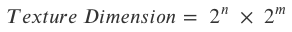
endif::[]

Where _n_ and _m_ are positive integers (_n_, _m_ ≥ 1).

===== Texture Mipmap

include::requirements/REQ040.adoc[]

//latexmath:[\[Number\ of\ Mipmaps = \max\left( n,m \right) + 1\]]

ifndef::backend-pdf[]
\[Number\ of\ Mipmaps = \max\left( n,m \right) + 1\]
endif::[]
ifdef::backend-pdf[]
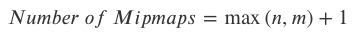
endif::[]

For instance, a texture whose dimension is 2^3^ × 2^4^ has a total of 5 mipmaps.

===== Texture Size

The naming conventions of all model textures are described in Chapter 3 Volume 1: OGC CDB Core Standard: Model and Physical Data Store Structure. For texture file whose name uses the W field, the value of the field is a power of 2 representing the largest dimension of a (possibly rectangular) texture.

//latexmath:[\[Texture\ Size = 2^{W}\ \]]

ifndef::backend-pdf[]
\[Texture\ Size = 2^{W}\ \]
endif::[]
ifdef::backend-pdf[]
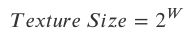
endif::[]

Where _W_ is a non-negative integer (_W_ ≥ 0).

===== Texel Size

For texture file whose name uses the L field, the value of the field is related to the size of the texels in accordance to Section 3.3.6 Table 3‑1: CDB LOD vs. Model Resolution (Volume 1: OGC CDB Core Standard: Model and Physical Data Store Structure).

==== Texture Palette

The OpenFlight Texture Palette record stores the names of all textures that are possibly referenced by the model; that includes all base and subordinate textures (i.e., all skins and all interchangeable textures). Each palette entry contains the path and filename of one texture.

include::requirements/REQ041.adoc[]

Below are examples of entries in the texture palette.

===== MModel Example

In the case of a moving model, the OpenFlight file resides in the MModelGeometry directory; for instance, the M1A2 resides in

[source,txt]
----
\CDB\MModel\600_MModelGeometry\1_Platform\1_Land\225_United_States\1_Tank\1_1_225_1_1_3_0\
----

Its main texture is called M1A2 and resides in

[source,txt]
----
\CDB\MModel\601_MModelTexture\M\1\M1A2\
----

The corresponding palette entry would be

[source,txt]
----
..\..\..\..\..\..\601_MModelTexture\M\1\M1A2\D601_S005_T001_W11_M1A2.rgb
----

===== GTModel Example

In the case of a geotypical power pylon model, the OpenFlight file resides in the GTModel directory

[source,txt]
----
\CDB\GTModel\510_GTModelGeometry\A_Culture\T_Comm\040_Power_Pylon\Lxx\
----

Assuming its texture is called Pylon, it resides in

[source,txt]
----
\CDB\GTModel\511_GTModelTexture\P\Y\Pylon\
----

The corresponding palette entry would be

[source,txt]
----
..\..\..\..\..\..\511_GTModelTexture\P\Y\Pylon\D511_Sxxx_Txxx_Lxx_Pylon.rgb
----

===== GSModel Example

In the case of a geospecific model, its OpenFlight file resides in the GSModelGeometry directory. An example is

[source,txt]
----
\CDB\Tiles\_lat_\_lon_\300_GSModelGeometry\Lxx\Ux\
----

If the model refers to a geospecific texture, it resides in

[source,txt]
----
\CDB\Tiles\_lat_\_lon_\301_GSModelTexture\Lxx\Ux\
----

The corresponding palette entry would be

[source,txt]
----
..\..\..\..\301_GSModelTexture\Lxx\Ux__\latlon___D301_Sxxx_Txxx_Lxx_Ux_Rx_TNAM.rgb
----

If the model refers to a geotypical texture, it resides in

[source,txt]
----
\CDB\GTModel\511_GTModelTexture\_T_\_N_\_TNAM_
----

And the corresponding palette entry would be

[source,txt]
----
..\..\..\..\..\..\..\GTModel\511_GTModelTexture\_T_\_N_\TNAM\D511_Sxxx_Txxx_Lxx_TNAM.rgb
----

===== T2DModel Example

In the case of a tiled 2D model, its OpenFlight file resides in the T2DModelGeometry directory. An example is

[source,txt]
----
\CDB\Tiles\_lat_\_lon_\310_T2DModelGeometry\Lxx\Ux\
----

If the model refers to a geospecific texture, it resides in

[source,txt]
----
\CDB\Tiles\_lat_\_lon_\301_GSModelTexture\Lxx\Ux\
----

The corresponding palette entry would be

[source,txt]
----
..\..\..\..\301_GSModelTexture\Lxx\Ux__\latlon___D301_Sxxx_Txxx_Lxx_Ux_Rx_TNAM.rgb
----

If the model refers to a geotypical texture, it resides in

[source,txt]
----
\CDB\GTModel\501_GTModelTexture\_T_\_N_\_TNAM_
----

And the corresponding palette entry would be

[source,txt]
----
..\..\..\..\..\..\..\GTModel\501_GTModelTexture\_T_\_N_\_TNAM_\D511_Sxxx_Txxx_Lxx_TNAM.rgb
----

==== Usages

===== Model Shadow Textures

Ideally, Model shadows should be generated at runtime by the client-device from the model’s actual geometry. However, depending on the technique used by the client device, special textures called projected shadow maps may be used to cast shadows from Models.

When the projected shadow map technique is used, special object nodes are used to store the shadow polygons.

====== Shadow Geometry

include::requirements/REQ042.adoc[]

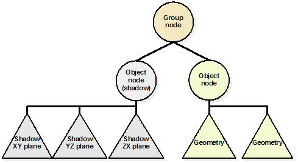
[#img_UsingShadowPolygons,reftext='{figure-caption} {counter:figure-num}']
*_{figure-caption}{counter:figure-num}. Using Shadow Polygons_*

Several object nodes can be used to store several polygons all textured with projected shadow maps. It may be desirable to also create separate shadow maps for major articulated parts and locate these shadow objects just under their corresponding DOF nodes.

====== Shadow Maps

Projected shadow maps are created by applying one, two or three orthographic projections on the model (or optionally on major articulated parts of the model). Figure 6‑50: Example of a Shadow Map in the XY Plane shows one example of a shadow map of an aircraft in the XY plane. Similar maps can also be produced for the YZ and ZX planes.

[[_Ref244589825]]
[#img_ExampleofaShadowMapintheXYPlane,reftext='{figure-caption} {counter:figure-num}']
*_{figure-caption}{counter:figure-num}. Example of a Shadow Map in the XY Plane_*

A projected shadow map is a monochrome (single-component) texture without transparency. It represents the mask to cut out the contour of the model. In theory, a black and white texture would be enough; however, shades of gray are permitted to represent semi-transparent surfaces that could be present on the model. In any case, a value of 0 (black) means the model does not block the passage of lights. The opposite value, 1 (white), indicates the model completely obstruct the light.

Because the shape of the model may change with damage states, each model state should have its own set of projected shadow maps. Section 6.9.2.2 describes damage states.

Shadow maps are general base textures. Their Texture Kind is 007 and their Texture Index is a sequence number when several shadow maps exist for the same Model.

To illustrate the naming convention, assume the shadow map from Figure 6‑50: Example of a Shadow Map in the XY Plane, is called “aircraft”. According to Section 3.5.2.1, MModelTexture Naming Convention, and Section 5.5, MModel Library Datasets, the resulting file name would be:

D601_S007_T001_Wnn_aircraft.rgb

The value Wnn represents the texture size, 2^nn^, and is explained in Section 6.13.3.2, Texture Size.

Note that if a client-device generates shadows on its own, without the support of pre-computed projected shadow maps, it can ignore all OpenFlight object nodes whose Shadow flags are set as well as all textures associated with these nodes.

===== Model Skin Textures

Models skins are base textures that correspond to one or more moving models paint schemes or one or more time-of-year representations of the cultural feature.

For instance, the same tank can be painted with several different colors to match various areas of operation. Below are two examples of the same tank, the M1A2 Abrams, painted for operation in a desert area (Figure 6‑51) or in a forest area (Figure 6‑52).

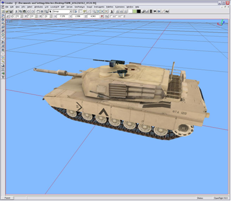
[#img_TheM1A2AbramswithDesertCamouflage,reftext='{figure-caption} {counter:figure-num}']
*_{figure-caption}{counter:figure-num}. The M1A2 Abrams with Desert Camouflage_*

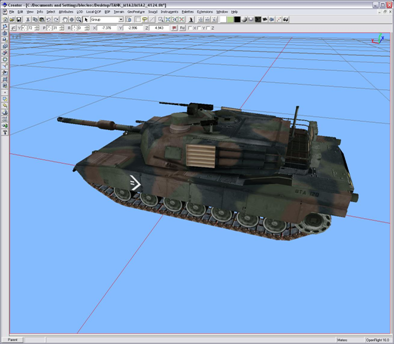
[#img_TheM1A2AbramswithaForestCamouflage,reftext='{figure-caption} {counter:figure-num}']
*_{figure-caption}{counter:figure-num}. The M1A2 Abrams with a Forest Camouflage_*

The two different textures for this tank qualify for use as skins since they have been designed in such a way that they can be exchanged for one another without affecting their mapping on the affected polygons.

include::requirements/REQ043.adoc[]

OpenFlight itself does not provide an explicit mechanism to change the base texture assigned to faces. In fact, OpenFlight supports a single base texture per face record. The other textures that can be added to a face are called layers and none of them is a replacement for the base texture.

In order to have several skins for a single model, the CDB standard provides the mechanism defined in 6.14.5.2, Texture Switch. The enumeration values for each skin can be found in Annex O, Volume 2: OGC CDB Core: Model and Physical Structure Annexes.

The M1A2 used in the above examples has two skins. Each skin is made of a single texture that happens to be a mosaic of all the individual textures used by the model. Figure 6‑53: M1A2 Desert Skin Mosaic below shows one of the M1A2 skins.

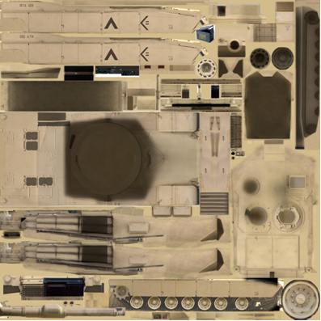
[#img_M1A2DesertSkinMosaic,reftext='{figure-caption} {counter:figure-num}']
*_{figure-caption}{counter:figure-num}. M1A2 Desert Skin Mosaic_*

The following texture kinds implement the concept of model skins:

* Kind 002 – Monthly Representation
* Kind 009 – Quarterly Representation
* Kind 004 – Uniform Paint Scheme
* Kind 005 – Camouflage Paint Scheme
* Kind 006 – Airline Paint Scheme

Paint schemes apply to moving models only. Annex O lists available paint schemes (Volume 2: OGC CDB Core: Model and Physical Structure Annexes).

Time-Of-Year representations are appropriate for cultural features. A good example is the case of leafy trees. Depending on the hemisphere and the latitude, several textures represent leafy trees at different stages during the year.

All texture kinds listed above are mutually exclusive; also, all instances of textures of a kind are mutually exclusive. Since all texture kinds above are base textures, and because only one base texture can be active at any one time on a face of a model, it follows that only one skin can be active at a time.

===== Model Night Maps

Night maps fall under the category of subordinate textures. Night and light maps (see next section) are both used at night to represent how interior and exterior light sources change the appearance of a Model. It is possible for a Model to have both a night and a light map, or just a light map. However, it is not possible to have a night map alone.

Simulator client-devices invoke a night map when the (simulated) light sources located inside the model need to change its appearance at night. This is the case when the interior light sources shine through openings like windows and portholes. To simulate the effect of lights emitted through these openings, a night map is created; it adds these bright window details normally missing from the base day texture.

The creation of a night map for models is left to the discretion of the modeler. Creating additional geometry for the windows and changing the material associated with the polygons to incorporate an emissive component can also produce a lighting effect similar to night maps. However, this approach requires additional (unnecessary) model geometry that adds additional computational load in the client-devices. For this reason, the use of night maps is recommended.

Light maps differ from night maps in that they combine the effect of exterior lighting with interior lights. A light map acts as a (colored) filter to mask portions of the model that are no longer visible at night when no ambient light exists.

A Model may have a relatively different aspect at night. This difference comes from two changes in the environment. The ambient illumination provided by sunlight is totally absent at night; only the moon and man-made light sources affect the appearance of objects. When present, the moon provides only a modest level of illumination when compared to the sun. In addition, the model itself might have internal lights turned on that are not modeled in day version of the texture but that do affect its appearance at night.

To illustrate these differences, imagine a building as seen during the day. No light seems to come out of its windows because the average daytime sunlight overwhelms any man-made lighting (internal to the building and coming out of the windows). At night, the outside walls of the building have not changed but light is now emanating from the windows. This is an important change that requires a modification to the texture used to represent the walls.

Another example of the use of a night map is the case of an aircraft flying at night. During daytime, the aircraft windows look dark while at night, light comes from the inside and the windows appear white.

Night maps are used to add details to base textures; details that are not visible during the day and that become visible at night. Therefore, a night map is not a replacement for the base texture. It is used in conjunction with the base texture.

The next figures illustrate the purpose of night maps.

Figure 6‑54: Base Texture is the base texture used in modeling a commercial aircraft, the Airbus 330, during the day. Notice that portholes are represented by dark rounded rectangles because the lights in the cabin are off. The same is true for the cockpit windows located in the bottom right of the texture.

[#img_BaseTexture,reftext='{figure-caption} {counter:figure-num}']
*_{figure-caption}{counter:figure-num}. BaseTexture_*

Figure 6‑55: Night Map, is the model’s corresponding night map and shows the same portholes but this time brighter to reflect the fact that cabin lights are on. This time, notice the appearance of the cockpit windows as well as the presence of colors in them. Remember that this texture is used to add details that may be missing from the base texture.

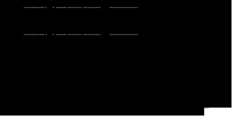
[#img_NightMap,reftext='{figure-caption} {counter:figure-num}']
*_{figure-caption}{counter:figure-num}. Night Map_*

include::requirements/REQ044.adoc[]

====== Night Map Generation

A night map is mapped on top of its base texture using a Decal texture environment. Since a night map is a subordinate texture, it is mapped on polygons using an OpenFlight multitexture record.

include::requirements/REQ045.adoc[]

The night map alpha channel is in fact a mask identifying which portions of the base texture are replaced by the night map. Accordingly, the alpha channel contains a value of 0 when the corresponding texel of the base texture is left intact. However, the alpha channel will contain the value 1 when the corresponding texel of the base texture is replaced by the equivalent night map texel. Overall, the Decal environment mapping applies the following transformation to the base texture.

//Useful resource https://en.wikibooks.org/wiki/LaTeX/Mathematics

[.text-center]
ifndef::backend-pdf[]
\[C = C_b \cdot (1-A_n)+C_n \cdot A_n\]
//latexmath:[\[C = C_b \cdot (1-A_n)+C_n \cdot A_n\]]
endif::[]
ifdef::backend-pdf[]
image::math/ccb.png[align=center]
endif::[]

[.text-center]
where…

[.text-center]
_C~b~_ is the color component (or intensity) of the base texture
[.text-center]
_C~n~_ is the color component (or intensity) of the night map
[.text-center]
_A~n~_ is the alpha component of the night map

Since the values found in the night map alpha channel are limited to 0 and 1, the resulting color will either be the one found in the base texture when _A~n~_ is 0 or the one found in the night map when _A~n~_ is 1.

===== Model Light Maps

Light maps also fall under the category of subordinate textures. Night maps and light maps are both used at night to represent how interior and exterior light sources change the appearance of a Model. It is possible for a Model to have both a night map and a light map, or just a light map. However, it is not possible to have a night map alone.

Light maps differ from night maps in that they combine the effect of exterior lighting with interior lights. A light map acts as a (colored) filter to mask portions of the model that are no longer visible at night when no ambient light exists.

A light map is used when active light sources are located on the outside of the model. This technique is used to simulate the appearance of a model when lit by local spotlights. For instance, spotlights may be used to illuminate a building at night. The light map provides the illumination pattern that represents the spotlight illumination on the building. The technique provides a convenient mean to produce interesting and entirely predictable lighting effects without resorting to computationally intensive local light sources. Their effects are already incorporated into special textures called light maps.

A light map also contains a mask related to the night map when present. Remember that a light map is a filter (a mask) to retain the detail associated with the base texture and its optional night map.

As opposed to a night map, a light map does not have constraints. More specifically:

A light map does not need to be of the same size as its base texture.

A light map has its own UV mapping.

A light map can be an intensity map or an RGB image.

Note that when light sources are modeled with light maps, they only affect the model onto which they are applied.

The next set of figures illustrates how light maps contribute to the lighting of a model. Note that a light map is not applied directly to the model base texture. The light map is first modified to take into account the ambient lighting, and then the resulting lighting is applied to the model.

Figure 6‑56: Light Map, is the light map matching the base texture in Figure 6‑54: Base Texture. Notice that it combines light lobes representing external light spots with the mask associated with internal light sources from the night map. This mask is used to key in details that stay visible at night.

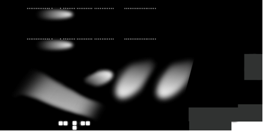
[#img_LightMap,reftext='{figure-caption} {counter:figure-num}']
*_{figure-caption}{counter:figure-num}. Light Map_*

Figure 6‑57: Combined Effect of Base Textures and Light Maps, shows on the actual aircraft the result of applying the light map from Figure 6‑56: Light Map to the base texture from Figure 6‑54: Base Texture. Notice that portholes and cockpit windows are still dark since the base texture has not been modified by the night map yet.

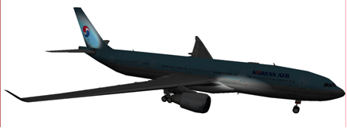
[#img_CombinedEffectofBaseTexturesandLightMaps,reftext='{figure-caption} {counter:figure-num}']
*_{figure-caption}{counter:figure-num}. Combined Effect of Base Textures and Light Maps_*

Figure 6‑58: Combined Effect of Night and Light Maps, shows the result of adding the night map to the base texture and then applying the light map. This time, we can clearly see the lights coming through portholes and cockpit windows.

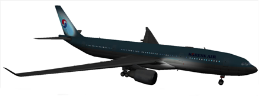
[#img_CombinedEffectofNightandLightMaps,reftext='{figure-caption} {counter:figure-num}']
*_{figure-caption}{counter:figure-num}. Combined Effect of Night and Light Maps_*

====== How and When to Use Night Maps and Light Maps

The CDB standard recommends the use of night maps to represent lights that are internal to the model; this permits the client device to control the appearance of the model with internal lights on or off. This condition is usually true at night, hence the name of the texture.

Similarly, the CDB standard recommends the use of light maps to represent the effect of lights that are external to the model; this permits the client-device to control the appearance of the model with external spotlights on or off.

Note that night and light maps can be applied to any of the skins since skins are base textures.

====== How and When Not to Use Light Maps

A client device may discard light maps if the effect of external lights is internally generated by its GPU. It can be envisioned that future development of specialized hardware – such as graphics processor unit – will allow more of the lighting effects to be generated in real-time. When this time comes, artificial textures generated off-line such as light maps will become obsolete.

===== Model Tangent-space Normal Maps

A normal map is an RGB texture (without an alpha channel) where the normal to the surface is encoded in the Red, Green, and Blue channels. The normal (i, j, k) values are encoded in the following manner into the 8-bit value of each channel:

[source,txt]
----
R [0, 255] = i [-1.0, +1.0]

G [0, 255] = j [-1.0, +1.0]

B [0, 255] = k [-1.0, +1.0]
----

The mapping is identical on all channels; the range of all possible 8-bit values (0, 255) is mapped linearly to the range of floating point values -1.0 to +1.0. This mapping provides a resolution of 2/255 or 0.0078.

In addition, the reader should note that the floating-point value 0.0 has no exact integer equivalent footnote:[The conventional OpenGL mapping specifies that -1 and 1 can be represented exactly, but 0 can not.]. Here, the closest value to 0.0 is approximately ±0.0039 and is obtained when the channel contains 127 or 128.

Besides this particular encoding of the normal into the RGB channels, a normal map has all the other attributes of a standard RGB texture whose format is defined in in the SGI Image File Format footnote:[ftp://ftp.sgi.com/sgi/graphics/grafica/sgiimage.html].

In the industry, there are at least two types of Normal Map: object-space normal map, and tangent-space normal map. Both types have their pros and cons. The CDB standard opts for tangent-space normal map. A sample is shown here.

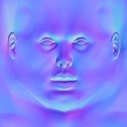
[#img_NormalMapSample,reftext='{figure-caption} {counter:figure-num}']
*_{figure-caption}{counter:figure-num}. Normal Map Sample_*

Typically, the normal points away from the surface, and not toward the underlying surface. For this reason, the value of the k-component of the normal is positive, most of the time, resulting in a bluish tint of the map. A negative k-component could indicate the presence of a cliff with an overhang, for instance.

===== Model Detail Texture Maps

A detail texture map is 1- or 3-component (aka channel) texture where each texel is represented as an 8-bit unsigned integer. A detail texture exhibits two important properties; it has a neutral luminance (intensity) and chrominance (color). This is achieved by applying the following constraints:

The 8-bit unsigned value of each texel is scaled to a floating point value in the range -1.0 to 1.0

The average value of an individual component is always 0.0

The Detail texture is mapped on the underlying surface through a simple addition operation

The net effect of applying a Detail Texture Map is to highlight (> 0) or darken (< 0) fragment details on the underlying surface. When using a single component detail texture map, only the intensity of the resulting image is affected; when using a 3-component detail texture map, the color is also varied.

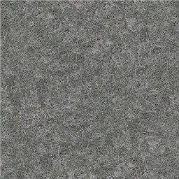
[#img_DetailTextureMapSample,reftext='{figure-caption} {counter:figure-num}']
*_{figure-caption}{counter:figure-num}. Detail Texture Map Sample_*

Recall that a detail texture map is a mean of adding high-frequency (spatial) details to a rather low-frequency image.

===== Model Contaminant and Skid Mark Textures

Historically, Image Generators of civil aviation simulators provided the means for flight instructors to control the appearance of airport runways, taxiways, and roads with various surface contaminants. To this end, the CDB provides a set of standardized Model Contaminant and Skid Mark Textures that are commonly used in flight simulators and listed in Annex O, Volume 1.1: OGC CDB Core: Model and Physical Structure: Informative Annexes. These textures are typically four-component (R, G, B, alpha) textures that act as an overlay to airport surfaces.

===== Model Cubic Reflection Maps

Reflection mapping (aka environment mapping) is an efficient image-based lighting technique for approximating the appearance of a reflective surface by means of a precomputed texture image. The texture is used to store the image of the distant environment surrounding the rendered object.

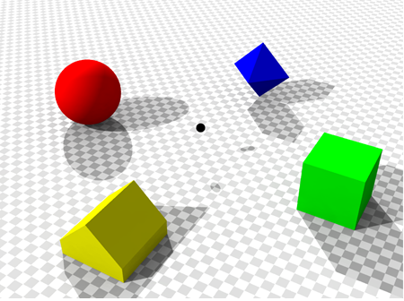
[#img_EnvironmentUsedtoProduceReflectionMap,reftext='{figure-caption} {counter:figure-num}']
*_{figure-caption}{counter:figure-num}. Environment Used to Produce Reflection Map_*

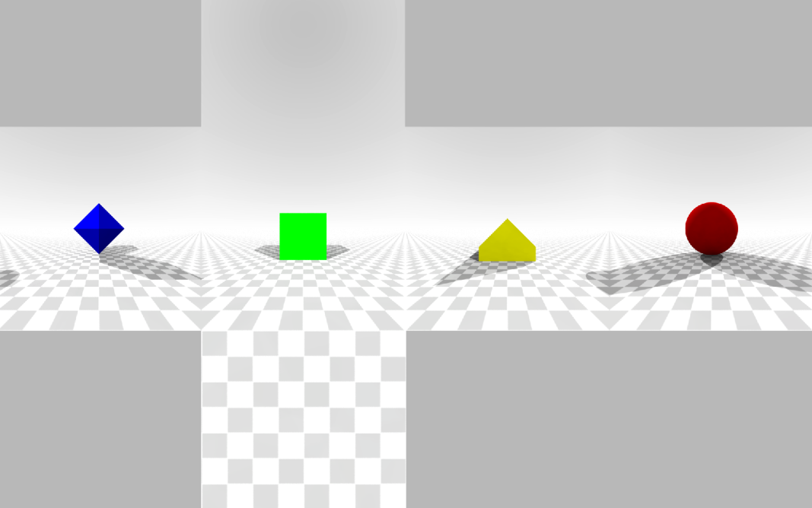
[#img_ResultingReflectionMap,reftext='{figure-caption} {counter:figure-num}']
*_{figure-caption}{counter:figure-num}. Resulting Reflection Map_*

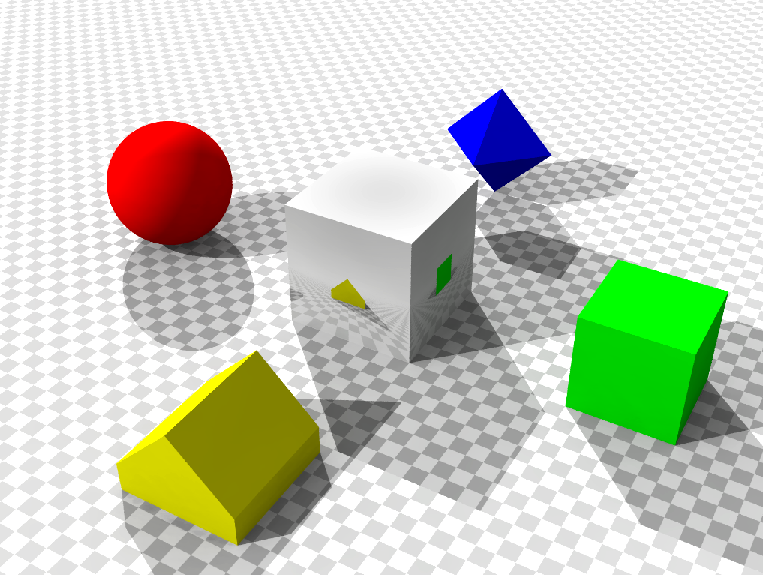
[#img_RenderedReflectionMapontoReflectingCube,reftext='{figure-caption} {counter:figure-num}']
*_{figure-caption}{counter:figure-num}. Rendered Reflection Map onto Reflecting Cube_*

The CDB standard assumes that the surrounding environment is stored using a cubic mapping approach. In this technique, the environment is projected onto the six faces of a cube and stored as six square textures or unfolded into six square regions of a single texture. The reflection mapping approach is more efficient than the classical ray tracing approach of computing the exact reflection by tracing a ray and following its optical path. The reflection color used in the shading computation at a pixel is determined by calculating the reflection vector at the point on the object and mapping it to the texel in the environment map. This technique often produces results that are superficially similar to those generated by raytracing, but is less computationally expensive since the radiance value of the reflection comes from calculating the angles of incidence and reflection, followed by a texture lookup, rather than followed by tracing a ray against the scene geometry and computing the radiance of the ray, simplifying the GPU workload.

Note however that in most circumstances, a mapped reflection is only an approximation of the real reflection. Environment mapping relies on four assumptions:

* All radiance incident upon the _statically-positioned_ object being shaded comes from an _infinite distance_. When this is not the case, then a) the reflection of nearby geometry appears in the wrong place on the reflected object, and b) no parallax is seen in the reflection.
* The object being shaded is _convex_, such that it contains no self-interreflections. When this is not the case the object does not appear in the reflection; only the environment does.
* The environment map is _valid for the location_ for which it was generated.
* The environment is _static_.

===== Model Gloss Maps

A gloss map is a texture that describes whether a surface is matte or gloss. The texture is used to modulate specular highlights in the same way the material shininess does. A gloss map is stored as an 8-bit single channel texture (a grey-scale image) where texels are mapped to the range 0.0 (matte) to 1.0 (glossy). The values in the gloss map play the same role as the single shininess value found in the OpenFlight material assigned to a polygon. In this way, the gloss map can effectively modulate the specularity on a per-pixel basis. Note that if the material applied to the surface has no specular component, then the gloss map has no effect.

===== Model Material Textures

Material textures fall under the category of subordinate textures. They are mapped to Models the same way as any other textures. As such, the surfaces these textures are mapped to possess their own set of UV mapping.

A material texture tells the interested client devices (e.g., FLIR, CGF) what the underlying surface is made of. For this reason, a material texture is not at all related to a base texture. The two are completely independent and exist separately. A material texture does not require that a base texture be applied to the model. In fact, it is perfectly possible to create a Model that does not use texture except for a single material texture describing its various materials.

The <Material> tag presented in section 6.5.3 is a high level mean of providing material information about the geometry of a model. With the use of a material texture, the modeler can provide highly detailed material information about the same model.

In short, the <Material> tag supports a polygon-based approach of sensor client devices such as FLIR, NVG, and RADAR. A Material texture is a texel-based approach supporting an implementation of such client devices with a much higher resolution.

In the case of the Raster Material dataset (dataset code 005) applied onto the terrain, it is conceivable that multiple layers and mixtures of materials are required to represent the rich variety of materials found on the earth surface. However, for Models, a single material layer is probably adequate for the vast majority of man-made objects.

===== Model Heat Map Texture

A Heat Map texture describes the temperature radiated by the surface described by its base texture (ex. engine). A heat map is stored as an 8-bit single channel texture (a grey-scale image) where texels are mapped to the range 0.0 (ambient temperature) to 1.0 (hot). This texture can be used to simulate IR sensor effects.

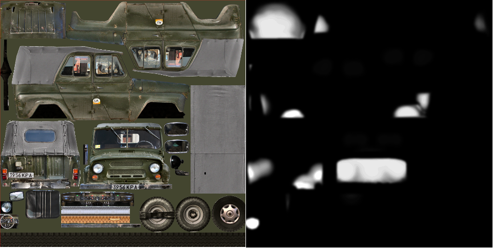
[#img_HeatMapSideBySide,reftext='{figure-caption} {counter:figure-num}']
*_{figure-caption}{counter:figure-num}. Base with corresponding heap map texture_*

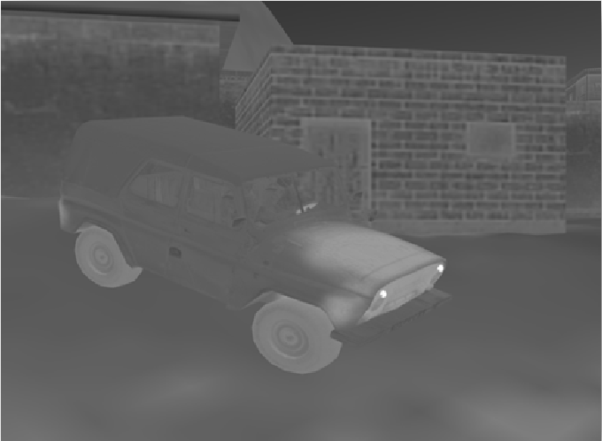
[#img_RenderedHeatMapinasimulatedIRsensor,reftext='{figure-caption} {counter:figure-num}']
*_{figure-caption}{counter:figure-num}. Rendered Heat Map in a simulated IR sensor_*

===== Model Decal Texture

A decal texture is overlayed on top of the base texture to provide extra detail (sticker, crack, etc.)

===== Model Mask Texture

A mask texture is used to control the transparancy of its base texture, independently of its mapping. The mask texture will multiply the transparency of the base texture. A mask texture is stored as an 8-bit single channel texture (a grey-scale image) where texels are mapped to the range 0.0 (0-transparent) to 1.0 (1-opaque). 

Below is an example of a mask texture that can be used to feather the hard edges from a base texture.

image::images/Mask.png[image,width=475,height=359]
[#img_Mask,reftext='{figure-caption} {counter:figure-num}']
*_{figure-caption}{counter:figure-num}. Mask Texture_*

===== Model ORM Texture

An ORM texture is used for Physically Based Rendering (PBR) effects. An ORM texture is a 3 channel packed texture defining the Ambient Occlusion (O), Roughness \(R) and Metalness (M) of the surface.

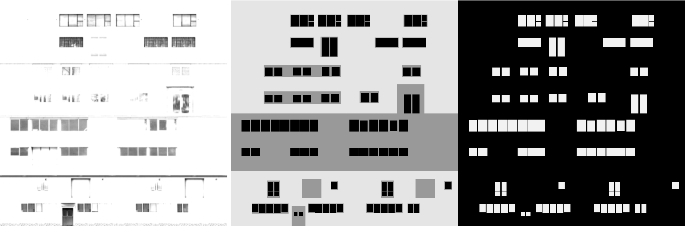
[#img_ORM,reftext='{figure-caption} {counter:figure-num}']
*_{figure-caption}{counter:figure-num}. Three channels viewed indepdendently - Ambient Occlusion(AO), Roughness\(R) and Metalness(M)_*