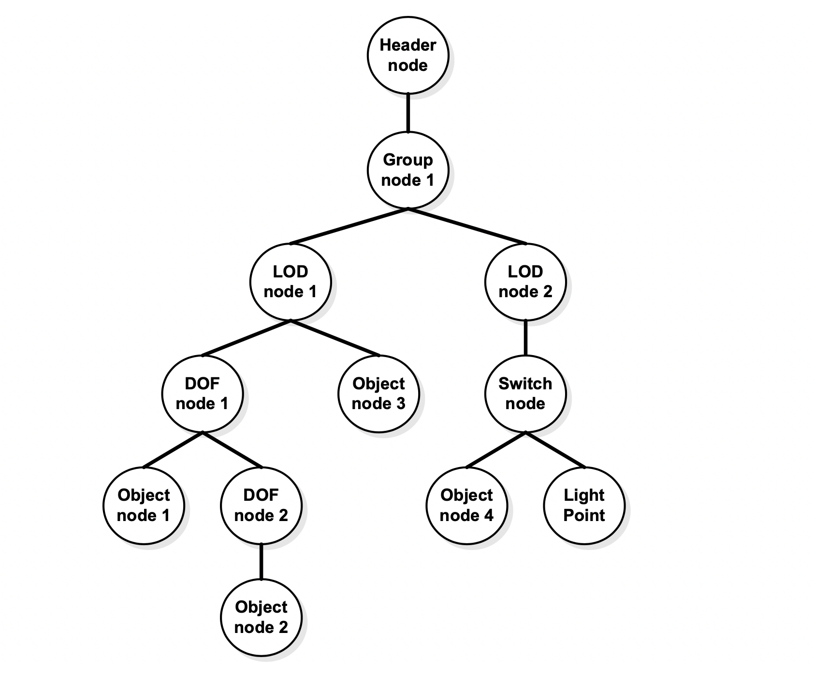
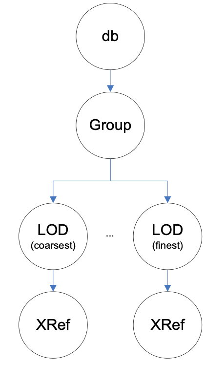

=== OpenFlight Model Tree Structure

The internal structure of OpenFlight models is a tree structure that consists of nodes having child nodes as well as sibling nodes footnote:[In Appendix C, the section called _Database Hierarchy_ explains in details how OpenFlight organizes its graph.]. This type of tree structure is called a directed acyclic graph, or DAG. The general tree structure of a Model resembles that of Figure 6‑1: General OpenFlight Tree Structure.

[#img_GeneralOpenFlightTreeStructure,reftext='{figure-caption} {counter:figure-num}']
*_{figure-caption}{counter:figure-num}. General OpenFlight Tree Structure_*

The CDB standard uses Group Nodes to arrange Models in a hierarchical manner. This way of organizing models helps identify components of interest.

The CDB standard refers to a number of OpenFlight nodes to store meaningful data for simulation client-devices. For a complete list of nodes supported by the CDB standard, see Appendix C. The nodes listed here are the ones referred to by one or more CDB conventions.

An example of an ancillary record is the OpenFlight comment record. A comment record may appear once, anywhere after a node’s primary record. The CDB standard relies on comment records to extend the definition of OpenFlight nodes. Instead of using the Extension Record to create new primary and ancillary records, the CDB standard uses comments to store the extra attributes required by the specialization of existing OpenFlight nodes footnote:[CDB-compliant readers must ignore all OpenFlight extension records.]. Comment records were chosen over OpenFlight extensions in order to minimize any changes to the Creator tool or the need to develop a plug-in to Creator. Using this approach, anybody can create CDB-compliant models using a plain version of Creator. Nevertheless, the development of Creator CDB plug-ins would improve modeler’s efficiency. Such plug-ins could, for instance, offer a menu-based GUI to allow modelers to enter and edit CDB comments, while ensuring that syntax and conventions are fully adhered to.

The text contained in the comment record is formatted using the XML notation.

include::requirements/requirements_class01.adoc[]

==== CDB Model Tree Structure

Based on Figure 6‑1 above, the internal structure of CDB Models resemble this one:

[#img_InternalStructureofCDBModels,reftext='{figure-caption} {counter:figure-num}']
*_{figure-caption}{counter:figure-num}. Internal Structure of CDB Models_*

include::requirements/REQ002.adoc[]

==== T2DModel Tree Structure

A T2DModel being a collection of 2DModels, each individual 2DModel occupies its own subtree of the graph. The general structure of a T2DModel is as follows:

[#img_InternalStructureofT2DModels,reftext='{figure-caption} {counter:figure-num}']
*_{figure-caption}{counter:figure-num}. Internal Structure of T2DModels_*

include::requirements/REQ003.adoc[]

A 2DModel is comprised of multiple layers; the layer number is expressed by the group’s relative priority (section 6.3.4). Each layer has an optional LOD node followed by a fixed hierarchy of regular OpenFlight Object, Face, and Mesh nodes.

===== Restrictions

T2DModels being an alternate representation of the terrain and its imagery and materials, a number of restrictions are necessary to ensure client devices can consume the dataset efficiently.

include::requirements/REQ004.adoc[]

All Face and Mesh nodes share exactly the same set of graphic attributes (color, textures, material, and other flags). Stated differently, the Face and Mesh nodes provide the shape of the layer while the Object node controls its appearance.

Subfaces are not permitted because coplanar geometry is implemented through layers.

===== Node Attributes

include::requirements/REQ005.adoc[]

==== The Use of Node Names

Although the CDB standard defines naming conventions for objects stored in an OpenFlight file, the standard does not constrain the OpenFlight node names themselves. Instead, the CDB standard defines names that are assigned via XML tags stored in the comment record.

The following question arises, “Why not establish a set of CDB conventions around node names?” The answer lies primarily around constraints imposed by tools used to edit/create OpenFlight files. Tools such as Creator require unique node names throughout the OpenFlight file. The OpenFlight format specification itself does not state that node names must be unique; however, a tool such as Creator prevents the modeler from entering the same node name twice.

To circumvent this limitation, the CDB standard provides naming conventions through XML tags inserted in the comment record following a node’s primary record. This way of doing things leaves modelers with the needed freedom in naming nodes. The CDB standard defines how to organize a model; all extra object attributes that do not fit in the current OpenFlight records are stored in the comment record, including object names.

Here is an example of XML tags stored in the comment record for a Group Node.

[#SampleXMLTagUsedinaCommentRecord,reftext='Table 6-1']
*Table 6-1: Sample XML Tag Used in a Comment Record*

[source,xml]
------
<CDB:Zone

name = "zone name"

/>
------

All XML tags defined by the CDB standard belong to a single XML namespace that is appropriately named CDB footnote:[The syntax to specify a XML namespace is <ns:element> where ns is the namespace and element is the XML element name (or simply tag).].

==== Model Master File

A Model Master file is an OpenFlight file that contains only external references to other OpenFlight files. The purpose of the master file is to ensure a Model is seen as a single “object” even though its constituents are stored in separate files. The use of a model master file provides a convenient means for modelers to reference all of the constituent files that make up the model. There is no other purpose associated to the master file.

The concept of a Model Master file is used in a single case, to regroup all representations (all LODs) of a geotypical model into a single OpenFlight file. However, the concept applies to all types of CDB Models. The concept can also be used to regroup a model’s shell with its interior. For this reason, expect new usage of the Model master file in future version of the Standard.

The master file is useful in two circumstances: when modelers create or edit Models, and when client devices want to discover at once all constituents of Models.

For modelers, it is useful (if not required) to edit a model using a single source file to present a coherent view of the model as a whole. For this reason, a master file with a set of LOD-XRef nodes is perfect to assemble and present a unified view of the model to edit.

Figure 6‑4: Typical Structure of a Model Master File presents the general structure of a master file.

[#img_TypicalStructureofModelMasterFile,reftext='{figure-caption} {counter:figure-num}']
*_{figure-caption}{counter:figure-num}. Typical Structure of Model Master File_*

The value found in the Significant Size field of the above LOD nodes matches the values found in Table 3‑1 of Volume 1 CDB Core Standard: CDB LOD vs. Model Resolution. The next section provides details on XRef nodes themselves.

==== Referencing Other OpenFlight Files

include::requirements/REQ006.adoc[]

The XRef node (and its External Reference record) supports a number of options: Override flags, View-As-Bounding-Box flag, and Target Node Name. The CDB standard supports none of these options.

Here are two cases to illustrate the use of XRef nodes.

===== Models Straddling Multiple Files

In the case of GTModels, GSModels, and MModels, the OpenFlight geometry can straddle multiple files. It could be seen in a moving model (e.g., a helicopter) whose pilot could be stored in a separate file. In that case, the file containing the pilot resides in the same directory as the file containing the helicopter itself. The helicopter would be stored in file 1:

[source,txt]
----
\CDB\MModel\600_MModelGeometry\1_Platform\2_Air\225_United_States\21_Utility_Helo\1_2_225_21_x_x_x\D600_S001_T001_1_2_225_21_x_x_x.flt
----

The pilot would be stored in file 2:

[source,txt]
----
\CDB\MModel\600_MModelGeometry\1_Platform\2_Air\225_United_States\21_Utility_Helo\1_2_225_21_x_x_x\D600_S001_T002_1_2_225_21_x_x_x.flt
----

The XRef node in file 1 would contain the following string:

[source,txt]
----
.\D600_S001_T002_1_2_225_21_x_x_x.flt
----

where 1_2_225_21_x_x_x is the complete DIS code of the helicopter.

===== Models with Multiple Model-LODs

This is the case of the master file of a geotypical model. The master file (known as the GTModelGeometry Entry File) refers to all levels of details of the geometry files that reside in different sub-directories. Assuming a geotypical model representing a gothic church, the master file itself would reside in a directory such as this one:

[source,txt]
----
\CDB\GTModel\500_GTModelGeometry\A_Culture\L_Misc_Feature\015_Building\D500_S001_T001_AL015_050_Church-Gothic.flt
----

The targets of the XRef nodes would all reside in directories such as these:

[source,txt]
----
\CDB\GTModel\500_GTModelGeometry\A_Culture\L_Misc_Feature\015_Building\Lnn\D510_S001_T001_Lnn_AL015_050_Church-Gothic.flt
----

The resulting strings to use in the XRef nodes in the master file would resemble this:

[source,txt]
----
.\Lnn\D510_S001_T001_Lnn_AL015_050_Church-Gothic.flt
----

where Lnn corresponds to the LOD the XRef file resides in.
