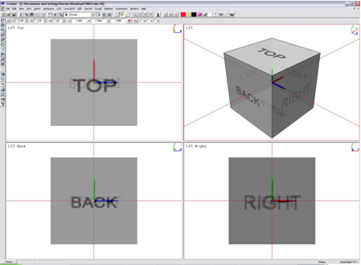
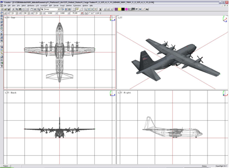
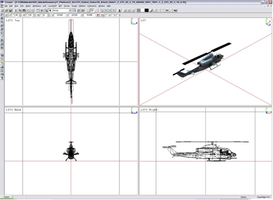
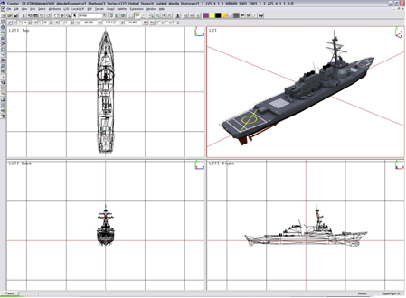
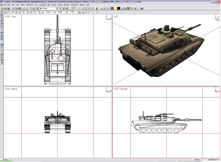
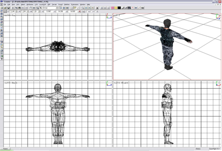
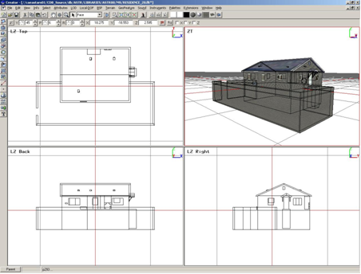
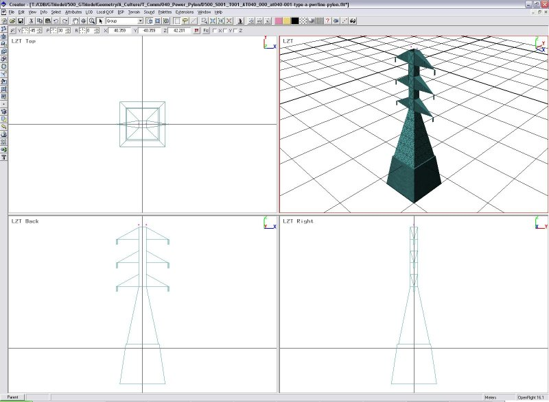

=== Modeling Conventions

include::requirements/requirements_class02.adoc[]

==== Model Coordinate Systems

include::requirements/REQ007.adoc[]

<<img_ModelCoordinateSystem>>: Model Coordinate System is a screenshot footnote:[Most figures in this chapter are actual screenshots from Creator.] of Creator footnote:[Creator or CAD Creator is a Siemans product. Mention of Creator in the CDB standard IS NOT an endorsement of that product.] showing a CAD view of a semi-transparent cube.

[#img_ModelCoordinateSystem,reftext='{figure-caption} {counter:figure-num}']
*_{figure-caption}{counter:figure-num}. Model Coordinate System_*

===== Origin

The location of the model origin is defined in the following manner:

include::requirements/REQ008.adoc[]

The following examples will illustrate the above two rules.

Fixed wing aircraft – A KC-130 Hercules is illustrated below with its landing gears fully extended.

[#img_CoordinateSystemAircraft,reftext='{figure-caption} {counter:figure-num}']
*_{figure-caption}{counter:figure-num}. Coordinate System - Aircraft_*

Helicopter – An AH-1W Super Cobra is shown below. Note that no equipment is mounted on its winglets.

[#img_CoordinateSystemHelicopter,reftext='{figure-caption} {counter:figure-num}']
*_{figure-caption}{counter:figure-num}. Coordinate System - Helicopter_*

Surface ship – Shown below is the Arleigh Burke DDG-51 guided missile destroyer. Note how the XY plane defines the waterline.

[#img_CoordinateSystemShip,reftext='{figure-caption} {counter:figure-num}']
*_{figure-caption}{counter:figure-num}. Coordinate System - Ship_*

Land Platform – The M1A2 Abrams is a main battle tank shown here with its desert skin.

[#img_CoordinateSystemGroundBasedModel,reftext='{figure-caption} {counter:figure-num}']
*_{figure-caption}{counter:figure-num}. Coordinate System - Ground Based Model_*

Lifeform – A human lifeform (a soldier) is presented here.

[#img_CoordianteSystemLifeform,reftext='{figure-caption} {counter:figure-num}']
*_{figure-caption}{counter:figure-num}. Coordiante System - Lifeform_*

Cultural Feature – When a Model represents a cultural feature, the origin is the point of insertion of the model into the ground. In general, the XY plane (at Z = 0) delimits the basement from the first floor.

[#img_CoordinateSystemCulturalFeature,reftext='{figure-caption} {counter:figure-num}']
*_{figure-caption}{counter:figure-num}. Coordinate System Cultural Feature_*

Power Pylon – In the case of an electricity pylon, the front (and back) of the model is aligned with the general direction of the attached wires.

[#img_CoordinateSystemPowerPylon,reftext='{figure-caption} {counter:figure-num}']
*_{figure-caption}{counter:figure-num}. Coordinate System - Power Pylon_*

===== Local Coordinate Systems

Most OpenFlight nodes can have a local transformation used to create a local coordinate system. The origin and orientation of this coordinate system are expressed by a single transformation matrix.

When a transformation is specified for a node’s primary record, only the matrix record (opcode 49) is considered by CDB client-devices. All other transformation records (opcode 76, 78, 79, 80, 81, 82 and 94) are discarded footnote:[Typically, these transformations are used by modeling editing tools only.].

===== Units

====== GSModels and GTModels

The MODL attribute of the GSFeature and GTFeature datasets are used to reference GSModels and GTModels. In turn, the position of GSModels and GTModels are obtained from the coordinates of each point of the associated vector data set; these coordinates are interpreted as the latitude (y), longitude (x), and elevation (z) coordinates that position the model within the CDB footnote:[The local origin of the model is translated to the (lat, long) coordinates of the point feature. The elevation component is either obtained from the point feature (AHGT=True) or obtained from the elevation of the terrain at (lat, long) coordinates of the point-feature (AHGT=False). The model’s XY plane is rotated in accordance to the feature’s AO1 attribute. The model’s Z-axis is adjusted so that it is tangential to the WGS-84 earth model.].

GSModels and GTModels are drawn to real-world dimensions using meters as their unit of measurement.

====== MModels

MModels are usually internally activated and positioned by the client-devices in response to a running simulation.

In the case of Moving Model location features, the MMDC attribute of the GTFeature dataset is used to reference a MModel. Otherwise, the MModel behaves exactly as a GTModel as described in section 6.3.1.3.1 above.

MModels are drawn to real-world dimensions using meters as their unit of measurement.

====== T2DModels

include::requirements/REQ009.adoc[]

Note however, that the file’s origin and size are implicitly defined by the tile position and the tile level-of-detail. The absolute position of each vertex is obtained by adding the vertex relative value to the tile origin.

T2DModels are used to model features that have no significant height with respect to the neighboring terrain; they are generally conformed to the terrain using the “Surface Conformal Mode” as explained in section 6.7, Model Conforming. Note that the vertices of T2DModels need not have Z-coordinate values that are always zero. For example, it is permissible to model a road lineal that is modestly elevated with respect to the neighboring terrain. Client-devices must be capable of handling T2DModels that are either perfectly surface-conformed to the terrain (all vertices have Z=0) or modestly elevated (vertices with Z>0) with respect to the terrain. Note that surface-conformed models with vertices with Z-coordinate values less than zero are, by definition, below the terrain.

===== Roll, Pitch, Yaw

include::requirements/REQ010.adoc[]

==== Geometry

include::requirements/REQ011.adoc[]

==== Roof Tagging

OpenFlight has a provision for tagging polygons that are part of a roof. The Roofline flag can be found in both the Face and Mesh records. This flag is useful to apply a geospecific texture to the roof. When the flag is set, the client-device can discard the texture referenced by the polygon and use instead the geospecific texture that appears on the terrain.

More generally, the Roofline flag is used to tag any polygon whose texture can be replaced with a geospecific texture.

==== Relative Priority

The Relative Priority field appears in four OpenFlight primary records:

[source,txt]
----
Face Record

Mesh Record

Object Record

Group Record
----

The field is required to implement layering, a method to handle coplanar geometry. By using the Relative Priority field, the modeler can construct more complex coplanar geometry than what is possible with sub-faces.

Here is the definition of the field according to OpenFlight 16.0:

_Relative priority specifies a fixed ordering of the node relative to its sibling nodes. Ordering is from left (lesser values) to right (higher values). Nodes of equal priority may be arbitrarily ordered. All nodes have an implicit (default) relative priority value of zero._

The CDB standard further restricts the use of the Relative Priority field for complex coplanar geometry as follows. Using relative priorities, the modeler defines 'n' layers of coplanar geometry. Layers are numbered from 0 to 'n-1'.

include::requirements/REQ012.adoc[]
