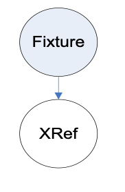

=== Model Zones

include::requirements/requirements_class03.adoc[]

The concept of a model zone is of the utmost importance when creating models, particularly those used in military simulation applications.

A model zone represents a component footnote:[A dictionary of CDB Component Names is provided in Appendix F.] of interest on the Model. A model zone (as well as the component it represents) occupies a certain volume and is delimited by a bounding box. At least one simulator subsystem must be interested in a specific component to justify the creation of a corresponding zone. Examples of zones are a turret on a tank, or an engine on a platform, or an entrance door on a building, etc.

Since the model itself is of interest to the simulation, it will have at least one zone, the global zone. That will be the case for most Models used as cultural features; they will have a single zone. However, Models used as moving models will typically be subdivided into several zones.

To implement the concept of model zones, the CDB standard uses the OpenFlight Group Node. Firstly, a Group Node can have child nodes to represent its own geometry as well as other zones. Secondly, a Group Node can have a bounding volume encompassing its child nodes and that can be used to represent the volume corresponding to the zone.

==== Definition

A Model Zone is an OpenFlight Group Node with a mandatory Bounding Box and the following XML tags in the comment field.

include::requirements/REQ013.adoc[]

[#XMLTagsforZones,reftext='Table 6-2']
*Table 6-2: XML Tags for Zones*

[source,xml]
------
<CDB:Zone name="name" volume="closed|open">

... zone attributes

</CDB:Zone>
------

include::requirements/REQ014.adoc[]

Remember that if the zone exists, it is because it has its importance for at least one client device. In general, all client devices interested in a zone will use its name to identify and control it.

The volume attribute is optional and specifies whether the zone represents a closed or open volume. By default, a zone represents a closed volume.

<<table_OpenFlightRecordsforaZone>> lists the OpenFlight records required to represent a zone.

[#table_OpenFlightRecordsforaZone,reftext='Table 6-3']
*Table 6-3: OpenFlight Records for a Zone*

[cols="",align="center"]
|===
| GROUP
| MATRIX (optional)
| BOUNDING BOX (mandatory)
| COMMENT (mandatory)
|===

Note the use of the MATRIX record. It is necessary when the zone has a different position or orientation than its parent node. A zone can be thought of as a separate Model in itself. A zone has a natural orientation and its local coordinate system must indicate where their front, right, and back sides are. A zone is subject to the same convention as the model itself regarding the orientation of its coordinate system.

==== Global Zones

include::requirements/REQ015.adoc[]

Figure 6‑13 illustrates the location of the global zone in the graph hierarchy.

[#img_ModelGlobalZone,reftext='{figure-caption} {counter:figure-num}']
*_{figure-caption}{counter:figure-num}. Model Global Zone_*

The global zone contains the name of the Model contained in the OpenFlight file.

==== Zone Attributes

A Model Zone can have any number of attributes using the general mechanism described later in section 6.12, Model Attributes. However, two specific attributes are described here because of their particular relevance to the concept of Model Zone.

===== Material

The Material attribute provides an indication of the principal material the zone is made of. Since the majority of man-made models are made of one principal material as well as several less important materials, it is strongly suggested to use the Material attribute in the model global zone to specify what that principal material is.

The Material attribute is an index into the Composite Material Table located within the Model Descriptor file described in section 6.14. The value of the Material attribute is a strictly positive integer. The syntax of the XML tag is:

[source,xml]
------
<CDB:Zone>

<Material> index </Material>

</CDB:Zone>
------

The Material attribute can also be assigned to OpenFlight Object, Face, and Mesh nodes. The preferred syntax would be the following:

[source,xml]
------
<CDB:Object>

<Material> index </Material>

</CDB:Object>

<CDB:Face>

<Material> index </Material>

</CDB:Face>

<CDB:Mesh>

<Material> index </Material>

</CDB:Mesh>
------

However, for compatibility with version 3.1 and 3.0 of the CDB standard, a simplified (but deprecated) syntax is still supported for Object, Face, and Mesh nodes when the Material is the only attribute.

[source,xml]
------

index

</CDB:Material>
------

===== Temperature

When the zone has a heat source, such as an engine, it is known as a Hot Spot. The maximum temperature the zone can reach is specified using the Temperature attribute as shown here:

[#XMLTagsforHotSpots,reftext='Table 6-4']
*Table 6-4: XML Tags for Hot Spots*

[source,xml]
------
<CDB:Zone>

<Temperature> maximum temperature </Temperature>

</CDB:Zone>
------

include::requirements/REQ016.adoc[]

\CDB\Metadata\Model_Components.xml supplies a comprehensive list of zones that are candidates for hot spots. Typical hot spot names are Engine and Chimney to name only these two. Other zones that are of interest for hot spots simulation are wings leading edge and other surfaces subjected to friction.

==== Implementation Guidelines

This section provides a set of guidelines to implement the concept of model zones. The guidelines provided here are also applicable to Model Points described in section 6.6.

A zone is made of at least one Group Node.

[[_Toc187561859]]
[#img_SimpleZone,reftext='{figure-caption} {counter:figure-num}']
*_{figure-caption}{counter:figure-num}. Simple Zone_*

A zone may have an optional articulation by adding a DOF node.

image::images/image15.png[image,width=166,height=207][[_Toc187561860]]
[#img_ArticulatedZone,reftext='{figure-caption} {counter:figure-num}']
*_{figure-caption}{counter:figure-num}. Articulated Zone_*

To simplify the following diagrams, we will use a single circle to represent a zone, whether the zone is a single Group Node, or a pair of group and DOF nodes.

In general, a zone has a graphical representation as well as other child zones.

[#img_ZoneHierarchy,reftext='{figure-caption} {counter:figure-num}']
*_{figure-caption}{counter:figure-num}. Zone Hierarchy_*

The graphical representation of a zone is itself subject to several possible implementations using various OpenFlight nodes.

The simplest way to associate a graphical representation to a zone is to use an Object node with a combination of graphic primitives available in OpenFlight: polygons, triangles, quads, and meshes.

[#img_SimpleZoneGraphicalRepresentation,reftext='{figure-caption} {counter:figure-num}']
*_{figure-caption}{counter:figure-num}. Simple Zone Graphical Representation_*

The modeler is also free to use a combination of LOD and Switch nodes to control the graphical representation of a zone.

For instance, an LOD node inserted before the object node is useful to inform the client device on how significant the graphical representation is.

[#img_AdditiveLODtoControltheGraphicalRepresentation,reftext='{figure-caption} {counter:figure-num}']
*_{figure-caption}{counter:figure-num}. Additive LOD to Control the Graphical Representation_*

If the modeler wants to provide two (or more) graphical representations for a zone, he should use two (or more) LOD nodes.

[#img_ExchangeLODstoSelecttheGraphicalRepresentation,reftext='{figure-caption} {counter:figure-num}']
*_{figure-caption}{counter:figure-num}. Exchange LODs to Select the Graphical Representation_*

Levels of details are discussed in length in Section 6.8, Model Levels-of-Detail.

If the modeler has several distinct graphical representations for the zone, he is also free to use a switch node to select between these representations.

[#img_SwitchNodetoSelecttheGraphicalRepresentation,reftext='{figure-caption} {counter:figure-num}']
*_{figure-caption}{counter:figure-num}. Switch Node to Select the Graphical Representation_*

CDB Switches are discussed in depth in Sections 6.9, Model Switch Nodes.

==== Model Zone Naming

A Model Zone Node is uniquely and unambiguously identified by concatenating with backslashes (‘\’) the names of all Model Zones traversed to reach it. When sibling CDB nodes have identical names, their name is appended with a sequence number in square brackets. Nodes are numbered starting with 1. Siblings are sorted in ascending order according to their X, Y, and Z coordinates. The leftmost sibling has the smallest XYZ coordinate while the rightmost sibling node has the largest XYZ coordinate. As a result, identical sibling CDB nodes are sorted from left to right (X-axis), then back to front (Y-axis), then bottom to top (Z-axis).

The following example provides a sample of Model Zone and Model Point names that would be used for a tactical fighter aircraft; the fighter has two pylons per wing, each pylon having 3 attach points. The resulting paths to each Model Zones and Model Points are as follows:

[source,txt]
----
\Fighter

\Fighter\Wing[1]

\Fighter\Wing[1]\Pylon[1]

\Fighter\Wing[1]\Pylon[1]\Attach_Point[1]

\Fighter\Wing[1]\Pylon[1]\Attach_Point[2]

\Fighter\Wing[1]\Pylon[1]\Attach_Point[3]

\Fighter\Wing[1]\Pylon[2]

\Fighter\Wing[1]\Pylon[2]\Attach_Point[1]

\Fighter\Wing[1]\Pylon[2]\Attach_Point[2]

\Fighter\Wing[1]\Pylon[2]\Attach_Point[3]

\Fighter\Fuselage

\Fighter\Fuselage\Attach_Point

\Fighter\Wing[2]

\Fighter\Wing[2]\Pylon[1]

\Fighter\Wing[2]\Pylon[1]\Attach_Point[1]

\Fighter\Wing[2]\Pylon[1]\Attach_Point[2]

\Fighter\Wing[2]\Pylon[1]\Attach_Point[3]

\Fighter\Wing[2]\Pylon[2]

\Fighter\Wing[2]\Pylon[2]\Attach_Point[1]

\Fighter\Wing[2]\Pylon[2]\Attach_Point[2]

\Fighter\Wing[2]\Pylon[2]\Attach_Point[3]
----

Here is how to interpret some of these paths:

[source,txt]
----
The global zone is identified as \Fighter

The left wing is \Fighter\Wing[1]

The leftmost attach point is \Fighter\Wing[1]\Pylon[1]\Attach_Point[1]

The rightmost attach point is \Fighter\Wing[2]\Pylon[2]\Attach_Point[3]

There is a single attach point on the fuselage, \Fighter\Fuselage\Attach_Point

The inner pylon on the left wing is \Fighter\Wing[1]\Pylon[2]

The inner pylon on the right wing is \Fighter\Wing[2]\Pylon[1]
----

==== Usages

===== Model Landing Zones

Landing zones are used primarily by the Computed Generated Forces (CGF) sub-system of the simulator. The landing zone information can be used during the set-up of mission scenarios since it provides CGF the location of known landing zones. Typically, landing zones are used to specify the location and dimension of helipads, aircraft carrier decks, etc. \CDB\Metadata\Model_Components.xml lists several CDB Components that can act as landing zones.

Landing zones must have a bounding box that tightly fits the landing area. If required by the geometry of the landing zone, the modeler should create a local coordinate system that is axially oriented with the landing zone. Inserting a MATRIX record after the GROUP record does this.

The width and the length of the landing zone can be extracted by the client-device from the bounding box associated with the Group Node representing the zone. The landing zone geometry must be located under the Group Node to obtain meaningful dimensions.

===== Model Footprint Zones

A Model Footprint footnote:[The OpenFlight Face and Mesh records both have a flag called _Terrain Culture Cutout_. This flag is commonly designated as the _Cultural Footprint_ flag within the simulation industry.] conceptually represents the footprint (i.e., the terrain surface outline) of a model on the ground. The Model Footprint is modeled as a set of OpenFlight Face or Mesh records.

include::requirements/REQ017.adoc[]

The footprint geometry should be terrain conformed using the “Surface Conformal Mode” as explained in section 6.7, Model Conforming. This instructs client-devices to conform this footprint to the underlying terrain altimetry, regardless of its level-of-detail.

The Model Footprint is the set of polygons or meshes that result from the intersection of the model geometry with its XY plane footnote:[The Model Footprint polygon is not an absolute Z-positioned 3D polygon generated by the intersection of the model with the specific terrain it sits on - that would make the footprint of the model specific to that terrain. Furthermore, a different 3D polygon would be required for each possible terrain LOD.].

A polygon that is tagged as Model Footprint can be used by client-devices to identify the portion of the terrain that is covered by a model. The Cultural Footprint can be used by client-devices such as:

* Map generators that may not be interested in the full 3D geometry of a Model.
* Procedural SE generation software that may use model footprints to automatically extrude such footprints into 3D models.
* Simulation of ground-based SAF entities that would use model footprints to avoid collisions with features such as buildings and trees.

include::requirements/REQ018.adoc[]

This CDB node facilitates the identification and discovering of footprints by client-devices. The subgraph representing the Footprint is presented here.

[#img_FootprintZoneStructure,reftext='{figure-caption} {counter:figure-num}']
*_{figure-caption}{counter:figure-num}. Footprint Zone Structure_*

The Footprint zone is followed by an OpenFlight Object node with the necessary OpenFlight Face or Mesh nodes containing the footprint itself. All Face/Mesh nodes must have their _Terrain Culture Cutout_ flag set. A Footprint zone is defined by the following XML tags.

[#FootprintZoneXMLTags,reftext='Table 6-5']
*Table 6-5: Footprint Zone XML Tags*

[source,xml]
------
<CDB:Zone name = "Footprint"/>
------

===== Model Cutout Zones

A Model Cutout Zone conceptually represents clipping geometry that is used to cut out the terrain from a 2DModel or a 3DModel. Cutouts are typically used in conjunction with model interiors and tunnels. The Model Cutout geometry defines a simple 3D convex volume (open or closed). A typical implementation of a Model Cutout Zone for a modeled building would consist of a simple cube. Similarly, the Model Cutout Zone for a tunnel entrance would consist of a simple cylinder or a partially-open cube (see Figure 5‑9: Modeling of Wells, Overhanging Cliffs and Tunnels).

include::requirements/REQ019.adoc[]

The Model Cutout is modeled as a set of OpenFlight Face or Mesh records. Client-devices are required to assume that the geometry that is associated with a Model Cut-Out Zone is hidden and cut-out. Client-devices should ignore the value of the OpenFlight _Hidden_ and _Terrain Culture_ _Cutout_ flags of associated geometry. However, CDB content creation tools are required to set the _Hidden_ and _Terrain Culture_ _CutOut_ flags of the associated geometry footnote:[This increases compatibility with OpenFlight readers that are not CDB-compliant.].

The Model Cutout geometry should be terrain conformed using the “Surface Conformal Mode” as explained in the 6.7, Model Conforming. This instructs the client-device to conform the Model Cutout to the underlying terrain altimetry, regardless of its level-of-detail.

It is specified using the following XML syntax:

[#listing_XMLTagsforLandingZones,reftext='Table 6-6']
*Table 6-6: XML Tags for Landing Zones*

[source,xml]
------
<CDB:Zone name="Cutout">
------

Polygons or meshes that are tagged as Model Cutout can be used by client-devices to identify the portion of the terrain that needs to be removed in order to reveal the interior of the model (say a building interior or a tunnel interior). The Model Cutout is necessary for models straddling the terrain surface and whose interior is modeled and viewed from within. The reason for this is that when the model is altitude-conformed onto the terrain, a hole must be cut into the terrain-LOD, so that the terrain itself does not visually interfere with the modeled building or tunnel interior.

include::requirements/REQ020.adoc[]

This CDB node facilitates the identification and discovery of model cutouts by client-devices. The subgraph representing the cutout is presented here.

image::images/CutoutZoneStructure.png[width=300,align="center"]
[#img_CutoutZoneStructure,reftext='{figure-caption} {counter:figure-num}']
*_{figure-caption}{counter:figure-num}. Cutout Zone Structure_*

===== Model Interior Zones

This section focuses on how to represent the interior of Models for an intelligent use by client-devices.

A Model is composed of 2 parts: a shell, and an optional interior. The shell contains both the exterior and the pseudo-interior. Client-devices need only access the shell if they do not need to penetrate and interact with the interior of the models; otherwise, they require both the shell and the interior. The shell of a Model is stored in five (5) datasets:

* ModelGeometry
* ModelTexture
* ModelSignature
* ModelDescriptor
* ModelMaterial

The optional model interior is stored in four (4) datasets:

* ModelInteriorGeometry
* ModelInteriorTexture
* ModelInteriorDescriptor
* ModelInteriorMaterial

Refer to CDB Standard Volume 7 OGC CDB Data Model Guidance section 6.5 for guidelines on Handling of Model Interiors.

====== Model Pseudo-Interior Zone

The pseudo-interior is the portion of the shell that contains geometry also represented in the interior dataset. This geometry represents what is visible from the outside and is necessary to ensure the integrity and completeness of the shell.

include::requirements/REQ021.adoc[]

[#img_ModelShellStructure,reftext='{figure-caption} {counter:figure-num}']
*_{figure-caption}{counter:figure-num}. Model Shell Structure_*

The name “Interior” is a reserved component name allowing a client-device to identify the node that is to be replaced by an entire dataset, namely the ModelInteriorGeometry dataset. The pseudo interior is mutually exclusive with the real interior defined in section 6.5.6.4.2, Model Interior Zone, below.

Figure 6‑23 also illustrates how to structure the shell of a Model that has a real interior. The model is divided in three components: the footprint of its exterior, the geometry of its exterior, and the geometry of its pseudo-interior. Therefore the names of these three components are “Footprint”, “Exterior”, and “Interior” as illustrated by the following XML tags.

[#listing_ShellZonesXMLTags,reftext='Table 6-7']
*Table 6-7: Shell Zones XML Tags*

[source,xml]
------
<CDB:Zone name = "Footprint"/>

<CDB:Zone name = "Exterior"/>

<CDB:Zone name = "Interior"/>
------

Footprints were discussed earlier in section 6.5.6.2, Model Footprint Zones.

====== Model Interior Zone

include::requirements/REQ022.adoc[]

The Model interior itself must have a global zone whose name is “Interior”. Accordingly, the graph of the interior of the model will present the following structure. Note that real interior must not include the modeled representation of the shell.

[#img_ModelInteriorStructure,reftext='{figure-caption} {counter:figure-num}']
*_{figure-caption}{counter:figure-num}. Model Interior Structure_*

The Interior zone contains one or more floors as well as the partitions separating these floors. An Interior zone is defined by the following XML tags.

[#listing_InteriorZoneXMLTags,reftext='Table 6-8']
*Table 6-8: Interior Zone XML Tags*

[source,xml]
------
<CDB:Zone name = "Interior">

<Ground_Floor> index </Ground_Floor>

</CDB:Zone>
------
The <Ground_Floor> is optional. It contains the index of the Floor that represents the ground floor of the model interior. By default, the ground floor is floor number 1.

The subgraph representing the Interior zone has the following structure.

[#img_InteriorZoneStructure,reftext='{figure-caption} {counter:figure-num}']
*_{figure-caption}{counter:figure-num}. Interior Zone Structure_*

The Interior zone has two (2) kinds of child nodes: Floor and Partition. The Interior has at least one Floor. When the Interior has several Floors, the separating Partitions appear as siblings of the Floor nodes. These Partitions contain external Apertures that connect two Rooms on different Floors. These external Apertures are later referenced by Rooms.

====== Model Interior Topology

To navigate through the interior of Models, simulator client-devices need to know the connections between the elements composing the interior, such as floors, rooms, doors, or fixtures. In addition, these elements must be identified and attributed for use by computer generated forces (CGF) client-devices. For this reason, the CDB Standard has opted for reuse and adoption of version 2 of the UHRB specification footnote:[OneSAF Ultra High Resolution Building (UHRB) Object Model.].

The CDB standard maps the UHRB Object Model to the OpenFlight Scene Graph using the concept of CDB nodes.

The UHRB object model proposes twelve (12) classes. Of these, four (4) are abstract base classes and one (1) is a provision for future expansion of the UHRB specification. The remaining seven (7) concrete classes are mapped to CDB Zone nodes. The UHRB Class Names and their corresponding CDB Zone Names are:

[#table_UHRBClassNamesandcorrespondingCDBZoneNames,reftext='Table 6-9']
*Table 6-9: UHRB Class Names and corresponding CDB Zone Names*

[cols=",",options="header",]
|=========================================
|*UHRB Class Name* |*CDB Zone Name*
|UHRB_TEMPLATE |Interior
|UHRB_FLOOR_LEVEL_COMPONENT |Floor
|UHRB_SURFACE_COMPONENT |Surface
|UHRB_ROOM_COMPONENT |Room
|UHRB_FIXTURE_COMPONENT |Fixture
|UHRB_APERTURE_COMPONENT |Aperture
|UHRB_FIXED_PARTITION_COMPONENT |Partition
|=========================================

The above CDB nodes are treated the same way as any other CDB nodes. In particular, Floor, Room, Partition, Aperture, Fixture, and Surface nodes are numbered following the conventions established in section 6.5.5, Model Zone Naming; they also have zone attributes such as the Material Index.

====== Model Interior Topology Attributes

This section describes the CDB mechanism that expresses the possible connections between compartments and apertures. The definition of a CDB Zone is extended with the addition of one XML tag indicating which other components are connected to this one.

The following table presents the revised syntax of the XML tags defining a CDB Zone. The addition is highlighted in yellow.

[#listing_XMLTagsforZoneConnections,reftext='Table 6-10']
*Table 6-10: XML Tags for Zone Connections*

[source,xml]
------
<CDB:Zone name="name" volume="closed|open">

<Material> _index_ </Material>

<Temperature> _value_ </Temperature>

<ConnectTo> _path_ </ConnectTo>

...

</CDB:Zone>
------

The <ConnectTo> tag may appear zero or more times, allowing for the definition of any number of connections to other components. The other tags (Material and Temperature) retain their current definition. In particular, the use of the <Material> tag is encouraged to define the material the components are made of.

The presence of the <ConnectTo> tag is restricted to a set of three (3) components: global zone, compartments and apertures. A connection is unidirectional; it goes from the zone that contains the <ConnectTo> tag to the zone referenced by the path. The path is either relative or absolute. When a relative path is used, it identifies a sibling of the current zone. Here are some path examples.

[#listing_ExamplesofAbsoluteandRelativePaths,reftext='Table 6-11']
*Table 6-11: Examples of Absolute and Relative Paths*

[source,xml]
------
Example 1:

<CDB:Zone name="Interior">

<ConnectTo> \Interior\Section[1]\Level[1]\Aperture[5] </ConnectTo>

</CDB:Zone>

Example 2:

<CDB:Zone name="Aperture[5]">

<ConnectTo> \Interior\Section[1]\Level[2]\Compartment[3] </ConnectTo>

</CDB:Zone>

Example 3:

<CDB:Zone name="Compartment[3]">

<ConnectTo> Aperture[1] </ConnectTo>

<ConnectTo> \Interior\Section[1]\Level[1]\Aperture[5] </ConnectTo>

</CDB:Zone>
------

Example 1 is an absolute path, expressed as a directory name, starting with the topmost zone, the global zone. It tells us that there is one entrance into the model interior through the fifth aperture (Aperture[5]) on the first level (Level[1]) of the first section (Section[1]) of the model interior (\Interior).

Example 2 is also an absolute path. It tells us that the fifth aperture (Aperture[5]) has a single connection to the third compartment (Compartment[3]) of the second level (Level[2]) of the first section (Section[1]) of the model interior (\Interior).

Example 3 illustrates how to use a relative path. It tells us that the third compartment (Compartment[3]) has two exits. The first exit is through the first aperture (Aperture[1]) of the current level. The second exit is through the fifth aperture (Aperture[5]) on the first level (Level[1]) of the first section (Section[1]) of the model interior (\Interior).

Example 1 tells us to use Aperture 5 to enter into the model interior. Example 2 further informs us that Aperture 5 brings us into Compartment 3. Example 3 says that we can exit Compartment 3 through either Aperture 1 or 5.

The global zone (the top level node) node provides the list of apertures representing entrances into the model. If the global zone does not provide at least one aperture to enter the model, then the model interior is unreachable. To exit a compartment, it must connect to at least one aperture; if not, you may be able to enter the compartment, but you will not be able to exit. Finally, an aperture allows entrance into compartments. An aperture without connection is an exit point; in that case, a compartment must connect to the aperture.

The CDB Standard Schema Package provides the XML schema governing the construction of a valid CDB Zone. The schema includes provision for the <ConnectTo> tag.

====== Floor Zone

A Floor zone contains one or more Rooms, and all Partitions shared by these Rooms. A Floor is defined by the following XML tags.

[#listing_FloorZoneXMLTags,reftext='Table 6-12']
*Table 6-12: Floor Zone XML Tags*

[source,xml]
------
<CDB:Zone name = "Floor">

<Label> floor name </Label>

</CDB:Zone>
------

The <Label> is optional. It can be used to give the Floor a meaningful name such as “Ground Floor”, “Basement”, “Mezzanine”, or “Penthouse”.

The subgraph representing a Floor has the following structure.

[#img_FloorZoneStructure,reftext='{figure-caption} {counter:figure-num}']
*_{figure-caption}{counter:figure-num}. Floor Zone Structure_*

The Footprint of a Floor is the minimum enclosing polygon containing all of the footprints of all of the Rooms on the Floor as well as the footprints of all of the Partitions associated with those Rooms. The Footprint is defined as per section 6.5.6.2, Model Footprint Zones. The Partitions contain the Apertures that connect two Rooms together. These Apertures are later referenced by Rooms.

====== Room Zone

A Room zone owns all its Surfaces and may contain Fixtures. A Room is defined by the following XML tags.

[#listing_RoomZoneXMLTags,reftext='{listing-caption} {counter:listing-num}']
*Table 6-13: Room Zone XML Tags*

[source,xml]
------
<CDB:Zone name = "Room">

<Label> _room name_ </Label>

<Aperture> _path to aperture 1_ </Aperture>

... other apertures as needed

<Partition> _path to partition 1_ </Partition>

... other partitions as needed

</CDB:Zone>
------

The <Label> is optional. It can be used to better identify the Room by its usual name. Examples are cubicle, toilet, conference room, atrium, office, electrical room, janitor room, etc.

The <Aperture> is optional but is likely to appear at least once, unless the Room is permanently closed and cannot be accessed. It points to one Aperture that connects this Room with another Room on this Floor or on another Floor. Two Rooms on the same Floor are connected through an Aperture in a Partition on the current Floor. Two Rooms on two different Floors are connected through an external Aperture in a Partition from the Interior zone. The path to an Aperture is built as specified in section 6.5.5, Model Zone Naming.

The <Partition> is also optional, but again, is likely to appear several times since a typical Room has a floor, a set of walls, and a ceiling.

The subgraph representing a Room has the following structure.

[#img_RoomZoneStructure,reftext='{figure-caption} {counter:figure-num}']
*_{figure-caption}{counter:figure-num}. Room Zone Structure_*

The footprint is the smallest polygon containing all of the bottom surfaces when projected onto the XY plane footnote:[This definition of a room footprint comes from the UHRB Specification.]. There can be zero or more Fixtures in a Room. The Surfaces making up the volume of the Room are separated in three (3) groups (Bottom, Side, and Top) as defined by the UHRB specification.

====== Fixture Zone

A Fixture zone is defined in the same manner as a Room; it is made of a number of Surfaces defining a closed volume. The Fixture is defined by the following XML tags.

[#listing_FixtureZoneXMLTags,reftext='Table 6-14']
*Table 6-14: Fixture Zone XML Tags*

[source,xml]
------
<CDB:Zone name = "Fixture">

<Label> _fixture name_ </Label>

<Moveable> _true/false_ </Moveable>

</CDB:Zone>
------

The <Label> is optional. It allows the modeler to describe what this fixture represents.

The <Moveable> flag is optional. It indicates whether or not the Fixture can move or if it is fixed. By default, the fixture does not move; if it does, the flag is set to true. A piece of furnitures is an example of moveable fixture while a column is an example of a fixed one.

The subgraph representing a Fixture is similar to that of a Room, except for the need to differentiate between the kinds of Surfaces. Its structure is presented here.

[#img_FixtureZoneStructure,reftext='{figure-caption} {counter:figure-num}']
*_{figure-caption}{counter:figure-num}. Fixture Zone Structure_*

The Footprint is the smallest polygon containing all of the Surfaces when projected onto the XY plane. The Surfaces form a closed volume, meaning there is no hole in the Fixture.

Alternately, to permit reuse of common fixtures stored in the GTModel Library, the Fixture may reference an existing model through the use of an XRef node. In that case, the following subgraph is to be used.

[#img_FixtureZoneStructureXRefSubgraph,reftext='{figure-caption} {counter:figure-num}']
*_{figure-caption}{counter:figure-num}. Fixture Zone Structure (XRef Subgraph)_*

====== Partition Zone

A Partition zone has Apertures, makes reference to all Surfaces composing it, and refers to its adjacent Rooms. The Partition is defined by the following XML tags.

[#listing_PartitionZoneXMLTags,reftext='Table 6-15']
*Table 6-15: Partition Zone XML Tags*

[source,xml]
------
<CDB:Zone name = "Partition">

<Label> _partition name_ </Label>

<Room> path to adjacent room 1 </Room>

<Room> path to adjacent room 2 </Room>

<Surface> _path to surface 1_ </Surface>

... other surfaces as needed

</CDB:Zone>
------

The <Label> is optional. It allows the modeler to better identify the type of Partition: wall, floor, ceiling, etc.

The <Room> tag is mandatory and is used to identify the two Rooms adjacent to the Partition footnote:[Note that the CDB standard follows established UHRB conventions as it relates to partitions, namely that all partitions must be clipped so that there are no more than two neighboring rooms.]. For this reason, there must be exactly two <Room> tags. The path to an adjacent Room is as specified in section 6.5.5, Model Zone Naming. Note that UHRB defines the concept of an “outside” room when the partition defines a building outside wall. In CDB, the path of this outside room is \Shell\Exterior as illustrated in 6.5.6.4.1, Model Pseudo-Interior.

The <Surface> tag appears as many times as necessary to refer to all Surfaces making up this Partition. A path similar to the one used to refer to a Room is used to refer to a Surface. Note that a Partition does not refer to the Surfaces that belong to its Aperture; that will be taken care of by the Apertures themselves.

The subgraph representing a Partition has the following structure.

[#img_PartitionZoneStructure,reftext='{figure-caption} {counter:figure-num}']
*_{figure-caption}{counter:figure-num}. Partition Zone Structure_*

The Footprint is the smallest polygon containing all of the referenced Surfaces when projected onto the XY plane. A Partition can have zero or more Apertures in it.

====== Aperture Zone

An Aperture zone provides a mean by which one can enter or exit a Room. The Aperture zone is defined by the following XML tags.

[#listing_ApertureZoneXMLTags,reftext='Table 6-16']
*Table 6-16: Aperture Zone XML Tags*

[source,xml]
------
<CDB:Zone name = "Aperture">

<Label> _aperture name_ </Label>

<Is_Open> _true/false_ </Is_Open>

<Is_Fixed> _true/false_ </Is_Fixed>

<Damage_Level> _percentage of damage_ </Damage_Level>

<Room> _path to room 1_ </Room>

<Room> _path to room 2_ </Room>

<Surface> _path to surface 1_ </Surface>

... other surfaces as needed

</CDB:Zone>
------

The <Label> is optional. It allows the modeler to better identify the type of Aperture: door, window, trap, etc.

The <Is_Open> and <Is_Fixed> flags are both optional; they are considered false when not provided.

The <Damage_Level> tag is also optional and provides a mean to indicate the level of damage of the Aperture. The value is expressed as a percentage using an integer in the range 0 (no damage) to 100 (destroyed).

The <Room> tag appears exactly two times and points to the two Rooms connected by this Aperture. Sometimes one of these two rooms may be an “outside” room - a concept defined in UHRB. In CDB, the path of this outside room is \Shell\Exterior as illustrated in 6.5.6.4.1, Model Pseudo-Interior.

The <Surface> tag appears as many times as necessary to refer to all Surfaces making up this Aperture.

The subgraph representing an Aperture has the following structure.

[#img_ApertureStructure,reftext='{figure-caption} {counter:figure-num}']
*_{figure-caption}{counter:figure-num}. Aperture Structure_*

The Footprint is the smallest polygon containing all of the referenced surfaces when projected onto the XY plane.

====== Surface Zone

A Surface zone contains useful geometry. That’s all it does. The Surface zone is a plain CDB zone. Its subgraph is presented here.

[#img_SurfaceZoneStructure,reftext='{figure-caption} {counter:figure-num}']
*_{figure-caption}{counter:figure-num}. Surface Zone Structure_*

A Surface is composed of one or more OpenFlight Object nodes holding the geometry defining the surface: face or mesh records.
