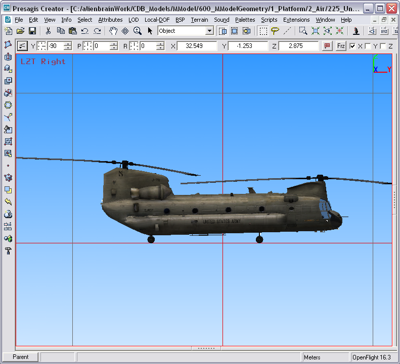
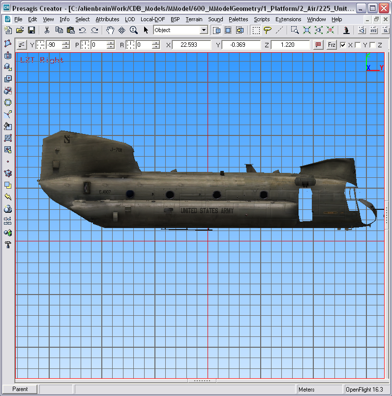
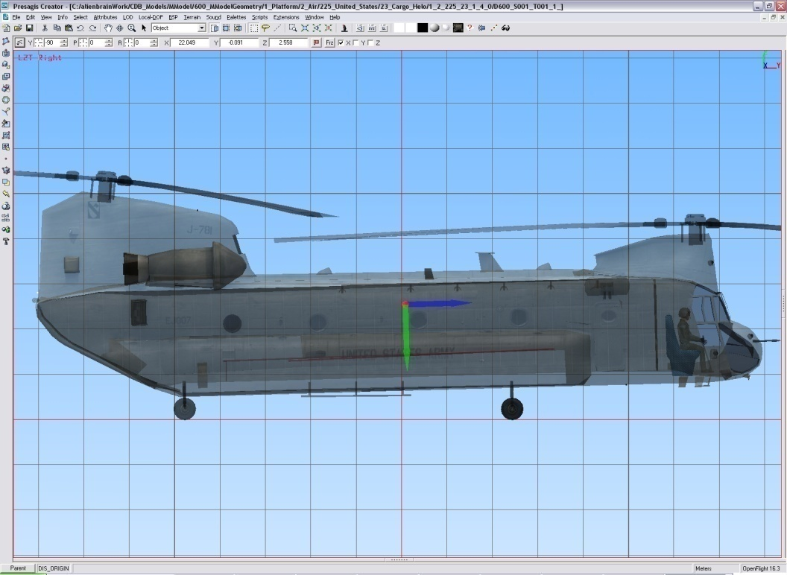

=== Model Points

A model point is similar to a model zone; it identifies a location on the model that is of interest to at least one simulation client device. A point defines a local coordinate system on the model. Hence, a point has a position and an orientation.

In some respect, a point and a zone are similar and can be used interchangeably. A zone is used when the component of interest is physically modeled and has a graphical representation. When the zone is not modeled but still represents a component of interest, a point is used to indicate its presence.

Again, the OpenFlight Group Node mechanism provides a convenient means of implementing the concept of a point because a transformation can be added to the node.

include::requirements/requirements_class04.adoc[]

==== Definition

<<XMLTagsforPoints>> below presents the syntax of the XML tags stored in the node’s comment record.

[#XMLTagsforPoints,reftext='Table 6-17']
*Table 6-17: XML Tags for Points*

[source,xml]
------
<CDB:Point name = "name">

... point attributes

</CDB:Point>
------

The point name is mandatory while the point attributes are optional. In general, a point can have the same name as a zone. <<table_OpenFlightRecordsforaPoint>> lists the OpenFlight records required to represent a point.

[#table_OpenFlightRecordsforaPoint,reftext='Table 6-18']
*Table 6-18: OpenFlight Records for a Point*

[cols="",align="center"]
|===
| GROUP
| MATRIX (mandatory)
| COMMENT (mandatory)
|===

A model point is used in several occasions such as defining the attach point where another Model can anchor itself.

==== Usages

===== Model DIS Origin

A Model that is intended as a DIS entity requires a point that defines the origin of the entity’s coordinate system. This point is the center of the entity’s bounding volume excluding its articulated and attached parts footnote:[This definition can be found on page 3 of reference [4].]. On a DIS network, the location of an entity is expressed relative to this point.

include::requirements/REQ023.adoc[]

The following XML tag identifies the point.

[#XMLTagsfortheDISOrigin,reftext='Table 6-19']
*Table 6-19: XML Tags for the DIS Origin*

[source,xml]
------
<CDB:Point

name = "DIS_Origin"

/>
------

include::requirements/REQ024.adoc[]

The intent of the DIS Standard is to have its axis system aligned with the body of the entity. When it comes to air platform, the body is associated with the fuselage of the entity. To illustrate the difference in orientation between the DIS entity’s bounding box and the CDB Model’s bounding box, consider the Chinook helicopter shown below.

[#img_OrientationoftheChinookHelicopter,reftext='{figure-caption} {counter:figure-num}']
*_{figure-caption}{counter:figure-num}. Orientation of the Chinook Helicopter_*

The fuselage of this helicopter has a pitch angle of approximately 1.6 degrees when resting on its wheels. Below is a snapshot of its fuselage, without rotors and landing wheels.

[#img_TheBodyoftheChinookHelicopter,reftext='{figure-caption} {counter:figure-num}']
*_{figure-caption}{counter:figure-num}. The Body of the Chinook Helicopter_*

From the snapshots above, it is clear that the orientation of the DIS origin must be such that its XY plane makes an angle of 1.6 degrees with respect to the XY plane of the CDB axis system.

Here is a recommended way of defining the DIS Origin:

1.  Create the Group Node and tag it as a CDB Point whose name is DIS_Origin.
2.  Make the CDB Point a child of the zone that best represents the entity’s bounding volume without any articulated and attached parts.
3.  Ensure the zone is properly oriented with respect to the CDB axis system.
4.  Add a translation to position the origin at the center of the above bounding volume.
5.  Add a rotation to align the X-axis to the front of this bounding volume.
6.  Add another rotation to align the Z-axis with the bottom of the bounding volume.
7.  By doing so, the Y-axis should already point correctly to the right side of the box.

====== Example

The snapshot below shows the proper location and orientation of the DIS origin on the Chinook. The DIS origin is represented by a set of 3 orthogonal Blue-Red-Green arrows. The blue arrow indicates the X axis; the green arrow points down and represents the Z axis.

[#img_TheDISOrigonoftheChinookHelicopter,reftext='{figure-caption} {counter:figure-num}']
*_{figure-caption}{counter:figure-num}. The DIS Origon of the Chinook Helicopter_*

If you watch carefully, you will notice that the DIS axis system is aligned with the fuselage and makes an angle with the CDB XY plane.

===== Model Viewpoint

To generate the correct view of the outside world from a model’s viewpoint, a client device needs an indication of where is the viewpoint located with respect to the model’s origin. The viewpoint corresponds to the pilot’s seat in an aircraft, the driver’s seat in a ground vehicle, the navigation post on a ship bridge, the periscope on a submarine, or the eyes of a soldier.

include::requirements/REQ025.adoc[]

The viewpoint has optional attributes to define the field of view available from this position. The field of view is defined by a frustum aligned along the local Y-axis. The horizontal field of view lies in the local XY plane while the vertical field of view is in the YZ plane.

[#XMLTagsforaViewpoint,reftext='Table 6-20']
*Table 6-20: XML Tags for a Viewpoint*

[source,xml]
------
<CDB:Point name="Viewpoint">

<FOV>

<Horizontal>min max</Horizontal>

<Vertical>min max</Vertical>

</FOV>

</CDB:Point>
------

All values are expressed in degrees using decimal numbers. The default values are ±30.0° in both directions for a total of 60.0° of horizontal and vertical fields of view.

===== Model Attach Point

A Model can be attached to another Model by mean of an attach point.

An attach point defines the position to which other (subordinate) models can attach themselves. For instance, a fighter has a number of attach points defined to receive missiles or external fuel tanks.

[#XMLTagsforAttachPoint,reftext='Table 6-21']
*Table 6-21: XML Tags for Attach Point*

[source,xml]
------
<CDB:Point

name = "Attach_Point"

/>
------

The orientation of the attach point is used to indicate how the two models connect together. A connection occurs by superimposing the coordinate system of the subordinate model with the coordinate of the attach point.

===== Model Anchor Point

The anchor point defines the location where a subordinate Model attaches to a parent Model. The anchor point is the counterpart to the attach point. Both can be seen as the male/female part of a connector and its receptacle.

[#XMLTagsforAnchorPoint,reftext='Table 6-22']
*Table 6-22: XML Tags for Anchor Point*

[source,xml]
------
<CDB:Point

name = "Anchor_Point"

/>
------

The orientation of the anchor point is used to indicate how the subordinate model connects to the parent model. A connection occurs by superimposing the anchor point (of the subordinate model) with the attach point (of the parent model).

The default anchor point of a subordinate model is its origin.

===== Model Center of Mass

The Center of Mass (CM) of a Model is a specific point where, for many purposes, the Model behaves as if its mass was concentrated there.

[#XMLTagsforCenterofMass,reftext='Table 6-23']
*Table 6-23: XML Tags for Center of Mass*

[source,xml]
------
<CDB:Point

name = "Center_Of_Mass"

/>
------
