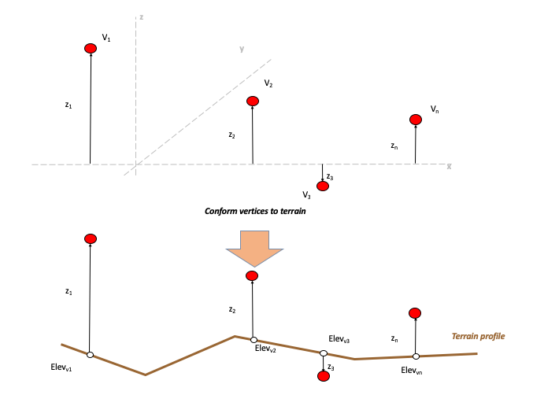
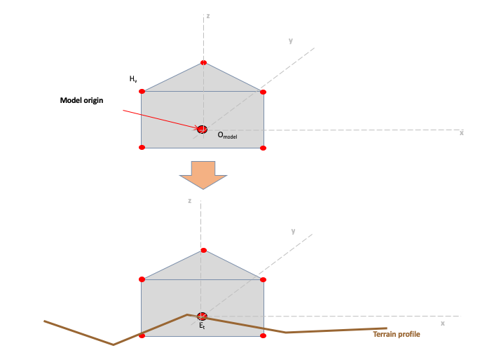
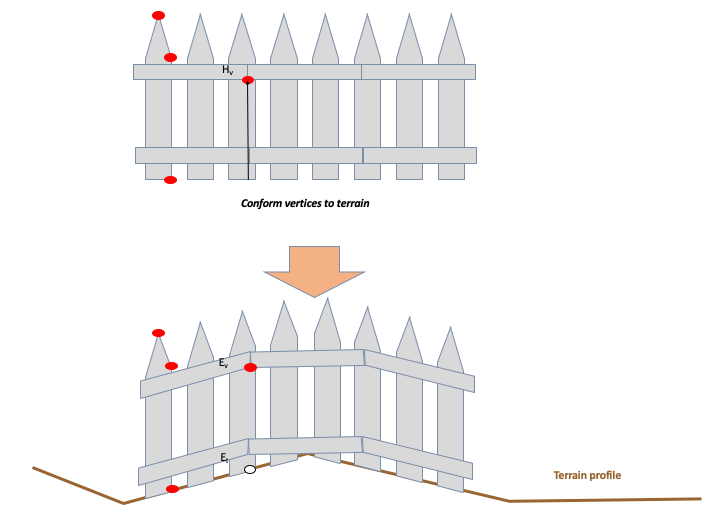
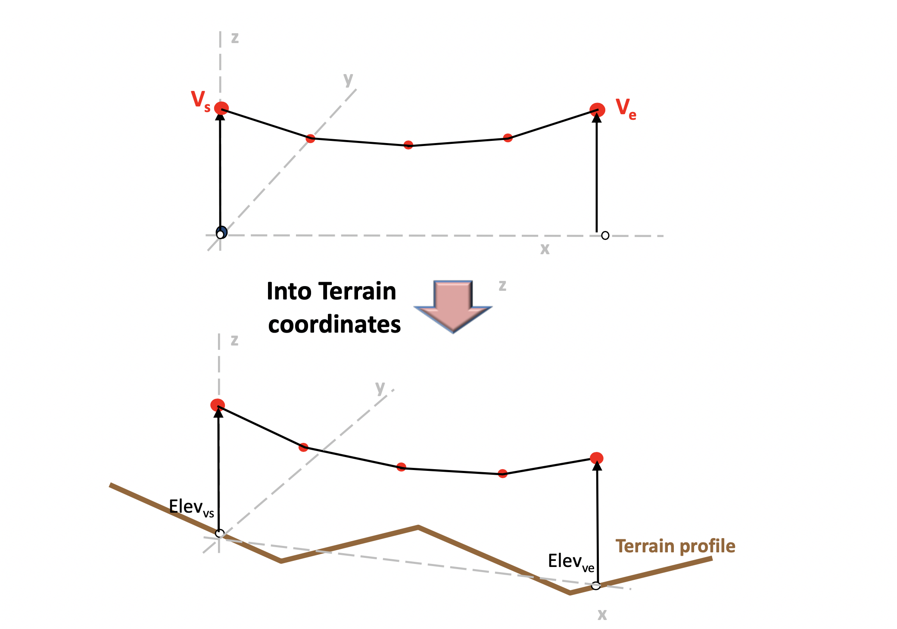
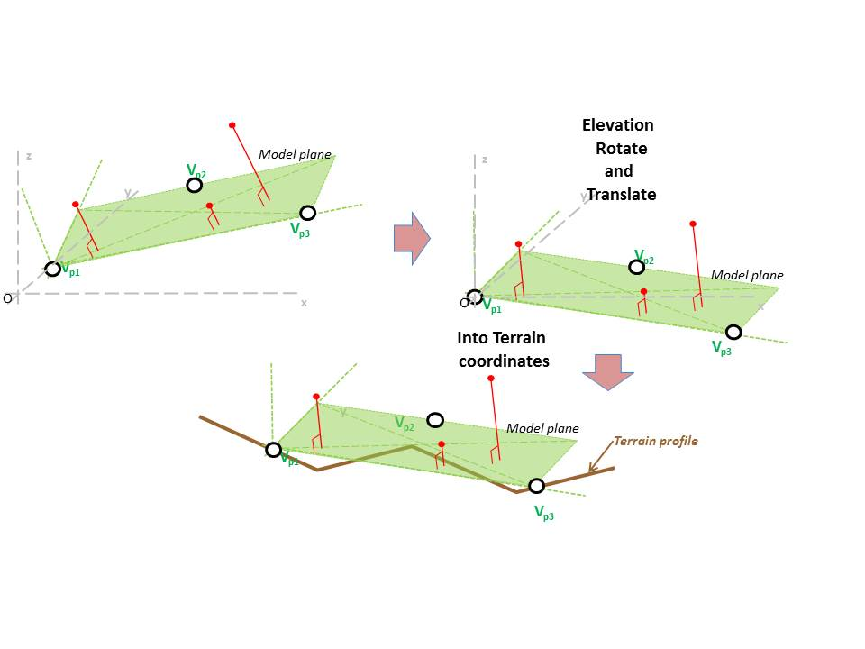
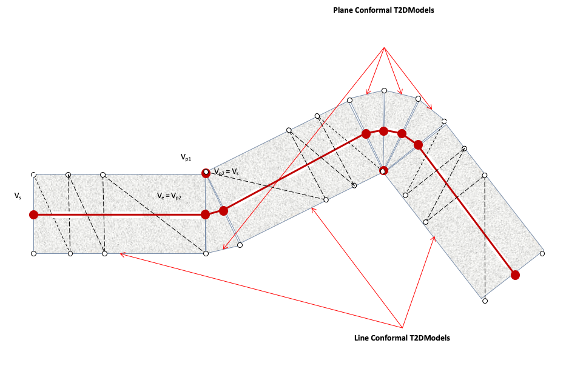
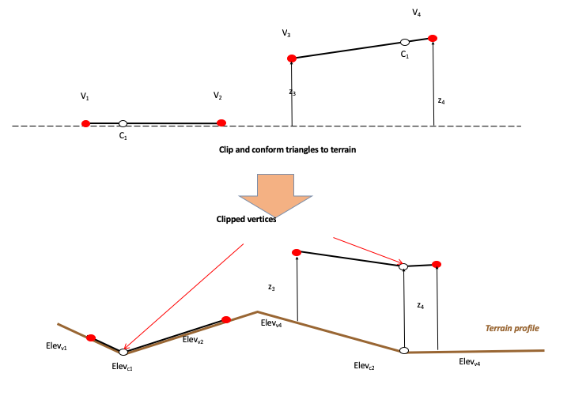

=== Model Conforming

Historically, the integration of models onto the terrain has been performed during the database compilation process. These offline approaches varied considerably from vendor to vendor because there were no standardized approaches related to terrain meshing structures, varying visual priority and hidden-surface removal mechanisms, runtime LOD mechanisms, number of LODs, etc.

This section describes a series of model conformal modes that instruct client-devices on how they should conform models to the underlying terrain.

All of the conformal modes rely on the conforming of the model origin and/or model vertices onto the terrain mesh directly beneath the model. Note that the Z-component of the model’s vertices is with respect to model’s XY plane (as shown in Figure 6‑36).

[#img_ConformingVerticestoTerrain,reftext='{figure-caption} {counter:figure-num}']
*_{figure-caption}{counter:figure-num}. Conforming Vertices to Terrain_*

Note that by definition, all portions of the model below its XY plane represent some form of under ground basement. The conforming of models on steep or rough terrain may yield unusual results because portions of the basement may be visible. This may require the modelers to level the terrain in the immediate vicinity or adjust the model.

A modeler can specify a model’s conformal mode by adding the following XML tags to the zone representing the model.

[source,txt]
----
<CDB:Zone>

<Conformal mode="..."/>

</CDB:Zone>
----

The conformal modes are listed in <<table_ConformalModes>> below.

[#table_ConformalModes,reftext='{table-caption} {counter:table-num}']
*Table 6-24: Conformal Modes*

[cols="",options="header",]
|================
|*Conformal Mode*
|Absolute
|Point
|Vertex
|Line
|Plane
|Surface
|================

==== Non Conformal (Absolute) Mode

When attributed as a Non Conformal model, none of the model vertices are conformed to the underlying terrain. Instead the model’s Z-values are used as-is, as elevation values. As a result the model is absolutely positioned and behaves independently of the terrain. The shape and orientation of the model is preserved. This conformal mode is typically used for the modeled representation of point-features. Typical use-cases include buildings, trees, and poles.

==== Point Conformal Mode

The Point Conformal mode conforms a single point of the model (its origin) onto the underlying terrain. All of the other model vertices are translated along the Z-axis; as a result, the shape of the model is preserved by this conformal operation. In effect, the Point Conformal mode dynamically positions a model on the underlying terrain so as to preserve the model’s relative altitude over the terrain. Point-conforming is the default conformal mode for the modeled representation of point-features. Typical use-cases include buildings, trees, and poles.

[#img_OrigonConformalMode,reftext='{figure-caption} {counter:figure-num}']
*_{figure-caption}{counter:figure-num}. Origon Conformal Mode_*

==== Vertex Conformal Mode

The Vertex Conformal mode conforms each of the vertices of a model on the underlying terrain. The shape of the model is *not* preserved by this conformal operation. The model’s XY plane defines a reference plane used by client-devices to adjust the elevation of each of the model’s vertices. This conformal mode is used for 3D models that represent typically long 3D lineal features or large 3D areal features that need to follow the terrain profile. Typical uses include fences, walls, trenches, and forest canopies.

[#img_VertexConformalModeExample,reftext='{figure-caption} {counter:figure-num}']
*_{figure-caption}{counter:figure-num}. Vertex Conformal Mode Example_*

==== Line Conformal Mode

The Line Conformal mode conforms each of the two reference vertices of the “linear” model on the underlying terrain. All of the other model vertices are sheared along this axis; as a result, the shape of the model is *not* preserved by this conformal operation. The model’s XY plane defines a reference plane used by client-devices to adjust the elevation of the two reference vertices. This conformal mode is used for models that represent lineal features such as powerlines and monorails.

[#img_LineConformalMode,reftext='{figure-caption} {counter:figure-num}']
*_{figure-caption}{counter:figure-num}. Line Conformal Mode_*

The line that is used to specify the conforming is defined by a Face node with the following XML tags:

_________________
<CDB:Face>

<Conformal_Line/>

</CDB:Face>
_________________

This Face node defines a single line with two vertices, the first one, V~s~, being the start and the second, V~e~, the end of the line.

==== Plane Conformal Mode

The Plane Conformal mode conforms each of the three reference vertices of the “planar” model on the underlying terrain. The resulting three vertices define a model transformation matrix that can then be applied to the vertices of the model. As a result, the shape of the model *is* preserved by this conformal operation, but the model undergoes a change in pitch and roll angles. Given this property, there are relatively few cases where this conformal mode can be used footnote:[Man-made structures and tree vegetation do not tilt regardless of the terrain they are on.]. However, as shown in Figure 6‑41, this conformal mode is required when conforming the curved segments of 3D (raised profiled) modeled road features.

[#img_PlaneConformalMode,reftext='{figure-caption} {counter:figure-num}']
*_{figure-caption}{counter:figure-num}. Plane Conformal Mode_*

[#img_ApplicationofLineandPlaneConformalModeson3dRoads,reftext='{figure-caption} {counter:figure-num}']
*_{figure-caption}{counter:figure-num}. Application of Line and Plane Conformal Modes on 3d Roads_*

The plane that is used to specify the conforming is defined by a Face node with the following XML tags:

_________________
<CDB:Face>

<Conformal_Face/>

</CDB:Face>
_________________

The Face node has exactly 3 vertices defining the plane used for the conforming. The only restriction on these 3 vertices is that they must not be collinear.

==== Surface Conformal Mode

This conformal mode is used for models whose points, edges and surfaces must all conform exactly to the underlying terrain. The Surface Conformal mode requires that the model’s edges and surfaces be clipped to the underlying terrain. The original vertices and the added vertices resulting from the clipping operation are conformed to the underlying terrain. As a result, the shape of the model is *not* preserved by this conformal operation. This conformal mode is primarily used for the modeled representation of 2D surface-feature such as paint markings and other terrain overlays. In addition, it can be used for 3D models that represent typically long or large 3D lineal and 3D areal features that need to *perfectly* follow the terrain profile. Note that in most cases, the vertex conformal mode provides an adequate solution for 3D models and is more economical to use than the surface conformal mode.

[#img_SurfaceConformalMode,reftext='{figure-caption} {counter:figure-num}']
*_{figure-caption}{counter:figure-num}. Surface Conformal Mode_*
