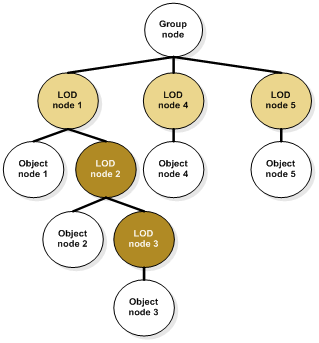

=== Model Levels-of-Detail

include::requirements/requirements_class05.adoc[]

A levels-of-detail model structure is essential when the intent is to use a model in a real-time application such as flight simulation. The level-of-detail mechanism provides client-devices with the essential structure for deterministic operation. Deterministic operation can be achieved only if a client-device can:

* control the paging bandwidth from the CDB main storage device
* control client-device processing load
* control client-device memory footprint
* control run-time publishing processing load and
* control run-time publishing memory footprint

For this reason, it is recommended to create LODs, especially for complex Models, and for models that are used extensively, in great density in the CDB data store. This is most critical for geospecific cultural models (especially in densely modeled geospecific areas of the synthetic environment) since they can consume a significant portion of the paging bandwidth and memory footprint of the client-devices. As a corollary, simple Models should not be made more complex by adding unnecessary level of details. The CDB standard provides rules for determining model complexity, and selecting the appropriate LOD, as defined in Chapter 3 of Volume 1: OGC CDB Core Standard:Model and Physical Database Structure.

OpenFlight LOD nodes now support two methods of specifying the criteria to determine if a level of detail is active, that is if the user application should traverse the node and its children. The first method, the classic one, is to specify the switch in and switch out distances in real world units. Using this method, a level of detail is active when the distance from the viewpoint to the center of the LOD is within the switch-in and switch-out distances. The second method uses the Significant Size associated with the LOD node to determine when to activate the node.

include::requirements/REQ026.adoc[]

There are several problems associated with the classic, range-based method. In a visual system for instance, the switching distance should be based on both range and the system resolution of the entire visual system; a database designed to rely solely on a range-based switching criteria is not truly portable, especially if the intent is to use it on systems with wildly different visual resolution. Furthermore, the blending or morphing of models solely based on range criteria can lead to undesirable effects. When the viewpoint moves quickly, the distance over which the model is LOD-transitioning should be large enough to avoid the “popping-in” of the higher LOD version. On the other hand, if the viewpoint is moving very slowly, the distance over which the model is LOD-transitioning should be reduced to avoid the “LOD-ghosting” of the higher LOD version. These two constraints make implicit assumptions on the model’s speed. In applications where the aircraft’s flight regime varies considerably (V22 for example), it is impossible to find a single set of LOD start and end points that simultaneously cater to all flight modes (hover versus cruise). Here again, a database design that directly encodes the start and end points of a model’s LOD transition is not truly portable, because it makes implicit assumptions on the speed it will be used for. Thus, in a tactical fighter application, the start and end points of a model’s LOD transition need to be widely spaced apart to prevent a popping effect at the onset of the LOD transition. Conversely, in a tank application, the start and end points of a model’s LOD transition need to be much more closely spaced to prevent a ghosting effect as the higher LOD model is blended-in. If the client device wants to implement some form of transition between LODs, the criteria should be based on a user-defined duration. Transitions between LODs can involve fading in the next LOD while fading out the current one. That fading operation should not last forever. It should be accomplished in a relative short period of time. The second method to transition from one LOD to the next is to use morphing. In the case of morphing, the transition period is less critical because the client-device (typically an Image Generator) does not blend-in two models together.

The consequences of such implicit assumptions result in a database that is highly client-device, and application-specific.

For all these reasons, the CDB standard has selected the second method to control the LOD mechanism.

Two methods exist to implement LODs, exchange or addition. The two methods can be used simultaneously and are not mutually exclusive.

In the first method, details are progressively added to the model, as the viewpoint gets closer. With the second method, different representations of the same model are substituted for one another based on the viewing distance. Figure 6‑43: Exchange and Additive LOD Nodes, illustrates the general organization of Models with both types of LOD nodes.

==== Exchange LODs

In the exchange LOD method, different representations of the same model are substituted for one another based on the model’s Significant Size. It is up to the client-devices to derive appropriate LOD transition viewing distance from the model’s Significant Size and the client-device’s field-of-view and resolution parameters.

==== Additive LODs

Additive LOD is just a special case of the more general Exchange LOD paradigm. When a LOD node has no sibling LOD, it becomes an Additive LOD node. That does not change the fact that at most one LOD node gets selected when its Significant Size justifies it.

[#img_EchangeandAdditiveLODNodes,reftext='{figure-caption} {counter:figure-num}']
*_{figure-caption}{counter:figure-num}. Exchange and Additive LOD Nodes_*

The LOD nodes in light brown represent Exchange LODs and are mutually exclusive. The two dark brown shaded LOD nodes are considered Additive LODs because they do not have another sibling node of type LOD.

Note that to make sense, the Significant Size of LOD node 2 must be less than the Significant Size of LOD node 1 (Requirement 26). The same is true for the Significant Size of LOD node 3 with respect to LOD node 2. Also, LOD node 3 has an additional constraint, its Significant Size must be greater than the one assigned to LOD node 4. If these constraints are not followed, LOD node 4 will be selected before LOD nodes 2 or 3 have a chance of being displayed.

==== Significant Size

The concept of a Significant Size is a recent improvement of the OpenFlight Specification. When a finer model LOD is created, the modeler typically adds additional geometric detail, additional features (such as markings), or refines the shape of curved surfaces (such as engines, wheels), etc. When assigning a Significant Size to a model LOD, the modeler needs to answer the following question: When I created a new model LOD, I did so to create additional detail in my model. What is the largest dimensional change in geometry for this new model LOD? In other words, what is the largest dimensional difference of a surface between this LOD and the next coarser LOD? In effect, the value of Significant Size corresponds to the “modeling difference” between the LOD and the next coarser LOD. At runtime, a client-device converts this modeling difference value from its real-world dimensional value into a viewing error value (typically measured in pixels or degrees). The client-device can then activate the appropriate model LOD because it knows that the modeler’s intent in creating the LOD was to show features, eliminate all modeling discrepancies whose dimension equaled that of the Significant Size dimension associated with that model’s LOD. This contribution of the LOD to the scene is based on the LOD’s Significant Size as well as other parameters (such as system resolution) relevant to the simulation model used by the client device.

Version 16.0 of the OpenFlight Specification introduces the concept of Visual Significance that is different from the concept of Significant Size. The concept of Visual Significance translates in two fields called Significance and they are found in the Group Record and Object Records footnote:[Users of Creator 3.0 will find the exact same definition for Significance in both the Group and Object Attributes Help pages.]. Here is the definition of this field as found in reference [11]:

“Significance can be used to assist real-time culling and load balancing +
mechanisms, by defining the visual significance of this group with respect to other groups in the database. Normally the value of this attribute is zero”.

The CDB standard mandates a value of zero for Visual Significance; the value zero indicates the object or the group has no particular significance and is not more or less important than any other objects or groups. Any other values, whether negative or positive, are reserved for future use by this Specification.

===== Definition of Significant Size

The Significant Size is defined as the “size” of the model, expressed in meters. By extension, it applies equally well to a submodel represented by an Additive LOD. In the case of an Exchange LOD, the Significant Size is the difference between two representations of the model or submodel.

===== Estimating the Size of the Model

Many models have shapes that resemble a cube (with roughly equal length, width, and height), and thus their significant size can be simply estimated by the length of the diagonal of their bounding box. As the shape of a model departs from that of a simple cube, either with respect to aspect ratio, or with respect to the amount of negative space within its bounding box, the model’s significant size should be decreased proportional to the amount of departure.

===== How to use the Significant Size

The Significant Size is used to distribute models into appropriate CDB LODs. Once a value is assigned to the coarsest LOD of a model, subsequent LODs of the same model can be distributed to subsequent CDB LODs. Use Table 3-1 and the model Significant Size to identify the CDB LOD it belongs to.

For instance, if the size of a building is estimated to 75 meters, then its coarsest LOD will be stored in CDB LOD 0, according to Table 3-1. On the other hand, a 2-meter park bench will appear in CDB LOD 5.

==== LOD Limits

The number of vertices per LOD is limited to ensure a smooth progression between all representations of the same model. <<table_MaximumNumberofVerticesperModelLOD>> below gives the maximum number of vertices allowed for each Model-LOD.

[#table_MaximumNumberofVerticesperModelLOD,reftext='Table 6-25']
*Table 6-25: Maximum Number of Vertices per Model-LOD*

[cols=",,",]
|============================================================================================================
|*Model LOD* |*Maximum Number of Vertices* |*CDB LOD*
|0 |128 |CDB LODc + 0
|1 |512 |CDB LODc + 1
|2 |2048 |CDB LODc + 2
|3 |8192 |CDB LODc + 3
|4 |32768 |CDB LODc + 4
|5 |131072 |CDB LODc + 5
|6 |524288 |CDB LODc + 6
|7 |2097152 |CDB LODc + 7
|============================================================================================================

The table above shows that a model is allowed up to 8 levels of details, numbered from 0 to 7. Model-LOD 0 is the coarsest level of detail of the model and may count up to 128 vertices. As the complexity of subsequent Model-LODs augments, a higher vertex count is permitted. The CDB LOD that is associated with a Model-LOD is expressed relative to the CDB LOD assigned to its coarsest representation, designated by CDB LODs.

===== How to Assign CDB LODs

To illustrate the use of <<table_MaximumNumberofVerticesperModelLOD>>, take a 3D model representing a building with three representations:

* Coarsest LOD:
** 8 vertices
** Significant Size estimated to 25 meters
* Medium LOD:
** 2244 vertices
** Significant Size estimated to 4 meters
* Finest LOD:
** 10320 vertices
** Significant Size estimated to 10 cm

The CDB LODs are first established by looking up the Significant Sizes of the three representations in Table 3-1:

* Coarsest LOD:
** 25 m is CDB LOD 2
** This is CDB LODc
* Medium LOD:
** 4 m is CDB LOD 4
* Finest LOD:
** 10 cm is CDB LOD 10

We then use the vertex count to identify the Model-LOD in <<table_MaximumNumberofVerticesperModelLOD>>:

* Coarsest LOD:
** 28 vertices is Model-LOD 0
* Medium LOD:
** 2244 vertices is Model LOD 3
** Should be assigned to CDB LODc (2) + 3 = 5
* Finest LOD:
** 10320 vertices is Model LOD 4
** Should be assigned to CDB LODc (2) + 4 = 6

Since all representations of the model must meet both the constraints associated with the Significan Size and the Vertex Count, the final CDB LODs are the maximum ones identified above.

* Coarsest LOD:
** CDB LOD 2
* Medium LOD:
** CDB LOD 5
* Finest LOD:
** CDB LOD 10

==== LOD Generation Guidelines

The following guidelines should help modelers produce efficient CDB models for use in real-time environments. There are two way of proceeding; one way is to create the finest representation of the model and then simplify it until the coarsest representation is obtained. The other way consists in creating the coarsest representation first and then refining it until the desired representation is obtained. In general:

* The coarsest Model-LOD is the simplest possible geometric representation of the model using at most 128 vertices.
* A coarser Model-LOD is created by removing details from a finer Model-LOD.
* Alternately, a finer Model-LOD is created by adding details to a coarser Model-LOD.
* In both cases, the size of the details that are removed or added to a Model-LOD should be consistent with its Significant Size.
* Model-LOD 0 is mandatory; the others are optional and exist only if Model-LOD 0 isn’t sufficient to represent the model with a proper level of detail.
* Multiple Model-LODs do not need to be consecutive.
