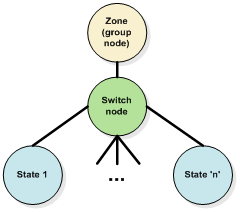
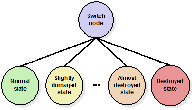
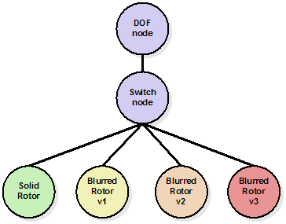

=== Model Switch Nodes

A Switch Node allows the selection of zero or more children by invoking a selector mask. Any combination of children can be selected per masks and the number of definable masks is unlimited. The CDB standard makes use of OpenFlight Switch Nodes to control the state of Model Components (zones and points).

include::requirements/requirements_class06.adoc[]

==== Definition

XML tags in the comment record are added to the switch’s primary record to identity it as a CDB Switch.

[#listing_XMLTagstoCreateaCDBSwitch,reftext='Table 6-25b']
*Table 6-25b: XML Tags to Create a CDB Switch*

[source,xml]
------
<CDB:Switch name = "switch name">

... switch attributes

</CDB:Switch>
------

include::requirements/REQ027.adoc[]

As an example, if the switch has 3 children, each representing a separate state of the parent zone, then the switch needs 3 masks, each selecting one child.

include::requirements/REQ028.adoc[]

The actual name is at the discretion of the modeler.

The corresponding OpenFlight records are as follow:

[#table_OpenFlightRecordstoCreateaCDBSwitch,reftext='Table 6-26']
*Table 6-26: OpenFlight Records to Create a CDB Switch*

[cols="",align="center"]
|===
| SWITCH
| COMMENT (mandatory)
| INDEXED STRING
|===

==== Usage

===== Articulations

Switch nodes provide an alternative to DOF nodes when an articulated part is implemented for only a few positions. An example of this use of switches is the control of undercarriage or control surfaces on aircraft. Suppose the modeler wants to represent the flaps in two distinct positions: flaps up and flaps down. A switch is the simplest way to implement these two flaps positions. In this example, the switch name could be “Flap Control” and the two mask names could be “Flap Up” and “Flap Down”.

Suppose the modeler wants to provide two positions for the door on a hangar: open and close. In addition, when the door is open, the modeler provides a representation for the interior of the hangar, which is not the case when the door is closed. Again, the use of a switch is appropriate to provide the control over the door position. A proper name for the switch would be “Door Position” and the appropriate names for the two masks would be “Door Closed” and “Door Open”.

===== Damage States

Switch nodes can be used to select one of many modeled representations of damages. A zone has at least a normal (usually undamaged) state. When other states exist, an OpenFlight switch node is used to select which state is active. A single damage state can be active at any time.

include::requirements/requirements_class07.adoc[]

//here skip Figure 6-44 because it was missing from the MS Word version. Note that counter2 is the command for increasing a counter without displaying it.

{counter2:figure-num}

Figure 6‑45: General Damage State Tree Structure shows the general organization of a zone with several states.

[#img_GeneralDamageStateTreeStructure,reftext='{figure-caption} {counter:figure-num}']
*_{figure-caption}{counter:figure-num}. General Damage State Tree Structure_*

Each damage state represents the zone with a certain level of damage. This level of damage is expressed as a percentage from 0 to 100%. A level of damage of 0 % means the zone is not damaged at all. At the opposite end, a percentage of damage of 100 % indicates the zone is completely destroyed.

To identify a damage state switch, use the following XML tags in the switch comment record.

[#listing_XMLTagsforDamageStateSwitch,reftext='Table 6-27']
*Table 6-27: XML Tags for Damage State Switch*

[source,xml]
------
<CDB:Switch name = "Damage_State">

<Damage_Level>...</Damage_Level>

</CDB:Switch>
------

The XML element <Damage_Level> is a list of percentages representing the transitions between child nodes of the switch. The list counts ‘n-1’ entries where ‘n’ is the number of states.

include::requirements/REQ029.adoc[]

To illustrate the concept of level of damage, assume a damage state switch has 3 child nodes representing the zone in normal, damaged, and destroyed states. Also, assume that the modeler’s intent is to switch to the damaged state when the level of damage exceeds 25 %, and to switch to the destroyed state when the level of damage exceeds 75 %. Here, the XML tag associated with the switch should look like this.

[#listing_ExampleofaDamageStateSwitchwithTwoTransitions,reftext='Table 6-28']
*Table 6-28: Example of a Damage State Switch with Two Transitions*

[source,xml]
------
<CDB:Switch name = "Damage_State">

<Damage_Level>25 75</Damage_Level>

</CDB:Switch>
------

include::requirements/REQ030.adoc[]

[#img_DamageStatesOrdering,reftext='{figure-caption} {counter:figure-num}']
*_{figure-caption}{counter:figure-num}. Damage States Ordering_*

While the number of damage states is left to the discretion of the modeler, some choices are better than others. Since a Model is meant to be used in a simulator and since many simulators are DIS-compliant, it is suggested to create the same number of CDB damage states as there are DIS damage states for the corresponding entity.

For instance, if the Model represents a DIS land platform such as the M1A2 tank, the modeler could create four damage states to match the four corresponding DIS damage states labeled No Damage, Slight Damage, Moderate Damage and Destroyed.

The DIS and the HLA standards are relatively vague regarding the definition of damage states. In the case of the DIS standard, the damage state is a field that belongs to a structure called the Entity Appearance. The field has only 2 bits and, accordingly, accommodates four different values. For HLA, version 2 of the RPR-FOM defines the damaged appearance as a 32-bit enumeration for which only 4 values have been defined so far – the same values as the one defined by DIS, that is No Damage, Slight Damage, Moderate Damage and Destroyed.

For both DIS and HLA, it is obvious that the damage state is meant to be a visual damage state.

The question to answer is the following: “What should the universally accepted visual appearance be for a slightly (or moderately) damaged state?”

In the DIS world, a platform is often qualified in terms of Mobility and Fire Power footnote:[Note that, on top of the Damage State field, the DIS Entity Appearance structure has two flags to describe the Mobility and Fire Power of the entity. This is also true for HLA and version 2 of the RPR-FOM which provides for two flags to describe the fire power and mobility of a physical entity on top of the field used to describe the damage state.]. Using these two criteria, it is possible to define the following guidelines.

* A slightly damaged model should represent a platform with limited mobility. However, its firepower is intact and it should be apparent that the entity is still capable of firing its weapons.
* A moderately damaged model should represent a platform for which both mobility and firepower are reduced without being completely out of service.

As a corollary, here are the definitions of normal and destroyed states.

* An undamaged model should represent a platform for which both mobility and fire power are completely operational.

A destroyed model should represent a platform for which both mobility and firepower are completely out of service.

===== Temporal Anti-aliasing

Temporal anti-aliasing may be achieved with the use of special textures. These textures are often required to aid IG client-devices to eliminate strobing effects on model rotating objects such as helicopter rotors, aircraft propellers, or vehicle wheels.

Figure 6‑47: Example of a Texture Representing a Rotor, is an example of a semi-transparent texture used to simulate a rotating helicopter rotor.

[#img_ExampleofaTextureRepresentingaRotor,reftext='{figure-caption} {counter:figure-num}']
*_{figure-caption}{counter:figure-num}. Example of a Texture Representing a Rotor_*

Motion blur textures are general base textures with a Texture Kind of S001. The Texture Index (Tnn) is used to sequentially number several motion blur textures representing the same object.

The use of motion blur textures can be combined with DOF and Switch nodes to produce efficient switching between several versions of a single rotating part.

The following subtree illustrates how four versions of the above rotor could be modeled using one solid version and three blurred versions.

[#img_MultipleVersionsofRotatingParts,reftext='{figure-caption} {counter:figure-num}']
*_{figure-caption}{counter:figure-num}. Multiple Versions of Rotating Parts_*

In this example, three textures are used to represent an increasingly blurred rotor.

In order to detect the presence of the above construct, the following XML comment must be added to the switch node.

[#listing_XMLTagsforMotionBlurSwitch,reftext='Table 6-29']
*Table 6-29: XML Tags for Motion Blur Switch*

[source,xml]
------
<CDB:Switch name = "Motion_Blur">

<Blurriness>...</Blurriness>

</CDB:Switch>
------

The children of the switch node could be any OpenFlight nodes. Most likely, the nodes that contain the geometry will be OpenFlight Object nodes.

When modeling solid and blurred objects in this manner, the CDB Standard requires that the leftmost child node contains the solid version of the object while the sibling nodes to the right contain increasingly blurred version of the same object.

The XML element <Blurriness> is a list of percentages representing the transitions between child nodes of the switch. The list counts ‘n-1’ entries where ‘n’ is the number of child nodes.

include::requirements/REQ031.adoc[]

To illustrate the concept of level of blurriness, assume a motion blur switch has two child nodes. Also, assume that the modeler’s intent is to switch to the second node when the level of blurriness exceeds 10 %. Here, the XML tag associated with the switch should look like this.

[#listing_ExampleofaMotionBlurSwitchwithOneTransition,reftext='Table 6-30']
*Table 6-30: Example of a Motion Blur Switch with One Transition*

[source,xml]
------
<CDB:Switch name = "Motion_Blur">

<Blurriness>10</Blurriness>

</CDB:Switch>
------
